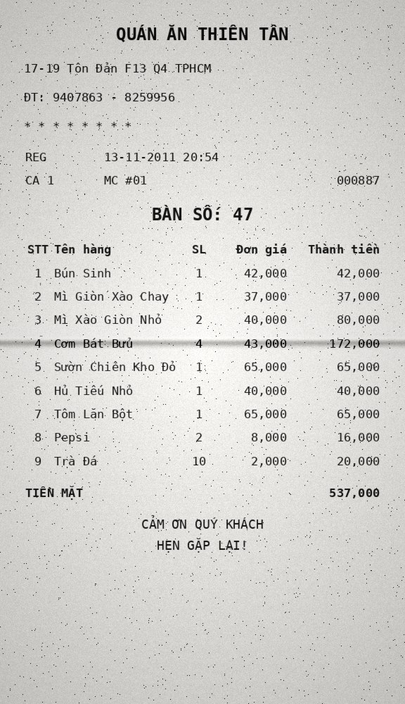
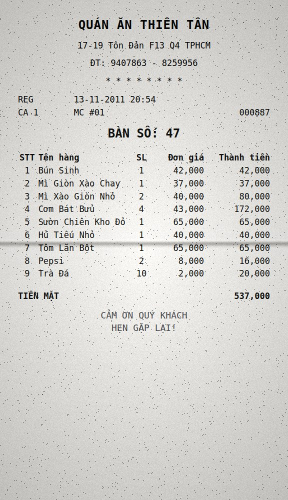
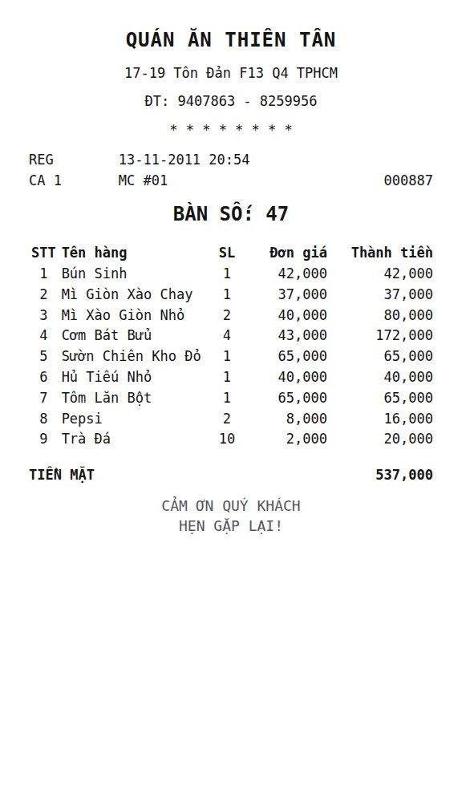
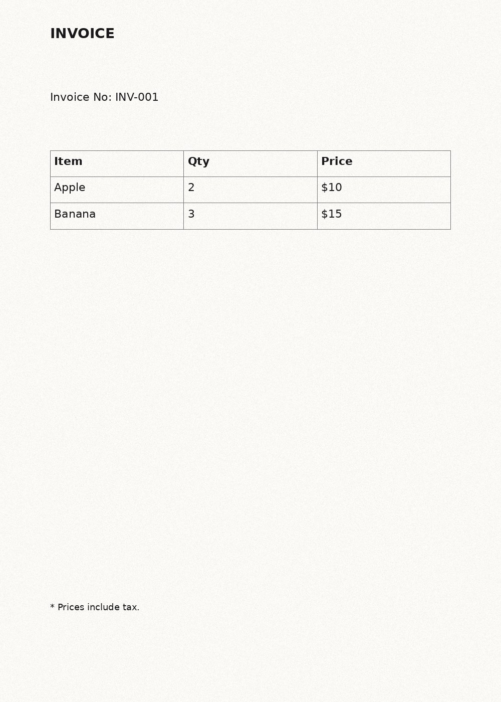

# vlm-ocr-synthetic

Synthetic document pages for training and evaluating VLM / OCR models.

A page is described **once** as a `Document` — blocks, tables, optional
positions — and any render backend can turn that description into an image
plus pixel-accurate ground truth. Two backends ship today:

| backend    | how it draws                                | strengths | costs |
| ---------- | ------------------------------------------- | --------- | ----- |
| `synthdog` | Pillow paints the page directly             | boxes exact by construction, ~10x faster per page, no browser needed | typography is basic, layout is simple stacking |
| `html`     | HTML/CSS laid out in chromium, screenshotted | real typography, tables, wrapping and CSS layout; boxes read off the DOM | needs a chromium binary, slower per page |

Both then go through the **same paper layer**, so a page from either backend
looks like it came off the same scanner (see [Paper](#paper-and-degradation)).

Because both consume the same `Document` and return the same `RenderResult`,
you can render one document through both and compare, or mix backends within a
single dataset.

---

## Layout

```
vlm_ocr_synthetic/
├── schemas/
│   ├── document.py     # BBox, TableCell/Row/Block, DocumentBlock, Document, BlockType
│   └── render.py       # RenderConfig (shared knobs), RenderResult (image + ground truth)
├── renderers/
│   ├── base.py         # BaseRenderer: the contract every backend implements
│   ├── __init__.py     # lazy registry: get_renderer(), available_renderers(), load_config()
│   ├── synthdog/
│   │   ├── fonts.py    # font lookup with sensible per-platform defaults
│   │   └── renderer.py # SynthdogConfig + SynthdogRenderer (Pillow)
│   ├── html/
│   │   ├── html_builder.py  # Document -> HTML (no browser involved, unit-testable)
│   │   ├── backends.py      # screenshot engines; PlaywrightEngine + chromium lookup
│   │   ├── renderer.py      # HtmlConfig + HtmlRenderer
│   │   └── templates/       # jinja2 page template
│   └── paper.py        # the paper + degradation layer both backends share
├── samples/            # ready-made documents + corpus.py (shared text + the format rule)
├── variations/         # the scenario space: layouts, styles, degradations, weights
├── pipeline.py         # sample scenarios -> render -> manifest.jsonl
├── benchmark.py        # render through every backend and compare
├── compat.py           # interpreter and dependency floors
├── cli.py              # python -m vlm_ocr_synthetic
└── __main__.py
configs/                # one strict YAML preset per backend
tests/                  # contract suite shared by all backends + per-backend tests
experiments/            # scratch scripts, safe to break
data/                   # everything generated (see below)
```

Backends are imported **lazily** through the registry, so a missing browser
never breaks `synthdog`, a missing Pillow never breaks the registry, and
`python -m vlm_ocr_synthetic list` still explains what is wrong.

---

## Install

Python **3.10 – 3.14**.

```bash
python -m venv .venv && source .venv/bin/activate
pip install -e ".[all]"
python -m vlm_ocr_synthetic doctor      # interpreter, deps and backends in one shot
```

Extras let you install only what you need:

| extra        | pulls in                        | for |
| ------------ | ------------------------------- | --- |
| *(none)*     | pydantic, PyYAML                | schemas, registry, configs |
| `synthdog`   | + Pillow                        | the Pillow backend |
| `html`       | + Pillow, Jinja2, playwright    | the browser backend |
| `dev`        | + pytest                        | the test suite |
| `all`        | everything above                | |

The `html` backend needs a chromium binary:

```bash
playwright install chromium          # if you have no system chromium
```

It is looked up in this order — first hit wins:

1. `executable_path:` in the renderer config
2. `$VLM_OCR_CHROMIUM_PATH`
3. `/opt/pw-browsers/chromium`, `/usr/bin/chromium`, `/usr/bin/chromium-browser`, `/usr/bin/google-chrome`
4. `chromium` / `chromium-browser` / `google-chrome` on `$PATH`
5. playwright's own bundled browser

Useful when the pre-provisioned browser and the playwright version disagree:

```bash
export VLM_OCR_CHROMIUM_PATH=/opt/pw-browsers/chromium
```

---

## Python 3.14, and why there is no pygame

The suite passes unchanged on **CPython 3.14.7** (and on 3.11), both backends
included. Two things make that true, and both are enforced by tests rather than
just claimed.

### Dependency floors

Python 3.14 needs newer dependencies than older interpreters: below these
versions there is no cp314 wheel, so pip falls back to a source build that fails
or takes minutes. `pyproject.toml` applies them with `python_version >= '3.14'`
markers, and `vlm_ocr_synthetic/compat.py` re-checks them at runtime.

| dependency | floor on 3.14 | what happens below it |
| ---------- | ------------- | --------------------- |
| `pydantic` | 2.12    | 2.11 and older have no cp314 wheel for `pydantic-core` — install fails outright |
| `PyYAML`   | 6.0.3   | first release with a cp314 wheel |
| `Pillow`   | 11.3    | first release with a cp314 wheel |
| `playwright` | 1.52  | 1.49 and older pin `greenlet==3.1.1`, which has no cp314 wheel |

Older interpreters keep the loose floors, so nothing is forced on 3.10 – 3.13.

### The original synthdog does not run on 3.14

The synthdog from donut renders through `synthtiger`, which pins
`pygame==2.6.1`. Measured on CPython 3.14.7:

| attempt | result |
| ------- | ------ |
| `pip install pygame` | no cp314 wheel → source build **fails** |
| `pip install synthtiger` | pulls `pygame==2.6.1` → same failure |
| `pip install pygame-ce` | **works** (2.5.8, ships cp314 wheels, same `import pygame` API) |
| synthtiger + pygame-ce + NumPy 2 | `import synthtiger` → `AttributeError: np.sctypes was removed in NumPy 2.0` (via `imgaug`) |
| synthtiger + pygame-ce + NumPy 1.26 (2 min source build) | `import synthtiger` → scipy dies on `np.long`, removed in NumPy 2 |

So **pygame is only the first wall.** Swapping in `pygame-ce` clears it, but
`imgaug` (unmaintained since 2020) needs NumPy 1.x APIs while every scipy build
that exists for 3.14 needs NumPy ≥ 2 — a conflict no pin resolves. The last
interpreter where that whole stack installs from wheels is **CPython 3.12**
(`numpy 1.26.4` and `scipy 1.13.1` stop at cp312).

### What replaces pygame here

Our `synthdog` backend never depended on pygame — it draws with Pillow, whose
FreeType binding covers everything synthtiger used pygame for:

| synthtiger / pygame | here |
| ------------------- | ---- |
| `pygame.freetype` glyph rasterisation | `PIL.ImageFont` on FreeType 2.14, with **raqm 0.10** for complex-script shaping (Vietnamese diacritics, Arabic, Indic) |
| pygame surfaces and blitting for layers | `PIL.Image` / `ImageDraw` layers |
| `imgaug` noise and effects | the `paper` layer: `PIL.ImageChops` + a seeded `random.Random`, so output stays reproducible |
| synthtiger text layout | the wrapping and flow layout in `renderers/synthdog/renderer.py` |

`tests/test_environment.py` runs a real render in a clean interpreter and fails
if `pygame`, `synthtiger` or `imgaug` ever appear in `sys.modules`.

If you specifically need the original synthdog, run it on Python ≤ 3.12 in its
own environment and keep this package on 3.14 — they exchange data as plain
images plus JSON.

---

## Quickstart

```bash
# Which backends are usable right now, and why the others are not?
python -m vlm_ocr_synthetic list

# Render the built-in sample with every available backend (into data/)
python -m vlm_ocr_synthetic render -r all

# Compare the backends and write data/benchmark/report.md
python -m vlm_ocr_synthetic benchmark --pages 3

# One backend, a shipped preset, 2x resolution
python -m vlm_ocr_synthetic render -r html -c configs/html_scanned.yaml --scale 2.0

# Your own document
python -m vlm_ocr_synthetic render -r synthdog -d my_doc.json --stem my_doc
```

Both backends side by side, with the boxes printed:

```bash
python experiments/render_sample.py --out data/compare
```

From Python:

```python
from vlm_ocr_synthetic.renderers import get_renderer
from vlm_ocr_synthetic.samples import get_sample

document = get_sample("invoice")

for name in ("synthdog", "html"):
    result = get_renderer(name, {"scale": 2.0, "seed": 7}).render(document)
    result.save(f"data/{name}", stem="invoice")   # -> invoice.png + invoice.json
```

### CLI reference

| command | what it does |
| ------- | ------------ |
| `doctor` | interpreter, dependency floors, backend availability; exits non-zero on problems (`--json` too) |
| `list` | backend availability (`--json` for machine-readable output) and sample names |
| `render` | render one document |
| `benchmark` | render the same pages through every backend, save images + report |
| `generate` | sample the scenario space and render a dataset (`--dry-run` to plan only) |

Samples: `invoice`, `receipt_vn` (pass with `-s`).

`render` flags: `-r/--renderer` (name or `all`, default `all`) · `-c/--config`
(YAML/JSON preset) · `-d/--document` (a `Document` JSON file) · `-s/--sample`
(built-in document, default `invoice`) · `-o/--out` (default `outputs`) ·
`--stem` (file stem, default `page`) · `--scale` (override the config) ·
`--no-paper` (structure only, skip the paper stage) · `--strict` (exit non-zero
when a backend is unavailable, for CI).

---

## Output format

Every render writes a pair into `<out>/<backend>/`, and `<out>` defaults to
`data/`:

```
data/html/page.png     # the rendered page
data/html/page.json    # the document, with every bbox filled in
```

```jsonc
{
  "renderer": "html",
  "image_size": [1000, 1400],            // pixels
  "metadata": {
    "engine": "playwright",
    "layout": "flow",
    "scale": 1.0,
    "bbox_space": "document"             // NOT pixels -- see below
  },
  "document": {
    "page_width": 1000,
    "page_height": 1400,
    "blocks": [
      {
        "block_type": "Page-Header",
        "content": "INVOICE",
        "bbox": {"x1": 60.0, "y1": 60.0, "x2": 940.0, "y2": 97.79}
      },
      {
        "block_type": "Table",
        "bbox": {"x1": 60.0, "y1": 175.48, "x2": 940.0, "y2": 316.54},
        "table": {
          "bbox": {"x1": 60.0, "y1": 175.48, "x2": 940.0, "y2": 316.54},
          "rows": [
            {"cells": [
              {"content": "Item", "is_header": true, "rowspan": 1, "colspan": 1,
               "bbox": {"x1": 60.5, "y1": 175.98, "x2": 427.6, "y2": 222.67}}
            ]}
          ]
        }
      }
    ]
  }
}
```

### Coordinate convention

Boxes are always in **document space** (`page_width` x `page_height`), never in
pixels. The same annotation is therefore valid for every `scale`; convert when
you need pixels:

```python
scale = result.metadata["scale"]
pixel_bbox = block.bbox.scaled(scale)
```

---

## Documents

```python
from vlm_ocr_synthetic.schemas.document import (
    BBox, BlockType, Document, DocumentBlock, TableBlock, TableCell, TableRow,
)

Document(
    page_width=1000,
    page_height=1400,
    blocks=[
        DocumentBlock(block_type=BlockType.TITLE, content="Quarterly report"),
        DocumentBlock(block_type=BlockType.TEXT, content="Body text ..."),
        DocumentBlock(
            block_type=BlockType.TABLE,
            table=TableBlock(rows=[
                TableRow(cells=[TableCell(content="Item", is_header=True)]),
                TableRow(cells=[TableCell(content="Apple")]),
            ]),
        ),
    ],
)
```

- `block_type` uses the DocLayNet-flavoured vocabulary in `BlockType`
  (`Title`, `Section-header`, `Text`, `List-item`, `Table`, `Footnote`, ...).
- `content` holds the text; `table` holds structure and is only set for table
  blocks.
- **`bbox` is optional on input.** Leave it out and the backend lays the block
  out itself, then reports where it landed. Provide it and the block is pinned
  there (`synthdog`, and `html` with `layout: absolute`).

Documents are pydantic models, so `Document.model_validate_json(...)` /
`document.model_dump_json()` round-trip cleanly through disk.

---

## Samples

Two documents ship with the package; `python -m vlm_ocr_synthetic list` names
them, and `experiments/build_gallery.py` regenerates the previews below.

### `receipt_vn` — Vietnamese restaurant bill

80mm thermal paper, centred shop block, cash total, thank-you footer, and the
column layout Vietnamese invoices actually use:

| STT | Tên hàng | SL | Đơn giá | Thành tiền |
| --- | -------- | -- | ------- | ---------- |
| 1 | Bún Sinh | 1 | 42,000 | 42,000 |
| 4 | Cơm Bát Bửu | 4 | 43,000 | 172,000 |

Only the item name is free text. `STT` numbers the lines, `Thành tiền` is
`SL x Đơn giá`, and the cash total is the sum — so a generated bill always adds
up, whatever order you feed it. The register line and the cash total are real
two- and three-column tables rather than padded strings, so they land the same
way in both backends (see [the corpus rule](#corpus-rule-content-is-words-layout-is-structure)):

```python
from vlm_ocr_synthetic.samples.receipt_vn import OrderLine, build_receipt_document

document = build_receipt_document(
    order=(OrderLine("Phở Bò", 3, 30_000), OrderLine("Trà Đá", 2, 2_000)),
    table_number=12,
)
```

The text carries full diacritics on purpose: it is the cheapest end-to-end check
that font shaping is not dropping Vietnamese marks, in **both** the Pillow
backend (via raqm) and the browser.

| `synthdog` | `html` | `html`, structure only |
| --- | --- | --- |
|  |  |  |
| `configs/synthdog_receipt_vn.yaml` | `configs/html_receipt_vn.yaml` | `--no-paper` |

Receipts needed things the general presets did not have, all added as config or
document structure rather than as special cases in the renderers: `extra_css` on
the html backend (centre the header, drop table borders) and
`center_block_types` / `underline_headers` on synthdog. The column widths and
alignment are **not** in either preset — they are in the document.

### `invoice` — A4 page with a bordered table

| `synthdog` | `html` (flow) | `html` (scanned preset) |
| --- | --- | --- |
|  |  |  |

---

## Generating a dataset

One page is a point in a **scenario space** — four axes, sampled per page with
weights you control:

| axis | what it decides | declared in |
| ---- | --------------- | ----------- |
| `layout` (10) | what the page *is*: page size, which blocks, table shape — anything that changes the ground truth | `variations/layouts.py` |
| `backend` (3) | `synthdog`, `html-flow`, `html-absolute` | `variations/__init__.py` |
| `style` (15) | how it looks before ageing: fonts, margins, borders, CSS | `variations/styles.py` |
| `degradation` (10) | what happened to it after printing: a `PaperConfig` | `variations/degradations.py` |

```bash
# Plan the run and print the distribution you would actually get — renders nothing
python -m vlm_ocr_synthetic generate -c configs/dataset.yaml --dry-run

# Render it
python -m vlm_ocr_synthetic generate -c configs/dataset.yaml -o data/dataset

# Overrides for a quick look
python -m vlm_ocr_synthetic generate -n 20 --scale 0.5 --mode stratified -o /tmp/peek
```

`--dry-run` first, every time. It catches weight typos, impossible combinations
and a distribution that is not what you meant, before you spend an hour
rendering:

```
pages                  200
images                 400
combinations available 1505
combinations used      307

layout
  receipt_80mm                    66   16.5%  ########
  receipt_58mm                    62   15.5%  ########
  ...
```

### Output

```
data/dataset/
├── pages/000123-0-light_scan.png    # image
├── pages/000123-0-light_scan.json   # the document, every bbox filled in
├── manifest.jsonl                   # one line per image
└── summary.json                     # the config, and the realised distribution
```

Each manifest line records everything that produced the page, so any single one
can be reproduced without rerunning the batch:

```json
{"index": 123, "seed": 1234003702, "layout": "receipt_80mm", "backend": "html-flow",
 "style": "thermal_17", "degradation": "light_scan", "renderer": "html",
 "image_size": [576, 1000], "blocks": 9,
 "image": "pages/000123-0-light_scan.png", "annotation": "pages/000123-0-light_scan.json"}
```

### Tuning the distribution

`configs/dataset.yaml` holds **only weights** — variants live in Python because
their values are objects (a `PaperConfig`, a callable, a dict of renderer
options). Weights are relative, not probabilities:

```yaml
axes:
  layout:
    receipt_80mm: 5      # picked 5x as often as a weight of 1
    receipt_58mm: 3
    invoice_a4_flow: 0   # switched off, but still declared
  degradation:
    clean: 3
    light_scan: 5
```

- **A weight of 0** disables a variant without deleting it — the usual way to
  narrow a run.
- **An unknown name raises.** `foldd_once: 3` is a typo that would otherwise
  silently change nothing; instead it fails on load.
- **Only the axes you mention are changed**; everything else keeps its
  in-code default weight.

Two sampling modes, and the difference matters:

| mode | behaviour | use when |
| ---- | --------- | -------- |
| `sample` | independent draws honouring the weights | you want a realistic mix |
| `stratified` | walks every compatible combination before repeating one | you want coverage |

With 1500 combinations and a skewed distribution, `sample` will leave some
combinations out entirely — at 200 pages the shipped config touches ~307 of
them. If a rare combination has to appear, use `stratified`.

### Keeping impossible combinations out

The cross product contains nonsense: an A4 office style on 58mm thermal paper,
absolute layout for a document that pins nothing. Variants declare `tags` and
`requires`, and axes are resolved in order — `layout` first — so each later axis
only sees variants compatible with what came before:

```python
Variant("receipt_58mm", ..., tags=frozenset({"thermal", "narrow"}))
Variant("thermal_20_large", ..., requires=frozenset({"wide_thermal"}))  # 80mm only
Variant("html-absolute", ..., requires=frozenset({"pinned"}))
```

This is why `html-absolute` is only ~2.5% of a run even at weight 1: only the
`invoice_a4` layout pins its blocks. That is the constraint working, not a bug.

### Cost

A page is laid out **once** and aged `degradations_per_page` times, because the
paper layer is a separate stage. With the browser backend that turns a ~0.2 s
layout into ~0.01 s per extra variant:

```yaml
pages: 5000
degradations_per_page: 3   # 15000 images, 5000 layout passes
```

---

## Adding your own attributes and resources

### A new degradation

Append a `Variant` to `DEGRADATIONS` in `variations/degradations.py`:

```python
Variant(
    "rain_damage",
    PaperConfig(color=(240, 238, 230), grain=8.0, blur=0.8, salt=0.006),
    weight=1,
    requires=frozenset({"thermal"}),   # optional: only on receipts
),
```

It is immediately sampleable, weightable from YAML, and covered by the
`--dry-run` report. Nothing else needs touching.

### A new style

Append to `STYLES` in `variations/styles.py`. A style carries one dict per
backend because they take different keys, and `common` for what they share:

```python
Variant(
    "thermal_narrow_bold",
    Style(
        common={"margin": 28, "block_spacing": 10},
        synthdog={"font_path": MONO_BOLD, "font_size": 16},
        html={"font_family": MONO, "font_size": 16, "extra_css": RECEIPT_CSS},
    ),
    weight=2,
    requires=frozenset({"thermal"}),
),
```

**A style must never change the ground truth** — no new blocks, no different
text. If your change would alter the annotation, it belongs on the layout axis.

### A new layout

A layout's value is a callable `(rng) -> Document`. Build it from the corpus so
the numbers stay consistent, and declare the tags styles will filter on:

```python
def _delivery_note() -> DocumentFactory:
    def factory(rng: random.Random) -> Document:
        order = sample_order(rng, 3, 8)
        return build_receipt_document(order=order, table_number=rng.randint(1, 40))
    return factory

Variant("delivery_note", _delivery_note(), weight=2, tags=frozenset({"thermal"}))
```

`tests/test_pipeline.py::test_every_layout_builds_a_valid_document` picks it up
automatically and will fail if it produces a document that breaks the corpus
rule.

### A whole new axis

Add an `Axis` and put it in `DEFAULT_SPACE` in `variations/__init__.py`, after
the axes whose tags it depends on:

```python
LANGUAGE_AXIS = Axis("language", (Variant("vi", weight=4), Variant("en", weight=1)))
DEFAULT_SPACE = ScenarioSpace(axes=(LAYOUT_AXIS, LANGUAGE_AXIS, BACKEND_AXIS, ...))
```

Then read it wherever it applies — `pipeline.build_document` for content,
`render_options` for anything the renderer needs. The CLI, `--dry-run`, the
manifest and the summary pick up new axes without changes.

### Resources: fonts, paper photographs

Nothing binary is shipped with the package; resources are referenced by path.

**Fonts** — set `font_path` / `bold_font_path` on synthdog and `font_family` on
html, in a style variant. Check coverage before a big run: a font missing
Vietnamese diacritics renders boxes and no test would notice.

**Paper photographs** — point `texture` at a file or a directory and one is
picked per page from the seed. This is how you use synthdog's own
`resources/paper`, or your own scans:

```python
Variant(
    "real_paper",
    PaperConfig(texture="resources/paper", texture_strength=0.8, grain=3.0),
    weight=2,
),
```

Keep resources out of git (`.gitignore` already excludes `assets/fonts/`,
`*.ttf`, `resources/backgrounds/`) and record the path in your run config so a
dataset can be traced back to what produced it.

---

## Using the dataset

`manifest.jsonl` is the entry point — stream it, do not glob the directory:

```python
from vlm_ocr_synthetic.pipeline import read_manifest

for entry in read_manifest("data/dataset/manifest.jsonl"):
    image_path = f"data/dataset/{entry['image']}"
    annotation = json.load(open(f"data/dataset/{entry['annotation']}"))

    document = annotation["document"]        # blocks, tables, every bbox filled in
    scale = annotation["metadata"]["scale"]  # bboxes are in document space
```

Filter by scenario before training — the manifest carries the axes, so a
held-out split by degradation or layout is one comprehension:

```python
entries = list(read_manifest("data/dataset/manifest.jsonl"))
train = [e for e in entries if e["degradation"] != "photocopy_dark"]
test  = [e for e in entries if e["degradation"] == "photocopy_dark"]
```

**Boxes are in document space, not pixels** — multiply by
`metadata["scale"]` for pixel coordinates (`BBox.scaled(scale)` does it). This
is what lets one annotation serve renders at several resolutions.

What you build from there depends on the task: layout detection wants the block
boxes and `block_type`; table recognition wants the cell boxes with
`rowspan`/`colspan`; a text-generation target wants the content serialised in
reading order. That serialisation step is deliberately not in this package yet —
it is the one choice that depends entirely on the model you are training.

---

## Corpus rule: content is words, layout is structure

A content string holds the words and nothing else — no padding spaces to line
columns up, no tabs, no manual right-alignment. Alignment lives in the table's
`column_widths` / `column_align`, which **both backends read from the
document**.

The rule exists because the two backends cannot agree about whitespace: Pillow
lays out glyph runs, a browser applies `white-space` and its own shaper, and a
proportional font makes padded "alignment" drift anyway. This string rendered as
two different documents:

```python
DocumentBlock(block_type="Section-header", content="TIỀN MẶT        537,000")
# synthdog collapsed it to  "TIỀN MẶT 537,000"
# the browser kept it as    "TIỀN MẶT        537,000"
```

It is now a two-cell row, and both backends place it identically:

```python
TableBlock(
    rows=[TableRow(cells=[TableCell(content="TIỀN MẶT"), TableCell(content="537,000")])],
    column_widths=(0.5, 0.5),
    column_align=("left", "right"),
)
```

`vlm_ocr_synthetic/samples/corpus.py` holds the shared text — Vietnamese invoice
column headings, labels, money formatting — and `assert_plain_text(document)`
enforces the rule. `tests/test_corpus.py` runs it over every shipped sample, so
a future generator cannot quietly reintroduce padded strings.

Two more things keep the backends aligned:

- **The table carries its own layout.** `column_widths` are normalised, so
  `(1, 4, 1)` and `(0.17, 0.66, 0.17)` mean the same thing. A renderer config
  (`table_column_widths` / `table_column_align` on synthdog, CSS on html) is
  only a fallback for documents that describe nothing — when the document does,
  it wins.
- **synthdog preserves whitespace runs**, exactly like `white-space: pre-wrap`
  in the browser, so text that *does* contain padding survives intact in both.
  A wrap swallows only the whitespace it broke on.

The invariant is tested, not just documented: the same document rendered through
both backends must produce **the same table column geometry**.

```
receipt header row, cell widths in document space
  synthdog  [41, 188, 41, 107, 132]
  html      [41, 188, 41, 107, 132]
```

---

## Paper and degradation

Rendering runs in **two stages**. A backend first produces the *structure* —
glyphs, rules, table geometry — and the paper layer is applied to that finished
page afterwards, for **both backends and every config**. A browser screenshot is
pixel-perfect and a rasteriser is pixel-perfect; scanned paper is neither, and a
model trained only on clean pages learns the wrong prior.

Keeping the stages separate means you can check the structure on a clean sheet,
then try several paper presets against the same render without paying for the
layout again — no browser involved the second time:

```bash
python -m vlm_ocr_synthetic render -r html --no-paper     # stage one only
```

```python
structure = get_renderer("html", {"paper": {"enabled": False}}).render(document)

for preset in (PaperConfig(grain=4), PaperConfig(grain=9, blur=0.4, vignette=0.3)):
    structure.with_paper(preset).save("data/variants")
```

`with_paper()` carries the annotations over untouched — the paper stage moves no
geometry, which is exactly what `tests/test_paper.py` asserts. Applying paper
afterwards is byte-identical to letting the backend do it inline with the same
seed.

`renderers/paper.py` is shared, so the paper treatment is never what makes two
backends differ:

| knob | simulates | default |
| ---- | --------- | ------- |
| `color` | the sheet itself; the render is multiplied onto it, so ink stays dark | `[250, 249, 245]` |
| `grain` | paper texture, as gaussian grey-level noise | `4.0` |
| `fold_rows` / `fold_columns` | creases from a sheet that was folded before it was scanned | `0` |
| `fold_strength` | how hard those creases were pressed (0 disables folds) | `0` |
| `fold_softness` | crease blur radius in px; how rounded the fold is | `4.0` |
| `fold_jitter` | crease offset as a fraction of the page, so no two sheets fold alike | `0.02` |
| `texture` | a photographed sheet: an image, or a directory to pick one from | `null` |
| `texture_strength` | how far that photograph is blended in | `1.0` |
| `blur` | a scanner that cannot quite focus | `0` |
| `bleed_through` | ink seeping from the reverse side (mirrored, blurred) | `0` |
| `salt` | fraction of pixels lightened — faded ink | `0` |
| `pepper` | fraction of pixels darkened — dust and scanner specks | `0` |
| `vignette` | darkening towards the corners | `0` |

### Folds

synthdog gets its creases from photographs — `resources/paper/*.jpg`, real
sheets that had been folded before they were shot. This generates the same
effect procedurally, so nothing has to be shipped or downloaded:

```yaml
paper:
  fold_rows: 1        # one crease across
  fold_columns: 1     # one down: the sheet was quartered
  fold_strength: 0.6
  fold_softness: 5.0
```

`fold_rows: 2` is a letter tri-fold; `fold_rows: 1` alone is the single crease a
restaurant bill picks up on the way into a pocket. Each crease gets a dark
valley and a lighter ridge beside it, each panel between creases leans towards
or away from the light, and position and pressure are jittered per page from the
seed — so a batch does not fold identically. `configs/html_folded.yaml` is a
ready-made quarter fold.

| clean | tri-fold, photocopied | quarter fold |
| --- | --- | --- |
|  |  |  |

If you do have real paper photographs — synthdog's `resources/paper`, or your
own scans — point `texture` at the file or the directory and they are multiplied
into the sheet instead, with one picked per page from the seed:

```yaml
paper:
  texture: /path/to/synthdog/resources/paper
  texture_strength: 0.8
```

The effect list follows [genalog's degradation
model](https://github.com/microsoft/genalog); the sheet-and-ink compositing
follows synthdog's paper layer. Turn it all off with `paper: {enabled: false}`,
or turn it up with `configs/html_scanned.yaml`.

Two properties are enforced by `tests/test_paper.py`: degradation changes
**pixels only, never annotations**, and the same seed always produces the same
page. Implementation stays on Pillow's C paths (a 256-entry LUT for the gaussian
grain, thresholded noise planes for salt and pepper), so this sits in the
default pipeline without dominating render time.

---

## Benchmark

```bash
python -m vlm_ocr_synthetic benchmark --pages 3          # -> data/benchmark/
python -m vlm_ocr_synthetic benchmark --no-paper         # measure without paper
python -m vlm_ocr_synthetic benchmark -r synthdog -n 20
```

It renders the same documents through every case, saves **every image it
generates** under `data/benchmark/<case>/`, and writes `report.md` +
`report.json` next to them. The committed
[`data/benchmark/report.md`](data/benchmark/report.md) is the current numbers.

The html backend appears twice, because comparing it to synthdog only makes
sense when both are asked for the same geometry:

| case | what it is |
| ---- | ---------- |
| `synthdog` | Pillow rasteriser |
| `html-flow` | browser, CSS decides the layout |
| `html-absolute` | browser, blocks pinned to the input bboxes |

Measured: seconds/page (median and mean), image and PNG size, ink coverage,
luminance mean/stdev, blocks and cells annotated, whether every box is present,
**layout fidelity** (mean IoU between requested and achieved geometry),
determinism, and pairwise cross-backend IoU.

Two findings worth knowing before you pick a backend:

- **synthdog renders ~10x faster per page.** The browser is one process for a
  whole batch — `render_many()` and the benchmark keep chromium alive via
  `renderer.session()` — but a page still costs ~0.25 s against ~0.03 s.
- **The two backends report boxes by different conventions.** `html-absolute`
  scores 1.0 on layout fidelity because a pinned block *is* its CSS box;
  synthdog scores ~0.26 on the same document because it reports the **tight ink
  extent** rather than the requested slot. Neither is wrong — but if you mix
  backends in one dataset, the boxes are not describing the same thing.

---

## Configs

Presets live in `configs/`, one per backend flavour, and are **strict**: an
unknown key raises instead of being silently ignored, so a typo cannot quietly
change nothing.

```yaml
# configs/html_flow.yaml
renderer: html          # required: picks the backend
scale: 1.0
seed: 42
layout: flow
font_size: 22
```

```bash
python -m vlm_ocr_synthetic render -c configs/html_flow.yaml
```

| preset | what it gives you |
| ------ | ----------------- |
| `synthdog_default.yaml` | Pillow, off-white paper, table grid, light scan noise |
| `html_flow.yaml` | browser, CSS decides the layout — realistic and varied |
| `html_absolute.yaml` | browser, blocks pinned to the input bboxes — comparable to synthdog |
| `html_scanned.yaml` | browser, genalog-style degradations turned up: blur, bleed-through, specks, vignette, tri-fold |
| `html_folded.yaml` | browser, a sheet quarter-folded before it was scanned |
| `html_receipt_vn.yaml` | browser, 80mm thermal receipt (mono font, centred, borderless) |
| `synthdog_receipt_vn.yaml` | the same receipt through Pillow, for side-by-side checks |

Shared knobs (`RenderConfig`): `page_width`, `page_height`, `scale`, `seed`.
`SynthdogConfig` adds fonts, margins, spacing, colours, `noise_sigma`,
`draw_table_grid`. `HtmlConfig` adds `engine`, `executable_path`, `timeout_ms`,
`layout`, and the CSS-facing typography/colour settings.

### HTML layout modes

- `flow` — CSS lays the page out; boxes come back from the DOM. Use this for
  realistic, varied training pages.
- `absolute` — every block is pinned to the bbox in the input document. Use this
  to render identical geometry through both backends and diff the results.

---

## What is in `data/`

Every image any command generates lands under `data/`:

```
data/<backend>/page.png            # python -m vlm_ocr_synthetic render
data/samples/*.jpg + *.json        # python experiments/build_gallery.py
data/benchmark/<case>/page_*.png   # python -m vlm_ocr_synthetic benchmark
data/benchmark/report.md + .json
data/benchmark/preview-<case>.jpg
```

Full-resolution PNGs are regenerable and large — paper grain is close to
incompressible, so a 1000x1400 page is ~1.5 MB. What git tracks is the small,
reviewable subset: the JPEG previews (~200 KB each at full resolution), their
annotations, and the benchmark report. Everything else under `data/` is ignored.

---

## Testing

```bash
pytest                  # everything (renders through both backends)
pytest -m "not slow"    # schemas, registry, markup only -- no rendering, <1s
pytest -k html          # one backend
```

`tests/test_renderers.py` is parametrised over the registry, so **every backend
is held to the same contract**: correct image size, a non-blank page, a bbox for
every block and every table cell, cells that do not overlap within a row,
content preserved through rendering, annotations that survive a save/reload, and
byte-identical output across two runs with the same seed.

A backend whose dependencies are missing is **skipped with the reason attached**
— never silently passed:

```
SKIPPED [1] tests/test_renderers.py:102: html renderer unavailable: chromium not found: /nope/chromium
```

Per-backend files cover what only that backend can get wrong: font lookup, text
wrapping and noise determinism for `synthdog`; HTML escaping, `data-*`
annotation, absolute-vs-flow layout and CSS-pixel (not device-pixel) boxes for
`html`.

---

## Adding a backend

1. Subclass `BaseRenderer`; set `name` and `config_model`; implement
   `render(document) -> RenderResult` and `check_available()` (return `None`
   when usable, else a human-readable reason).
2. Register it:

```python
from vlm_ocr_synthetic.renderers import register_renderer

register_renderer("weasyprint", "my_pkg.renderer:WeasyPrintRenderer")
```

   In-tree backends go straight into `_REGISTRY` in
   `vlm_ocr_synthetic/renderers/__init__.py`.

3. Emit boxes in document space and set `metadata["bbox_space"] = "document"`.

The shared contract suite, the CLI (`list`, `render -r all`) and config loading
pick the new backend up with no further changes.

To add only a new *screenshot engine* for the HTML backend (weasyprint, a
different browser driver), subclass `ScreenshotEngine` in
`renderers/html/backends.py` and add it to `ENGINES`; the engine is selected via
`engine:` in the config.
