# vlm-ocr-synthetic

Synthetic Vietnamese document images for training and evaluating VLM / OCR
models, with structured labels and per-field boxes.

[](.github/workflows/ci.yml)

**One rule-base, three renderers.** What a page *says* is decided once, in
[`rulebase/`](rulebase/README.md); how it *becomes pixels* is decided three
different ways — glyph by glyph, screenshotted from Chromium, or printed
through WeasyPrint. Every renderer receives the same `(recipe, receipt, grid)`
and writes the same `metadata.jsonl`, so a difference between two images is a
difference in *drawing* and nothing else.

The document kinds are **data, not code**. A till receipt, a statutory VAT
form, a water bill and an English tax invoice all come out of the same eight
pipeline stages; what separates them is a YAML file and a family node. Adding
the next kind is [a checklist](#adding-a-document-kind), not a refactor.

```bash
git clone https://github.com/LinhPhuong14/vlm-ocr-synthetic.git
cd vlm-ocr-synthetic
make setup                       # three environments, one per renderer
make preflight                   # every check that must hold before drawing
make dataset N=14                # 42 images: one per layout, per renderer
make check-boxes                 # the boxes still describe the pixels
```

Or look at the committed output first, with nothing built:

```bash
head -1 data/dataset60/html/metadata.jsonl
```

No `make` — on Windows, or anywhere — call the task runner directly. Every task
is defined there and the Makefile only forwards to it, so the two cannot drift:

```powershell
py -3.11 tasks.py setup
py tasks.py                 # list every task
```

---

## Contents

- [How it works](#how-it-works) — [context](#system-context) · [components](#components) · [pipeline](#the-pipeline) · [stages](#the-eight-stages)
- [The two render paths](#the-two-render-paths) · [Adding a document kind](#adding-a-document-kind)
- [The three renderers](#the-three-renderers) · [Degradation](#degradation)
- [Running at scale](#running-at-scale) · [What comes out](#what-comes-out)
- [What it looks like](#what-it-looks-like) · [Repository structure](#repository-structure)
- [Requirements](#requirements) · [Installation](#installation) · [Tasks](#tasks) · [Usage](#usage)
- [Quality gates](#quality-gates) · [Datasets](#datasets) · [Troubleshooting](#troubleshooting)
- [Limitations](#limitations) · [Known issues](#known-issues) · [Docs](#further-documentation) · [Licence](#licence)

---

## How it works

The repository is a **data generator**. There is no training code, no
checkpoint and no inference server in the tree; the only model it runs is
Tesseract, and only as a check that the images are readable and that the labels
match the pixels ([`tools/ocr_proof.py`](tools/ocr_proof.py)).

### System context

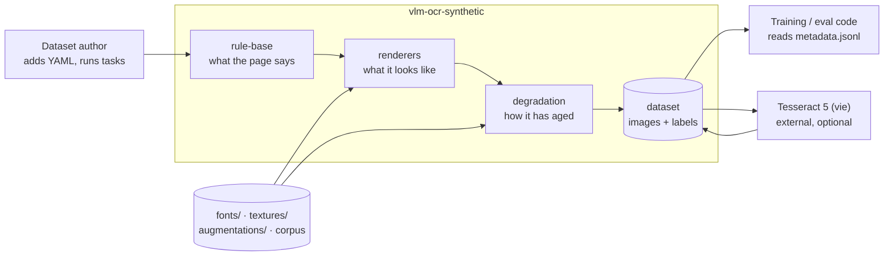

Nothing calls a network service. The external executables are a headless
Chromium (HTML backend), the GTK/Pango stack (WeasyPrint) and Tesseract (the
OCR proof, optional).

### Components

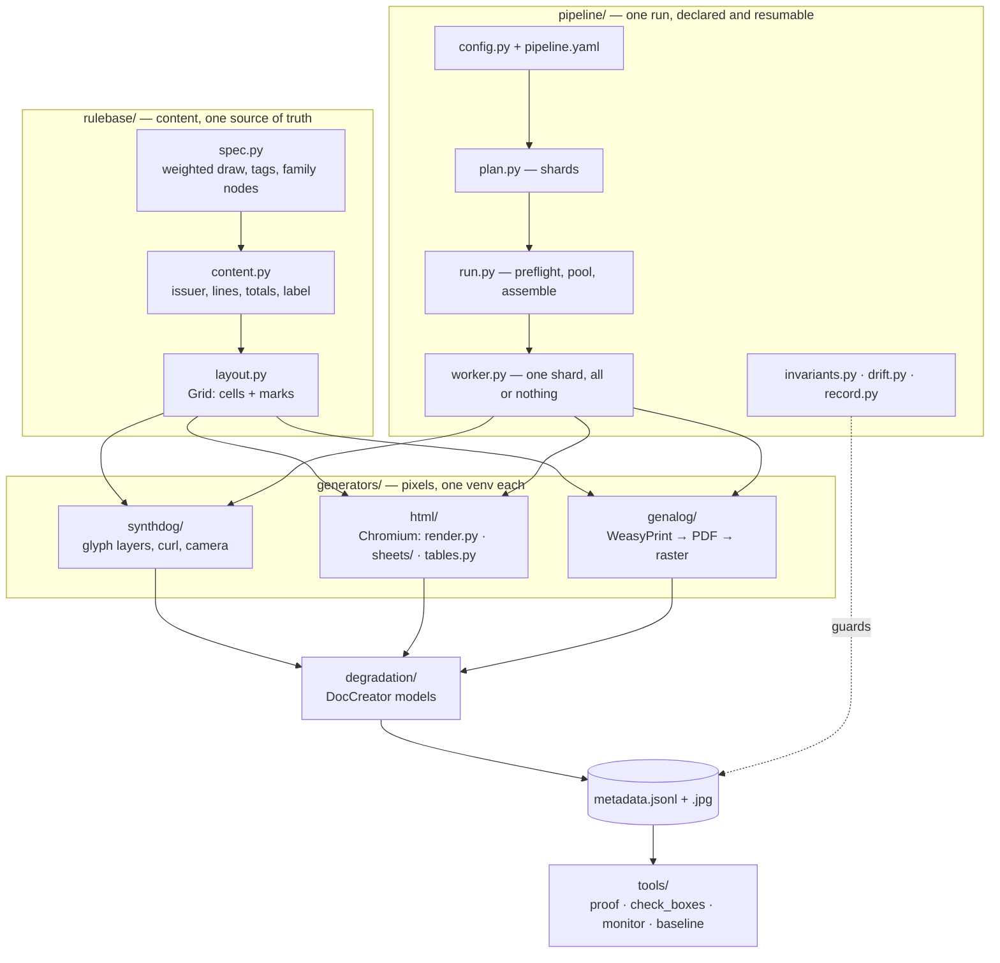

### The pipeline

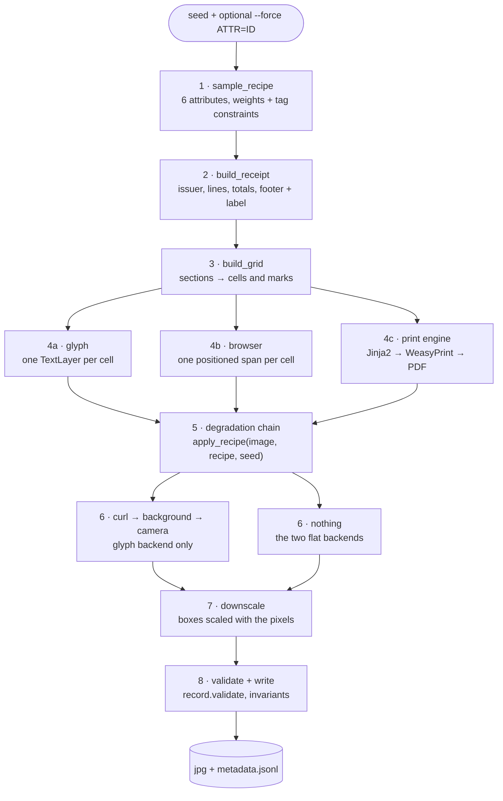

Stage 6 is the only structural divergence: the glyph backend curls the sheet,
drops it on a photographed background and re-photographs it; the other two stop
at a flat sheet.

### The eight stages

| # | stage | implementation | in → out | optional |
| --- | --- | --- | --- | --- |
| 1 | Sample a recipe | [`rulebase/spec.py`](rulebase/spec.py) `sample_recipe` | seed → `Recipe` (6 attributes + tags) | no |
| 2 | Build the document | [`rulebase/content.py`](rulebase/content.py) `build` | `Recipe` → `Receipt` + `gt_parse` | no |
| 3 | Lay it out | [`rulebase/layout.py`](rulebase/layout.py) `build_grid` | `Receipt` + layout → `Grid` (`Cell`s + `Mark`s) | no |
| 4 | Draw it | `generators/*/render.py` | `Grid` → pixels + boxes | one of three |
| 5 | Age it | [`degradation/pipeline.py`](degradation/pipeline.py) `apply_recipe` | image → image, **same size** | yes — empty for `augmentation=pristine` |
| 6 | Photograph it | [`generators/synthdog/elements/warp.py`](generators/synthdog/elements/warp.py) | image + quads → scene + warped quads | glyph backend only; off with `--clean` |
| 7 | Downscale | each `render.py` | image + boxes × factor | skipped if already small |
| 8 | Validate and write | [`pipeline/record.py`](pipeline/record.py), [`pipeline/invariants.py`](pipeline/invariants.py) | → `.jpg` + one metadata line | no |

Stages 1–3 are pure content and need no image library — which is why
[CI](.github/workflows/ci.yml) can test them with nothing but `pytest` and
`pyyaml`.

### Sequence: one run

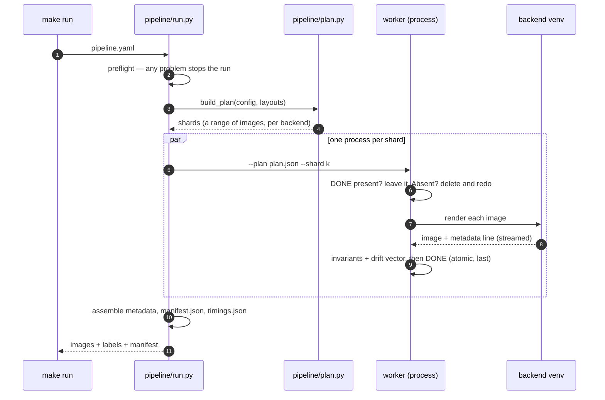

---

## The two render paths

A page is laid out on a **character grid**: every field sits at a row and a
column range measured in character widths. That is the right model for a
thermal till roll — which really is a monospace device — and it is what lets
three different text engines put the same word in the same column.

It is the wrong model for a printed VAT form, which has a logo, ruled table
cells, proportional type at four sizes and a signature block. So there is a
second path:

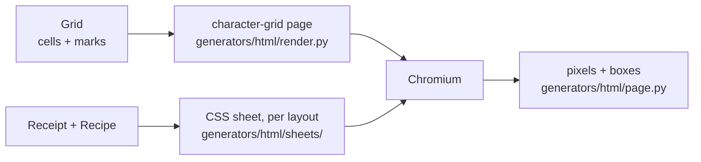

Both paths produce the same boxes through the same
[`page.py`](generators/html/page.py) helper, so the label schema does not know
which drew the page. The CSS path is opt-in per run (`render.py --template`),
and the sheet it draws follows **`recipe.layout.id`** — a hotel folio comes out
a hotel folio, not a tax form. `sheets/` groups the sixteen layouts into six
families, each modelled on one of the hand-drawn references in
[`samples/invoice-templates/`](samples/invoice-templates); which blocks and
which columns a member gets is read from its own layout file. **Both HTML
backends draw it**: Chromium reads the boxes off the DOM, WeasyPrint off the
PDF's character stream, and the markup is the same string.

Between the two sit cheaper seams, and they follow one rule: **the rule-base
states geometry in its own units, and each backend does the one multiplication
it was already doing.** Nothing new is learned by any renderer.

| seam | a layout says | what it buys |
| --- | --- | --- |
| **marks** — [`rulebase/layout.py`](rulebase/layout.py) | `rules: marks` | rules, shaded boxes and frames on the *same* coordinate system as a cell, so a form stops being drawn out of `---`. A till roll keeps ASCII rules, because a thermal head really does print them as characters |
| **cut sheets** — [`rulebase/style.py`](rulebase/style.py) | `sheet: a4` | a page whose height is decided *before* printing. A three-line invoice still fills the sheet, and the white space under it is part of what the document looks like. No name means a continuous roll, which has no bottom edge until the cutter makes one |

Eleven of the sixteen layouts are on a cut sheet; the five till receipts are on a roll.

---

## Adding a document kind

This is the path the repository is built around, and it is mostly YAML.

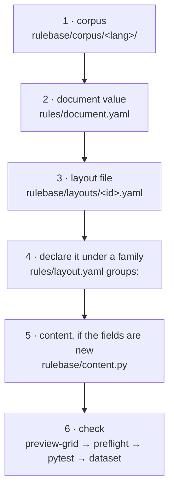

| step | where | notes |
| --- | --- | --- |
| 1 | [`rulebase/corpus/`](rulebase/corpus) | the strings the document prints; one file per kind of line |
| 2 | [`rules/document.yaml`](rulebase/rules/document.yaml) | a value with a `weight`, the `tags` it sets, and `params` (`profile`, `num_items`, `titles`, …) |
| 3 | [`rulebase/layouts/`](rulebase/layouts) | `sections:`, columns, and the form keys (`letterhead`, `parties`, `table`, `vat_summary`, `words`, `signatures`) |
| 4 | [`rules/layout.yaml`](rulebase/rules/layout.yaml) | under the **family node** it joins; the node's `tags`/`requires`/`excludes` are unioned into every value below it, so a family-wide constraint is written once and a later layout cannot forget it |
| 5 | [`rulebase/content.py`](rulebase/content.py) | only if the document carries fields no existing kind has |
| 6 | — | `make preview-grid LAYOUT=<id>`, `make preflight`, `python -m pytest`, then a small `make dataset` |

Nothing in `generators/` changes. A new layout is drawn by all three renderers
the day it is declared, because they consume the `Grid` and not the layout file.

The same shape applies to the other axes:

| to add | edit | nothing else changes |
| --- | --- | --- |
| a **document kind** | `rules/document.yaml` + `layouts/*.yaml` | the renderers |
| a **layout family** | a `groups:` node in `rules/layout.yaml` | the sampler discovers it |
| a **sampling attribute** | a new `rules/<name>.yaml` + a line in [`_order.yaml`](rulebase/rules/_order.yaml) | the attribute list is read, not hard-coded |
| an **ageing effect** | a module in [`degradation/`](degradation) + its name in the registry | all three backends get it |
| a **paper stock** | a file in [`textures/paper/`](textures/paper) named by `visual.paper` | the chain resolves it |
| a **seal or flourish** | a draw function in [`tools/make_ornaments.py`](tools/make_ornaments.py) + a `marks:` entry in `rules/ornament.yaml` | preflight checks both directions |
| a **sheet size** | one entry in `SHEETS` in [`rulebase/style.py`](rulebase/style.py) | every backend, which only reads the ratio |
| a **renderer** | a `render.py` that consumes a `Grid` and writes a metadata line | the rule-base |

Full guide, with the grammar of a layout file and the section list:
**[`rulebase/README.md`](rulebase/README.md)**.

### Why the order of the seven attributes matters

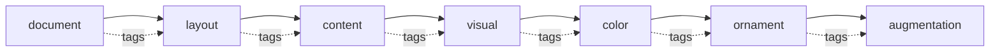

Each attribute sees the tags the earlier ones set, and a value may only
`require` a tag an **earlier** attribute sets. So the order decides which
constraints are expressible at all. It is causal, not alphabetical: a shop
decides what it prints long before the paper decides how it will crease.

---

## The three renderers

| | [`generators/synthdog/`](generators/synthdog) | [`generators/html/`](generators/html) | [`generators/genalog/`](generators/genalog) |
| --- | --- | --- | --- |
| **engine** | [synthtiger](https://github.com/clovaai/synthtiger) glyph layers | Chromium, headless, via Playwright | [genalog](https://github.com/microsoft/genalog) → WeasyPrint → PyMuPDF |
| **output** | a **photograph** of a page on a table | a **flat scan** | a **print / photocopy** |
| **text layout** | ours, per glyph | the browser's | WeasyPrint's |
| **geometry** | curl, perspective, lighting, background | none | page box, real pagination |
| **box source** | the `TextLayer` it positioned, through the same warp as the pixels | `getBoundingClientRect()`, × device scale × downscale | the PDF's text layer via PyMuPDF, × `dpi/72` × downscale |
| **quads** | rotated by the curl | axis-aligned | axis-aligned |
| **Python** | **3.8 – 3.11** (enforced in [`tasks.py`](tasks.py)) | 3.9+ | 3.9+ |
| **extra install** | — | a browser | GTK (Pango, cairo) |

Three, rather than one, because the disagreement is the training signal: a
model that has only seen browser screenshots has not met a print engine's text
shaping, and one that has only seen flat scans has never seen a page lying
under a lamp. The glyph backend is the hard end of that curve and the print
engine the easy end.

**No renderer re-reads its own output.** Boxes come from the engine that drew
the text, so a box cannot inherit a recognition error.

---

## Degradation

[`degradation/`](degradation/README.md) is a Python port of the degradation
models from [DocCreator](https://github.com/DocCreator/DocCreator) (Journet,
Mansencal, Kieu et al., LaBRI Bordeaux). It runs on whatever a renderer
produced, so the same ageing applies to all three — one implementation, not
three that share a name.

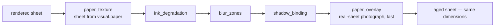

That chain is `augmentation=medium`, copied from
[`rules/augmentation.yaml`](rulebase/rules/augmentation.yaml); each image runs
whichever chain its recipe drew, in order, sharing one seeded rng. Order is not
commutative — ink decay before blur reads as worn ink that was scanned badly,
the other way round as a smudged scan.

Ten models are registered (`make list-degradations`). Four **paste a texture**
rather than filter — `paper_texture`, `paper_overlay`, `gradient_domain`
(Poisson blending) and `phantom_character` — and they are the ones that stop a
synthetic page looking synthetic. The rest filter (`ink_degradation`,
`bleed_through`, `blur_zones`, `blur`, `shadow_binding`) or tear (`holes`).

**Ageing must not move a pixel.** The HTML backend asserts the image dimensions
are unchanged after `apply_recipe`, because a resize slipped into a chain would
shift every box without changing anything visible.

Three directories hold surface photographs and are easy to confuse; what
separates them is *where in the pipeline they enter*:

| directory | when | what it is |
| --- | --- | --- |
| [`textures/paper/`](textures/paper) | head of the chain | the sheet the text is printed on — multiplied in, so ink stays ink |
| [`augmentations/data/image/`](augmentations/data/image) | last step | a photograph of a real sheet laid over the finished page, ink included |
| [`textures/background/`](textures/background) | after ageing, glyph backend only | the scene the sheet is photographed on |

---

## Running at scale

`make dataset` is a thin shell over the same machinery. For a long job, declare
it in [`pipeline.yaml`](pipeline.yaml) and use `make run`:

```yaml
run:      {out: data/run01, per_backend: 20, seed: 2026, workers: auto, pairing: paired}
backends: [synthdog, html, genalog]
shard:    {size: 100}
overrides: {}
quality:  {drift_tolerance: 0.15, sample_for_ocr: 500}
```

| property | what it buys | where |
| --- | --- | --- |
| **Unknown keys raise** | a config with `ouput:` in it does not silently run on the default | [`pipeline/config.py`](pipeline/config.py) |
| **Shards are ranges, not layouts** | a worker can hold one browser for a whole shard | [`pipeline/plan.py`](pipeline/plan.py) |
| **One renderer process per shard** | the renderer takes a job list, not one layout, so interpreter and backend start-up are paid once instead of once per layout — 1.43 images per process became 20, and the same plan went from 140s to 98s | [`worklist.py`](worklist.py), [`pipeline/worker.py`](pipeline/worker.py) |
| **Resume is all-or-nothing** | `DONE` is written last and atomically; a shard without one is deleted and redone, never appended to — appending duplicates records, and duplicates in a training set are invisible | [`pipeline/worker.py`](pipeline/worker.py) |
| **Processes, never threads** | Playwright's sync API is not thread-safe and synthtiger seeds numpy's global RNG | [`pipeline/run.py`](pipeline/run.py) |
| **The layout list is explicit** | `run.layouts` empty means every file in `rulebase/layouts/` — what a dataset wants. A *fixed comparison* names them, because the quota walks the list in order and a run that took the directory draws a different set the day someone adds a layout | `pipeline.yaml` |
| **`pairing` is declared** | `paired` (default) gives every backend the same documents, so a difference between renderers is a difference in drawing; `independent` gives three times the distinct pages and no basis for comparison | `run.pairing` |
| **The page model is declared** | `run.template` draws the CSS sheets in [`generators/html/sheets/`](generators/html/sheets) instead of the character grid, and lands in `dataset.json` so a reader need not guess from the pixels. Only the two HTML backends can print one, and a run that asks for a sheet while listing `synthdog` is refused rather than quietly mixed | `run.template` |
| **Per-image invariants** | money arithmetic, quads inside the frame, no missing-glyph box, every label value actually printed | [`pipeline/invariants.py`](pipeline/invariants.py) |
| **Drift** | whether the *mix* still matches the rules, measured per shard above the scatter a sample that size has anyway | [`pipeline/drift.py`](pipeline/drift.py) |
| **A golden fingerprint** | sha256 of every image and every metadata line, so the parallel path is held to what the sequential one produced. Replacing it needs `make baseline-write REASON="..."`, and the reason is kept in the file — a comparison point that changed without saying why is one nobody can argue with later | [`tools/baseline.py`](tools/baseline.py), `make baseline-verify` |
| **No durations in the manifest** | one worker and eight must produce byte-identical output; timings go to `timings.json` | `manifest.json` |

Watch a run while it is still going — `manifest.json` is written once, at the
end, which is not when anyone wants to look:

```bash
make monitor                       # the whole rule space, no run needed
make monitor RUN=data/run01        # a run in progress, read from its shards
```

### Where the time goes

```bash
make profile                       # every stage, every renderer -> data/profile/
```

Times each of the nine stages — sampling, content, layout, render, geometry,
degradation, annotation, validation, export — separately per renderer and per
ageing model, and writes a machine-readable cost model beside the table so a
later run can be *predicted* and the prediction compared with the clock. The
current numbers and the conditions they were taken under are in
[`data/profile/README.md`](data/profile/README.md); the short version:

| | synthdog | html | genalog |
| --- | ---: | ---: | ---: |
| seconds an image | 3.1 | 1.4 | 0.9 |
| dearest stage | `geometry` 55% | `render` 44% | `degradation` 54% |

Three things it found that reading the code would not have:

* **The dearest stage of the glyph renderer is not drawing.** Curl, canvas,
  background and camera effects are 55% of a synthdog image — more than the
  render and the ageing together.
* **`gradient_domain` is not the bottleneck** it had been assumed to be: 4% of
  all the ageing time, which is about 1% of a run.
* **The largest single lever is the shape of the plan, not any renderer.** A
  shard used to start one renderer process per *layout*, so twenty images over
  fourteen layouts started fourteen processes and paid start-up fourteen times
  — between 23% and 44% of the run depending on the backend. Fixed in W3b; the
  cost model predicted the saving to within 7.3% before the change was made.

The instrument is off unless asked for: `profiling.stage()` returns a shared
no-op object, `make baseline-verify` is green with it in place, and one worker
and eight still produce byte-identical output.

---

## What comes out

One `metadata.jsonl` line per image, the same shape from every renderer, its
keys fixed by [`pipeline/record.py`](pipeline/record.py) and validated on the
way out:

| field | |
| --- | --- |
| `file_name` | the image, relative to the backend's directory |
| `ground_truth` | CORD-style nested label, as a **JSON string** |
| `text_sequence` | flat reading order, for pre-training and OCR scoring |
| `recipe` | the seed and all six sampled attributes with their params |
| `boxes` | one `{kind, text, quad}` per drawn field; `quad` is four `[x, y]` corners |
| `framework`, `layout` | which renderer drew it, and from which layout |

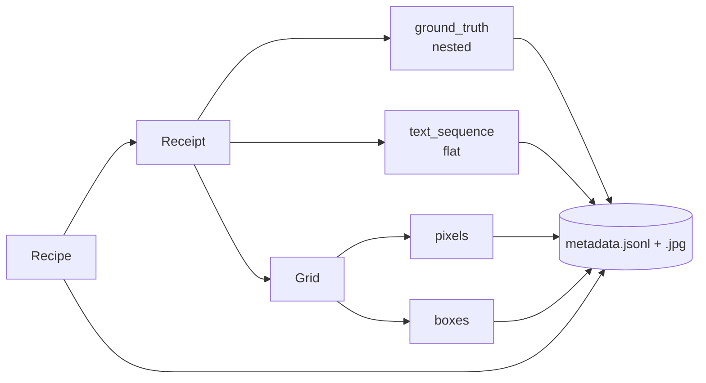

Two properties are worth knowing before writing a loader:

**Boxes are the definition of "printed".** `text_sequence` is built from the
`Receipt`, so it can list a field the layout had no room for; `boxes` comes
from the renderer's own geometry, one per drawn cell. `pipeline/invariants.py`
checks the label against the boxes for that reason, and
[`tools/check_boxes.py`](tools/check_boxes.py) checks the boxes against the
pixels.

**The seed alone does not reproduce a page.** Pinning an attribute changes the
tags it sets, so everything drawn afterwards diverges. Pin all six back:

```python
force = {name: value["id"] for name, value in record["recipe"]["attributes"].items()}
recipe, receipt, grid = rulebase.make(seed=record["recipe"]["seed"], force=force)
```

---

## What it looks like

The figures below are built by
[`docs/figures/make_figures.py`](docs/figures/make_figures.py) — **documentation
code**: it only crops, scales, labels and tiles pixels that a renderer already
produced, so it cannot show anything the generator did not.

```bash
python docs/figures/make_figures.py      # from data/dataset60 and its clean twin
```

### One page per document family

What the rule-base covers today. Each family is a parent node in
`rules/layout.yaml`; the figure reads the node list rather than hard-coding it,
so a family added tomorrow appears without editing the script.

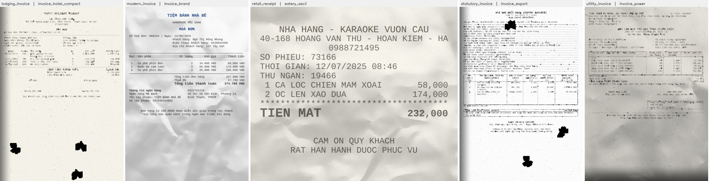

### One document, three engines

The committed sets are **paired**, so this really is one document photographed,
scanned and printed — not three similar pages.

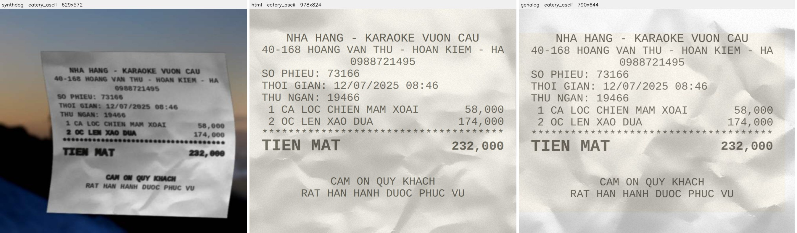

### With and without the degradation chain

The aged and clean sets come from the same seeds; the figure script asserts the
two recipes differ in exactly one attribute — `augmentation` — before drawing.

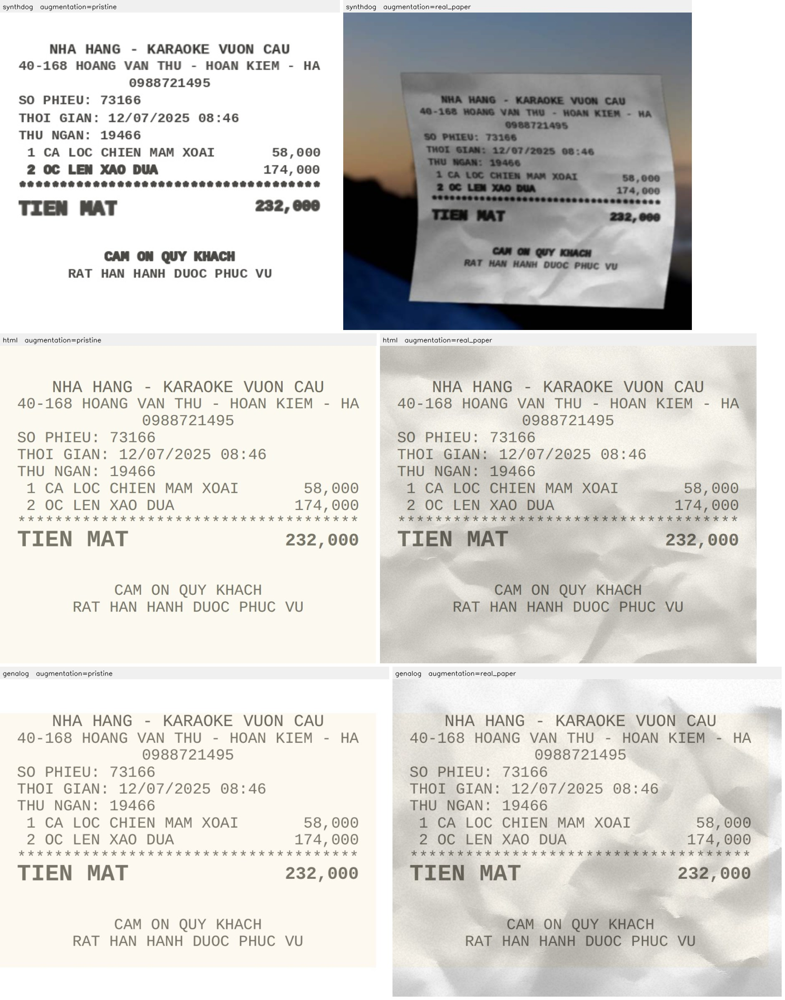

The glyph pair also shows stage 6: with `--clean` the curl, perspective and
camera are off, so the sheet fills the frame with no background at all.

### The labels, drawn on the pixels

Green for text fields, orange for amounts.

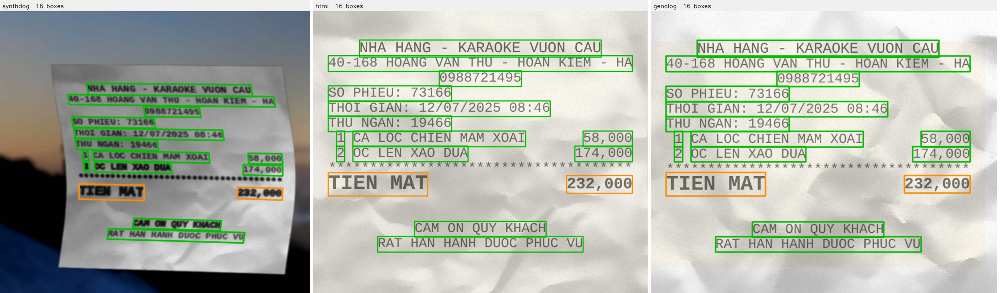

The quads follow the paper curl on the left and are axis-aligned in the middle
and on the right — but the schema and the `kind` vocabulary are identical, so
one loader reads all three.

### One image per degradation model

Committed under [`samples/degradation/`](samples/degradation): every model
applied **on its own** to the same page, plus a contact sheet. Run the whole
chain and you cannot tell which step caused what.

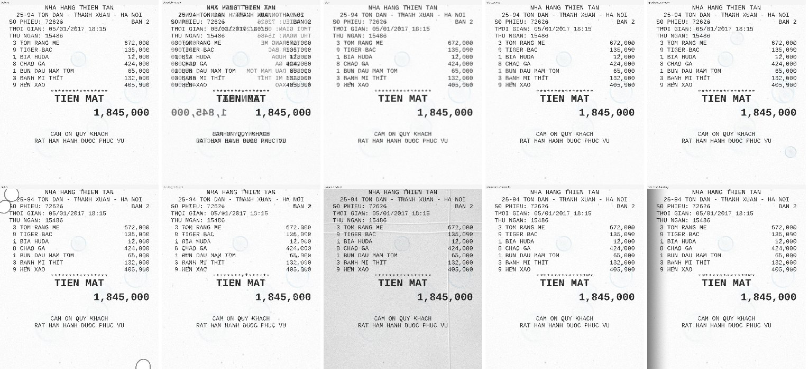

Regenerate with `make showcase`. The parameters there are chosen to be
*visible*, not realistic.

### The grid, before any pixel is drawn

`make preview-grid` prints a sampled document in the character grid the
renderers will draw — the fastest way to check a layout change. Actual output,
trimmed:

```text
seed=18  document=pub_eatery  layout=eatery_indexed  content=diacritics_upper
             QUÁN NHẬU SEN VÀNG 251
   235 PHAN XÍCH LONG - NGÔ QUYỀN - HẢI PHÒNG
               HOÁ ĐƠN THANH TOÁN
SỐ PHIẾU: 57376                           BÀN 33
STT   SỐ LƯỢNG         GIÁ                  TIỀN
  1 NƯỚC NGỌT CHAI
             4      15.000                60.000
       ----------------------------------
TIỀN HÀNG                                794.000
```

---

## Repository structure

```
rulebase/               THE RULE-BASE — one source of truth for content
├── rules/              7 attributes, one file each; layout.yaml has families
├── layouts/            one file per layout, measured off real paper
├── corpus/vi/ en/      the strings a document prints
├── spec.py             weighted draw, tags, parent nodes
├── content.py          fills the fields, builds the label
└── layout.py           Receipt + layout -> Grid (cells + marks)

generators/             THE RENDERERS — each with its own venv
├── synthdog/           glyph rendering, curl, background, camera
├── html/               Chromium
│   ├── render.py       the character-grid page
│   ├── sheets/         one CSS sheet per layout family
│   ├── tables.py       generic tables, labelled by structure
│   └── page.py         shared: the browser, the fonts, the boxes
└── genalog/            genalog + WeasyPrint (source vendored)

pipeline/               ONE RUN — declared, sharded, resumable, checked
├── config.py           pipeline.yaml, with unknown keys rejected
├── plan.py             shards, deterministically
├── worker.py           one shard, completely or not at all
├── run.py              preflight, a pool of processes, assemble
├── record.py           the shape of one metadata line
├── invariants.py       what must be true of every image
├── drift.py            has the mix stopped matching the rules
└── preflight.py        every check that must pass before drawing

degradation/            DocCreator's models, ported — all backends call this
textures/ fonts/ augmentations/   the assets a page is drawn with and onto
data/                   generated datasets
samples/                curated examples: degradation showcase, reference
                        sheets, the ornament contact sheet
tools/                  drivers: dataset, proof, boxes, monitor, baseline
docs/                   notes that outlive any one generator, plus figures
tasks.py                every task, and the only definition of them
```

Where to look for a thing:

| you want | it is in |
| --- | --- |
| to add a document kind | [`rulebase/README.md`](rulebase/README.md), and the [checklist above](#adding-a-document-kind) |
| to change what a document says | [`rulebase/corpus/`](rulebase/corpus), [`rules/content.yaml`](rulebase/rules/content.yaml) |
| to change how often something appears | the `weight:` fields in [`rulebase/rules/`](rulebase/rules) |
| to change how a page is drawn | `generators/<renderer>/render.py` |
| to make pages look old or scanned | [`degradation/`](degradation/README.md) |
| to run a long job | [`pipeline.yaml`](pipeline.yaml) and `make run` |
| to run anything at all | `make help` — the tasks are there, not in a directory |
| why a version is pinned | [`docs/python-versions.md`](docs/python-versions.md) |
| to run it on Windows | [`docs/windows.md`](docs/windows.md) |
| how a renderer works, function by function | [`docs/huong-dan-va-giai-thich.md`](docs/huong-dan-va-giai-thich.md) (Vietnamese) |

---

## Requirements

| | |
| --- | --- |
| **Python** | 3.8 – 3.11 for the glyph renderer (hard cap, enforced); 3.9+ for the other two. The task runner itself uses only the standard library. |
| **Disk** | one virtualenv per renderer — measured here: synthdog 624 MB, html 450 MB, genalog 397 MB |
| **System — html** | a Chromium build. Containers with one under `/opt/pw-browsers` or `/usr/bin/chromium` are found automatically; elsewhere Playwright downloads its own. |
| **System — genalog** | GTK (Pango, cairo) for WeasyPrint. Present on most Linux distributions; a manual install on Windows. |
| **System — `make proof`** | Tesseract 5 with the `vie` language pack. Optional. |

There is no installable package and no shared virtualenv: synthtiger pins
`pillow<10` while WeasyPrint needs a modern one, so the three cannot share an
interpreter. [`pyproject.toml`](pyproject.toml) exists only to configure ruff
and pytest.

## Installation

```bash
make setup             # all three
make setup-synthdog    # synthtiger        (Python 3.8-3.11)
make setup-html        # playwright + a headless browser
make setup-genalog     # WeasyPrint + PyMuPDF
```

`setup-synthdog` refuses to run on Python 3.12+ and names the interpreter to use
instead; the reason is measured in
[`docs/python-versions.md`](docs/python-versions.md).

## Tasks

`make help` (or `python tasks.py` with no argument) lists them. Both spellings
are equivalent — `make dataset N=5 DATASET=/tmp/x` is
`python tasks.py dataset -n 5 -o /tmp/x`.

| group | tasks |
| --- | --- |
| **setup** | `setup`, `setup-synthdog`, `setup-html`, `setup-genalog`, `textures` |
| **generate** | `dataset`, `dataset-clean`, `run`, `tables`, `receipts`, `preview`, `preview-grid` |
| **check** | `preflight`, `check-rules`, `check-corpus`, `check-boxes`, `proof`, `baseline-write`, `baseline-verify` |
| **inspect** | `distribution`, `monitor`, `list-degradations`, `showcase`, `profile` |
| **quality** | `check`, `lint`, `format`, `clean` |

## Usage

### Renderer CLIs

All three take the same flags, so a page can be pinned identically whichever
engine draws it:

```bash
cd generators/synthdog          # run from its own directory: config paths are relative
./.venv/bin/python render.py -o outputs -c 10 --seed 2026 --layout invoice_vat_form

generators/html/.venv/bin/python generators/html/render.py \
    -o outputs -c 10 --seed 2026 --force augmentation=pristine

generators/genalog/.venv/bin/python generators/genalog/render.py \
    -o outputs -c 10 --seed 2026 --dpi 150
```

| flag | meaning |
| --- | --- |
| `-o, --out` · `-c, --count` · `--seed` | where, how many, base seed (image *i* uses `seed + i`) |
| `--layout ID` | pin the layout — shorthand for `--force layout=ID` |
| `--force ATTR=ID` | pin any attribute, repeatable |
| `--clean` | glyph backend: no curl, no perspective, no camera |
| `--template [LAYOUT]` | both HTML backends: lay the page out with CSS instead of the grid ([`sheets/`](generators/html/sheets)). Bare, the sheet follows the layout the recipe drew; a layout id forces one particular dress |
| `--scale` · `--dpi` | html device scale factor · genalog rasterisation dpi |
| `--profile JSON` | time every stage and write the breakdown there. Off by default, and off costs nothing ([`profiling.py`](profiling.py)) |
| `--jobs JSON` | draw several layouts in one process — a list of `{layout, seed, count, force}`. Overrides the three flags above it; see [`worklist.py`](worklist.py) |

A pinned value must still satisfy its own `requires`/`excludes`; if it cannot,
the sampler names the tags at fault rather than drawing something else.

### Python API

```python
import rulebase

recipe, receipt, grid = rulebase.make(seed=7)

recipe.layout.id                      # which layout was drawn
recipe.get("visual", "font_size")     # any attribute's params
receipt.ground_truth()                # CORD-style nested label
grid.cells[0], grid.marks             # text, and everything that is not text
```

```python
from degradation.pipeline import apply_recipe
aged = apply_recipe(image_bgr, recipe, seed=recipe.seed)   # same dimensions out
```

---

## Quality gates

Each catches a different class of failure, and most failures here are *silent* —
a typo'd tag does not raise, it makes one value undrawable and generation
carries on.

| command | what it catches |
| --- | --- |
| `make preflight` | unreachable rule values, missing layouts and papers, unknown degradations, corpus gaps, and **glyph coverage over every character the rules can print** — wider than the corpus, because uppercase Vietnamese uses different codepoints |
| `python -m pytest` | the content layer: sampling, layout, text, the pipeline plan, drift, invariants |
| `make check-rules` / `check-corpus` | the rules and corpus, on their own |
| `make check-boxes` | the boxes still describe the pixels: coverage, inside the frame, ink underneath |
| `make baseline-verify` | the generator still produces exactly what it produced, image hash by image hash |
| `make proof` | an OCR engine can actually read the images, scored order-free against the labels |
| `make distribution` / `make monitor` | what the rules really draw, which is not what the weights say |
| `make check` / `make lint` | every tracked file parses; ruff on the first-party code |

A preflight check that could not *run* — a missing library rather than a broken
rule — is prefixed `unchecked:` and still fails, because a job that starts
without knowing is what preflight exists to prevent.

Verified in this environment (Python 3.11.15, 4 cores, all three venvs built):

| command | result |
| --- | --- |
| `python -m pytest` | 417 passed, 1 xfailed, 59 s |
| `python tasks.py check` | all 64 python files compile |
| `python tasks.py lint` | ruff: all checks passed |
| `python tasks.py preflight` | clean, ~15 s (glyph coverage over 16 layouts' strings) |
| `python tasks.py check-rules` / `check-corpus` | valid — vi 12 corpus files, en 5 |
| `python tasks.py distribution` | 2000 / 2000 draws succeeded, over 16 layouts in 6 families |
| `python tasks.py check-boxes` on both committed sets | 1330 boxes per renderer, all match |
| `python tools/generate_dataset.py -n 14 --workers 3` | 42 images, all 14 layouts, 3 shards |
| `python pipeline/run.py` (6 shards, 3 workers) | 18 images; a second run reported 0 unfinished and did nothing — resume works |
| `python tasks.py tables -n 3` | 3 tables, no chromedriver and no fourth environment |
| `python tools/degradation_showcase.py` | 10 degradation models |
| `python tasks.py monitor` | the whole rule space, no run needed |
| `generators/html/render.py --template` (120 pages) | the CSS sheets, all 14 layouts, 8512 boxes, 0 invariant failures, 0 overlapping pairs |
| `generators/genalog/render.py --template` (100 pages) | the same sheets through WeasyPrint, 7206 boxes, 0 invariant failures, 0 overlapping pairs |

One gate did **not** pass here; it is recorded under
[Known issues](#known-issues).

---

## Datasets

Two labelled sets and one table set are committed, so the output can be
inspected without building anything. Their contents, the label schema and how
to rebuild an image exactly are in **[`data/README.md`](data/README.md)**.

| set | |
| --- | --- |
| [`data/dataset60/`](data/dataset60) | aged — a degradation chain drawn from the rules |
| [`data/dataset60_clean/`](data/dataset60_clean) | the same seeds with `augmentation=pristine` |
| [`data/invoices54/`](data/invoices54) | the nine commercial invoice layouts drawn as CSS sheets, by both HTML backends |
| [`data/forms16/`](data/forms16) | a hospital cost statement and an authorisation to collect — the two documents here that are not a sale |
| [`data/tables60/`](data/tables60) | table-structure images, a different task and a different label |

`make proof` reads a set back with Tesseract 5 (`vie`) and scores it order-free
— Tesseract reads a two-column page in whatever order its layout analysis
picks, so comparing its output to the label as one string would measure reading
order rather than recognition. The scores live with the sets, in
[`data/dataset60/proof/README.md`](data/dataset60/proof/README.md).

Table images come from [`generators/html/tables.py`](generators/html/tables.py),
on the browser the html backend already launches. The label is PubTabNet-style
— the `<td>` token sequence, the spans, a box per cell — so anything that reads
PubTabNet or PP-Structure reads this. It teaches **structure, not reading**;
use the document sets for anything about text.

---

## Troubleshooting

| symptom | cause and fix |
| --- | --- |
| `synthdog needs Python 3.8-3.11, this is 3.12…` | the cap is real, not caution: `py -3.11 tasks.py setup-synthdog`. Measurements in [`docs/python-versions.md`](docs/python-versions.md). |
| `ModuleNotFoundError: No module named 'cairocffi'` from a genalog render | the vendored `genalog/generation/document.py` imports it at module scope. It is in `generators/genalog/requirements.txt`; rebuild with `make setup-genalog`. |
| `could not launch Chromium` | install one *only if* the machine has none: `generators/html/.venv/bin/python -m playwright install chromium`. Do **not** run that in a container that already ships one under `/opt/pw-browsers`. |
| WeasyPrint fails on a cairo/Pango import | GTK is missing. Linux: the distribution's GTK/Pango packages. Windows: [`docs/windows.md`](docs/windows.md). |
| `CERTIFICATE_VERIFY_FAILED` during `make setup` | an inspecting proxy, not a repository problem. The task prints the fix; alternatives are in [`docs/windows.md`](docs/windows.md). |
| `no interpreter at …/.venv/bin/python` | that renderer's environment was never built: `make setup-<renderer>`. |
| a rule value never appears in the output | almost always a typo'd tag, which is silent. `make check-rules`, then `make distribution`. |
| `unchecked: fontTools is not installed` from preflight | glyph coverage could not be verified. `pip install fonttools` — "I could not look" is not "it is fine". |
| a font prints empty boxes | missing Vietnamese glyphs. `generators/synthdog/.venv/bin/python generators/synthdog/tools/check_fonts.py fonts/mono`. |
| a shard is redone instead of resumed | it has no `DONE` file, so it was incomplete. That is the design: appending to a half-written `metadata.jsonl` duplicates records. |
| `make baseline-write` refuses to run | it needs `REASON="..."`. A recapture is a claim that the old pixels were wrong and the new ones are right; the reason is kept in the golden file. |
| `CÙNG KẾ HOẠCH, KHÁC PIXEL` from `baseline-verify` | the plan's inputs did not move but the images did — a regression until shown otherwise. Diff before reaching for `baseline-write`. |

## Limitations

- **Vietnamese documents, plus one English invoice kind.** One corpus family,
  one country's paper conventions.
- **No training or inference code.** The repository produces data; Tesseract is
  run only as a check.
- **Only the glyph renderer produces rotated boxes.** A detector trained on the
  two flat backends alone has never seen a non-axis-aligned quad.
- **`text_sequence` is a canonical order**, not the order an eye or an OCR
  engine follows on a two-column page — which is why the proof scores
  order-free.
- **Table images teach layout, not language**, and have no OCR proof: the right
  metric for table structure is TEDS, which is not implemented here.
- **No licence is chosen yet.**

## Known issues

| | |
| --- | --- |
| **`make baseline-verify` reports one differing image here** | `CÙNG KẾ HOẠCH, KHÁC PIXEL: 1 — n14: genalog/genalog_005.jpg differs`. Same plan, same rule hashes, and the metadata line for that image matches — only its pixels differ, 1 of 42, in the print backend alone, and byte-identical across repeated runs here. The golden file records the rules, layouts and corpus it was taken under but not the library versions, and `weasyprint` is unpinned (`>=60`), so a locally built venv can rasterise one page differently. The tool classifies any pixel difference as a regression, which is the right default — it does mean the gate cannot be read as green outside the environment the baseline was captured in. |
| **genalog needs an undeclared dependency** | the vendored `genalog/generation/document.py` imports `cairocffi` at module scope for `render_png()` — a function `render.py` deliberately replaced with `render_pdf()` + PyMuPDF — and WeasyPrint dropped its own cairocffi dependency at version 53. A freshly built environment therefore failed every genalog render, while `setup-genalog`'s smoke test passed because importing `genalog/__init__.py` never reaches that module. **Fixed** by listing the dependency in `generators/genalog/requirements.txt`. |

## Contributing

[CONTRIBUTING.md](CONTRIBUTING.md) covers which environment to build for which
renderer, the checks to run before pushing, and the constraints that are
deliberate. In short: `make check && make lint && make preflight` before
pushing, plus `make preview-grid` and a small `make dataset` if you touched
anything a renderer draws.

Vendored code — the upstream subdirectories of `generators/genalog/` — is
excluded from linting and byte-compiling; the list lives in
[`pyproject.toml`](pyproject.toml) and [`tools/paths.py`](tools/paths.py), and
the two must stay in step.

## Further documentation

| | |
| --- | --- |
| [`rulebase/README.md`](rulebase/README.md) | the rule-base in full: attributes, families, the grammar of a layout file, adding one |
| [`degradation/README.md`](degradation/README.md) | each model and the DocCreator file it came from |
| [`data/README.md`](data/README.md) | the datasets and the label schema |
| [`samples/README.md`](samples/README.md) | reading the degradation showcase |
| [`samples/invoice-templates/README.md`](samples/invoice-templates/README.md) | the five reference sheets, and why they are not layouts |
| [`docs/hoa-tiet-de-xuat.md`](docs/hoa-tiet-de-xuat.md) | ornaments surveyed and not built, with the reason each was left |
| [`docs/khao-sat-sinh-chu-viet-tay.md`](docs/khao-sat-sinh-chu-viet-tay.md) | eight handwriting-synthesis repositories ranked on breadth of data and on realism, for the `handwriting_fill` gap (Vietnamese) |
| [`docs/writevit.md`](docs/writevit.md) | standing up WriteViT for Vietnamese handwriting, and what it measurably cannot write (Vietnamese) |
| [`docs/brief-engine-html.md`](docs/brief-engine-html.md) | the three HTML render paths, what merged cells do and do not do in each, and what a fix has to preserve |
| [`docs/python-versions.md`](docs/python-versions.md) | why the glyph renderer stops below Python 3.12, measured |
| [`docs/windows.md`](docs/windows.md) | Windows setup: Python 3.11, GTK, Tesseract, proxies (Vietnamese) |
| [`docs/huong-dan-va-giai-thich.md`](docs/huong-dan-va-giai-thich.md) | line-by-line walkthrough of all three renderers, with a Q&A (Vietnamese) |
| [`fonts/README.md`](fonts/README.md) | which fonts, which licences, and why coverage is checked |

## Licence

**Not yet chosen — add one before publishing.** Bundled material carries its
own terms: `generators/genalog/` ships [genalog's MIT
licence](generators/genalog/LICENSE); the table model in
[`generators/html/tables.py`](generators/html/tables.py) derives from
TIES_DataGeneration by way of PaddleOCR (Apache-2.0) and says so in the file;
the fonts in `fonts/` are OFL 1.1, Apache 2.0 or Bitstream Vera — see
[`fonts/README.md`](fonts/README.md).

## References

- **SynthDoG / Donut** — Kim et al., *OCR-free Document Understanding
  Transformer*, ECCV 2022. <https://github.com/clovaai/donut>
- **synthtiger** — the layer/effect engine the glyph renderer builds on.
  <https://github.com/clovaai/synthtiger>
- **genalog** — Microsoft's synthetic document generator, vendored under
  `generators/genalog/genalog/`. <https://github.com/microsoft/genalog>
- **DocCreator** — Journet, Mansencal, Kieu et al., LaBRI Bordeaux; the
  degradation models are ported from it.
  <https://github.com/DocCreator/DocCreator>
- **Gradient-domain stains** — Seuret, Chen, Eichenberger, Liwicki & Ingold,
  ICDAR 2015.
- **TIES_DataGeneration** — the table model.
  <https://github.com/hassan-mahmood/TIES_DataGeneration>
- **CORD** — the receipt-parsing label schema `ground_truth` follows.
  <https://github.com/clovaai/cord>
