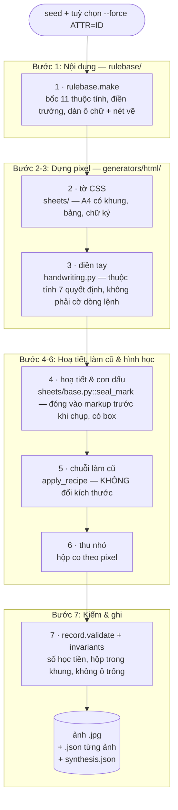
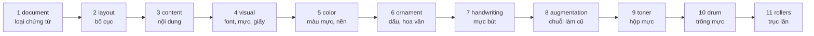
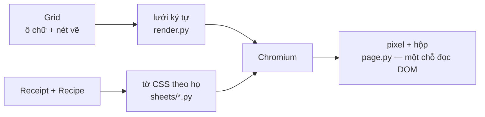
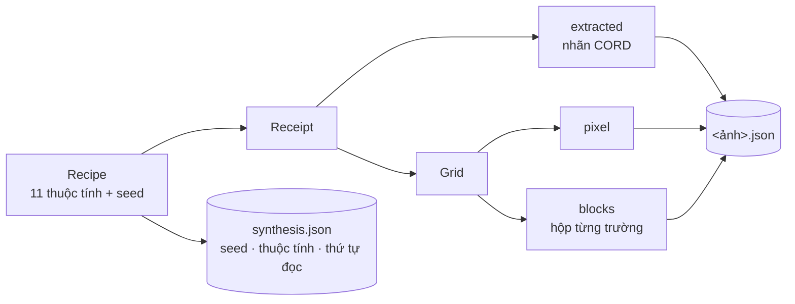
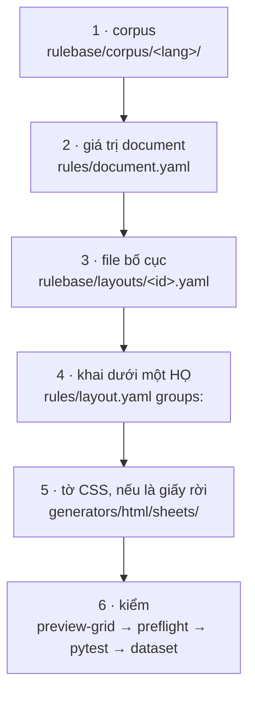
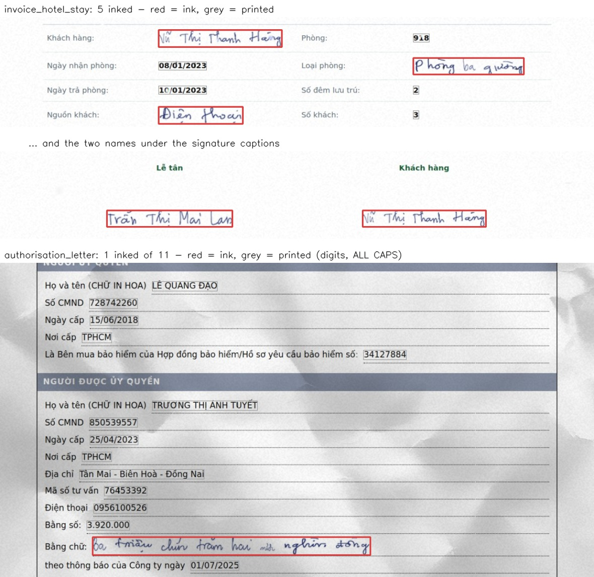
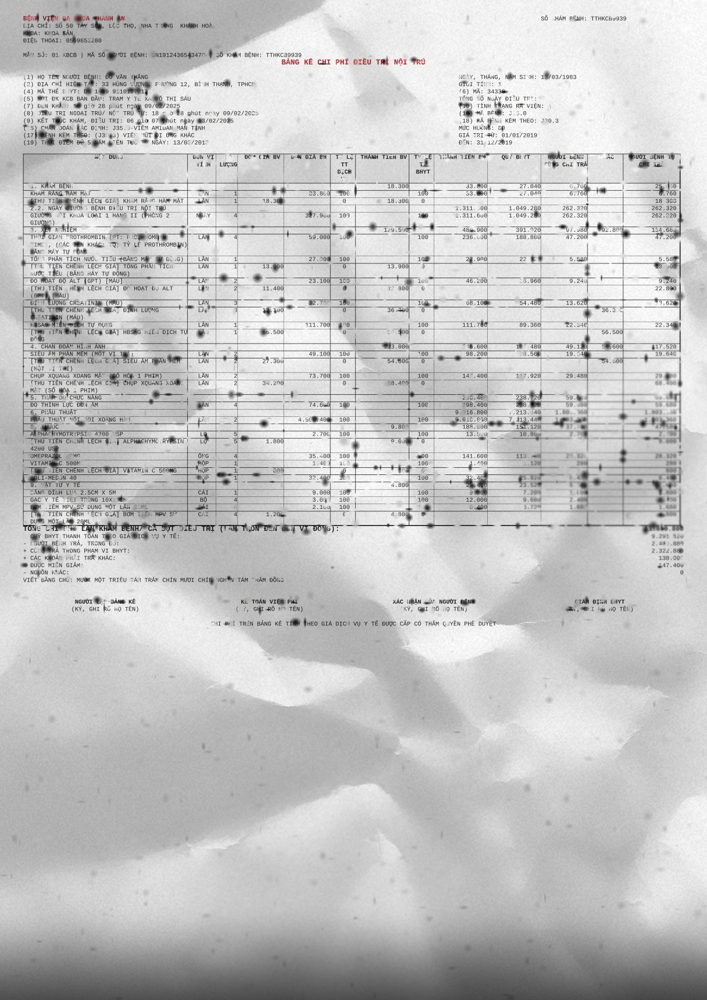

# 📄 vlm-ocr-synthetic — Bộ sinh ảnh chứng từ Việt Nam có nhãn

> **Kho:** [LinhPhuong14/vlm-ocr-synthetic](https://github.com/LinhPhuong14/vlm-ocr-synthetic)
> **One-liner:** Một luật sinh + một renderer → ảnh hoá đơn / biểu mẫu Việt Nam kèm nhãn CORD lồng nhau, hộp từng trường, và toàn bộ công thức đã sinh ra nó.

[](.github/workflows/ci.yml)
[](pyproject.toml)
[](generators/html)
[](rulebase/layouts)
[](degradation/README.md)
[](docs/handwriting-html.md)
[](#-repository--licence)

---

## 📌 1. Bối Cảnh & Bài Toán

### Bài toán thực tế

Huấn luyện một mô hình VLM/OCR đọc chứng từ Việt Nam cần **ảnh có nhãn chính
xác tới từng trường** — không chỉ "đọc được chữ gì", mà "chữ đó nằm ở đâu,
thuộc mục nào, và tờ giấy này là loại gì". Dữ liệu thật thì vướng thông tin cá
nhân, gán nhãn tay thì đắt và chậm, còn dữ liệu sinh tự động thì thường **nhãn
không khớp pixel**: nhãn ghi một trường mà bố cục không đủ chỗ in ra.

Khó hơn nữa, chứng từ Việt Nam không phải một loại giấy. Tờ hoá đơn nhiệt in ở
quán ăn, tờ mẫu GTGT có khung kẻ sẵn và ô ký, hoá đơn tiền nước tính theo chỉ
số công tơ, bảng kê viện phí mười ba cột, giấy uỷ quyền để điền tay — mỗi loại
có cấu trúc riêng, và một bộ sinh chỉ vẽ được hoá đơn bán lẻ thì vô dụng với
phần còn lại.

### Sứ mệnh của dự án

Xây một **bộ sinh dữ liệu** (không phải mô hình): khai báo *nội dung tờ giấy*
một lần trong YAML, dựng nó thành pixel qua một đường render duy nhất, làm cũ
bằng các mô hình xuống cấp có nguồn gốc học thuật, và xuất ra bản ghi theo
**đúng schema của bộ chuyển đổi tài liệu** — để một tờ giấy *vẽ ra* và một tờ
giấy *quét vào* đọc lên giống hệt nhau.

> **Loại chứng từ là DỮ LIỆU, không phải CODE.** Thêm một loại giấy mới là thêm
> một file YAML và một dòng khai báo — [xem mục 6](#-6-thêm-một-loại-chứng-từ-mới).
> Không renderer nào phải sửa.

---

## 🧩 2. Ma Trận Thành Phần

| Thành phần | Vai trò trong hệ thống | Trạng thái |
| :--- | :--- | :--- |
| **Chromium** (Playwright) — [`generators/html/`](generators/html) | Renderer **duy nhất** sinh dataset: dàn trang bằng CSS thật, chụp màn hình, đọc hộp từ chính DOM vừa dàn. | **Bắt buộc (Required)** |
| **Rule-base** — [`rulebase/`](rulebase/README.md) | 11 thuộc tính có trọng số + ràng buộc thẻ, quyết định *tờ giấy nói gì*: loại chứng từ, bố cục, nội dung, hình thức, màu, hoạ tiết, **mực bút**, cách làm cũ, và ba bộ phận của cái máy đã sao nó. | **Bắt buộc (Required)** |
| **Degradation** — [`degradation/`](degradation/README.md) | 26 mô hình xuống cấp (**3 đang tắt**: `gradient_domain`, `holes`, `dirty_rollers` — xem `degradation.SWITCHED_OFF`): 8 chuyển thể từ **DocCreator** (LaBRI Bordeaux) — vân giấy, mực mòn, thấm mặt sau, nhoè vùng, rách, bóng gáy; 12 từ **Augraphy** — máy photo hỏng, trống mực bẩn, in kim, in typo, chữ rỗng ruột, bút đánh dấu, nền chia ô, lệch kênh màu; 6 của repo — halftone, sọc quét, JPEG, dấu đóng, ảnh giấy phủ. Cộng `by_box`: bọc mô hình bất kỳ để nó chỉ ăn vào vài ô chữ. | **Bắt buộc (Required)** |
| **Pipeline** — [`pipeline/`](pipeline) | Một lượt chạy được **khai báo, chia shard, chạy song song và resume được**, kèm bất biến từng ảnh và đo trôi phân phối. | **Bắt buộc (Required)** |
| **Chữ viết tay** — [`generators/html/handwriting.py`](generators/html/handwriting.py), [`docs/handwriting-html.md`](docs/handwriting-html.md) | Điền ô trống của biểu mẫu bằng **nét bút chứ không phải font in bị rung**. Là **thuộc tính 7** của rule-base kể từ nay, nên một lượt chạy ra tập TRỘN — trang đánh máy lẫn trang điền tay — thay vì được-cả-hoặc-không như hồi còn là cờ dòng lệnh. Hai nguồn mực, **không thay thế nhau**: `font` phủ hết mọi ô nhưng một trang chỉ một nét chữ; `model` là [WriteViT](docs/writevit.md) ([`tools/writevit/`](tools/writevit)), nét mỗi lần một khác nhưng không viết được chữ số. | **Bắt buộc (Required)** |
| **Chữ ký** — [`generators/html/signature.py`](generators/html/signature.py), [`docs/chu-ky.md`](docs/chu-ky.md) | Ký vào khối chữ ký — ô trống cuối cùng của tờ mẫu. Lấy chữ thật (từ `fonts/hand/` hoặc từ WriteViT, **trace thành contour**) rồi kéo giãn thành dấu ký: chữ đầu phóng to, phần thân tan thành nét lượn, nét cuối hất lên, paraph. Mực **không mang nhãn** — nó phải nằm trên trang và nằm ngoài nhãn. | *Mở rộng (Signature)* |
| **Agent LLM** — [`agent/`](agent/README.md), [`tools/agent_dataset.py`](tools/agent_dataset.py) | Một lượt chạy mà **mô hình chọn tham số cho từng ảnh** thay cho seed: loại giấy, phôi, và **cách dựng lại phôi** (7 trục CSS — tông giấy, nét kẻ, bộ chữ, hoạ tiết sinh thêm). Giấy tờ do nhà nước quy định mẫu thì **chỉ được đóng dấu, không được dựng lại** — ràng buộc nằm trong chính bộ luật, không phải trong planner. | *Mở rộng (Agent)* |
| **Tesseract 5 (`vie`)** — [`tools/ocr_proof.py`](tools/ocr_proof.py) | Đọc ngược dataset và chấm điểm **không phụ thuộc thứ tự đọc**, để chứng minh ảnh đọc được và nhãn khớp pixel. | *Mở rộng (Kiểm chứng)* |
| **synthtiger / WeasyPrint** — [`docs/renderers.md`](docs/renderers.md) | Hai renderer cũ. **Đã nghỉ phần sinh**, giữ nguyên phần đọc: các bộ chúng đã vẽ vẫn được commit và vẫn kiểm tra được. | *Nghỉ (Retired)* |

---

## 🧠 3. Kiến Trúc Pipeline

Bảy bước, từ một hạt giống ngẫu nhiên tới một ảnh kèm bản ghi.

Bước 1 gộp cả ba việc `rulebase.make()` làm — bốc công thức, điền trường, dàn
thành ô chữ và nét vẽ. Cả ba **thuần nội dung**, không cần thư viện ảnh nào, và
đó là lý do CI kiểm được chúng chỉ với `pytest` và `pyyaml`; ngữ pháp của chúng
nằm trong [`rulebase/README.md`](rulebase/README.md).

Bước 2 vẽ **tờ CSS** — đường mà các bộ hoá đơn và biểu mẫu đã công bố dùng.
Còn một đường thứ hai, lưới ký tự cho giấy cuộn nhiệt, không vẽ ở đây mà ở mục
[Hai đường dựng trang](#hai-đường-dựng-trang-và-cái-nối-chúng) ngay dưới.



### Thứ tự mười một thuộc tính không phải chuyện thẩm mỹ

Mỗi thuộc tính **nhìn thấy thẻ (`tags`) mà các thuộc tính trước đã đặt**, và
một giá trị chỉ được `require` thẻ do thuộc tính **trước** nó đặt. Nên thứ tự
này quyết định *ràng buộc nào viết ra được*. Nó theo nhân quả: cửa hàng quyết
định in gì từ lâu trước khi tờ giấy quyết định nó sẽ nhàu thế nào.



Ba thuộc tính cuối là **ba bộ phận của cái máy đã in hoặc đã sao tờ giấy**, và
chúng hỏng độc lập với nhau: một cái máy có thể sọc trống mà mực vẫn đủ. Gói cả
ba vào một giá trị `augmentation` thì mỗi tổ hợp phải viết tay một kịch bản, và
số kịch bản phải viết là **tích** chứ không phải tổng. Đo trên 3 000 lượt bốc:
**18,0 %** số trang mang ít nhất một vết máy — từng là 25,2 % khi `rollers` còn
bật; số này đo lại sau khi tắt nó, không phải chép lại từ lần đo cũ.

| # | Thuộc tính | Quyết định | File |
| ---: | :--- | :--- | :--- |
| 1 | `document` | loại chứng từ — 5 họ, 17 giá trị | [`rules/document.yaml`](rulebase/rules/document.yaml) |
| 2 | `layout` | bố cục — **32 đang bật / 42 file**. Một file tự tắt mình bằng `enabled: false`: lượt chạy không bốc nó nữa, nhưng file vẫn ở đó và vẫn dựng lại được khi gọi đích danh (mười bố cục root 3 Form đang tắt) | [`rules/layout.yaml`](rulebase/rules/layout.yaml) |
| 3 | `content` | dấu tiếng Việt, viết hoa, định dạng tiền, VAT | [`rules/content.yaml`](rulebase/rules/content.yaml) |
| 4 | `visual` | font, cỡ chữ, độ đậm mực, lề, khổ giấy | [`rules/visual.yaml`](rulebase/rules/visual.yaml) |
| 5 | `color` | màu mực, sắc nền, màu nhấn | [`rules/color.yaml`](rulebase/rules/color.yaml) |
| 6 | `ornament` | **mực không phải chữ**: con dấu tròn, dấu vuông, hoa văn chìm, nẹp sóng, QR. Đóng vào markup bởi [`seal_mark()`/`render_ornament_marks()`](generators/html/sheets/base.py) TRƯỚC khi trang được chụp, theo **vị trí có nghĩa** (`signature_seller`, `letterhead`…) đọc từ chính box của trang — nên mỗi con dấu có box `seal.<hình>` thật, không phải dán đè sau | [`rules/ornament.yaml`](rulebase/rules/ornament.yaml) |
| 7 | `handwriting` | **ô trống điền bằng nét bút hay chữ in**. `typed` hoặc `hand_font`; `hand_model`/`hand_both` (WriteViT) có mặt nhưng `enabled: false` vì checkpoint 294 MB không nằm trong kho. Đứng **trước** `augmentation` nên nét bút bị làm cũ y như chữ in | [`rules/handwriting.yaml`](rulebase/rules/handwriting.yaml) |
| 8 | `augmentation` | chuỗi làm cũ chạy sau khi vẽ | [`rules/augmentation.yaml`](rulebase/rules/augmentation.yaml) |
| 9 | `toner` | hộp mực của cái máy đã sao tờ này — bụi mực bám mảng, mảng cháy trắng | [`rules/toner.yaml`](rulebase/rules/toner.yaml) |
| 10 | `drum` | trống mực — sọc **dọc** theo hướng giấy đi | [`rules/drum.yaml`](rulebase/rules/drum.yaml) |
| 11 | `rollers` | trục lăn — **đang tắt**, chỉ còn `no_rollers` | [`rules/rollers.yaml`](rulebase/rules/rollers.yaml) |

### Hai đường dựng trang, và cái nối chúng



Giấy cuộn nhiệt **thật sự** là thiết bị monospace, nên lưới ký tự là mô hình
đúng cho nó. Tờ GTGT A4 thì không: nó có logo, ô kẻ, chữ nhiều cỡ, khối ký tên.
Cả hai đường đều đi qua cùng một [`page.py`](generators/html/page.py) để lấy
hộp, nên **schema nhãn không biết đường nào đã vẽ**.

Giữa hai đường là các *mối nối rẻ tiền*, và tất cả theo một nguyên tắc:
**rule-base khai hình học bằng đơn vị của nó, mỗi backend làm đúng một phép
nhân mà nó vốn đã làm.**

| Mối nối | Bố cục khai | Được gì |
| :--- | :--- | :--- |
| **`Mark`** — [`rulebase/layout.py`](rulebase/layout.py) | `rules: marks` | đường kẻ, ô tô nền, khung viền **trên cùng hệ toạ độ với ô chữ**, nên tờ mẫu thôi phải kẻ bằng `---` |
| **Khổ giấy** — [`rulebase/style.py`](rulebase/style.py) | `sheet: a4` | trang có chiều cao **định trước khi in**: hoá đơn ba dòng vẫn chiếm trọn tờ, phần trắng dưới là một phần diện mạo. Không khai tên = giấy cuộn, không có mép dưới cho tới khi dao cắt |

---

## 📦 4. Đầu Ra Chuẩn Hoá

Mỗi ảnh có **một file JSON nằm cạnh nó**, cộng một `synthesis.json` cho cả bộ:

```
data/dataset60/html/
├── html_000.jpg        html_000.json      ← bản ghi, đúng schema bộ chuyển đổi
├── html_001.jpg        html_001.json
└── synthesis.json      ← tờ giấy này được SINH RA thế nào
```

**Vì sao tách làm hai.** Một trang *chuyển đổi từ ảnh quét* không có seed, không
có công thức. Nếu nhét provenance vào từng dòng thì bản ghi của trang vẽ ra khác
bản ghi của trang quét vào, và loader phải biết mình đang đọc loại nào. Nên
`record.py` viết **đúng và chỉ** schema của bộ chuyển đổi; còn seed, bảy thuộc
tính, thứ tự đọc phẳng thì sang `synthesis.json` — nơi tham số của mỗi lựa chọn
được ghi **một lần cho mỗi id**, không lặp lại hai mươi lần.

| Khoá trong bản ghi | Nội dung |
| :--- | :--- |
| `schema_version`, `job_id` | phiên bản schema; `uuid5` của `parser\|layout\|seed\|filename` — cùng trang thì cùng id |
| `task`, `parser` | việc gì đã sinh ra nó (`convert` / `table_structure`); renderer nào đã vẽ |
| `filename`, `source_files`, `settings` | tên ảnh, đầu vào của job, tuỳ chọn — đúng cách bộ chuyển đổi viết |
| `pages`, `blocks` | kích thước trang; **một block mỗi trường đã vẽ**, theo thứ tự đọc |
| `markdown`, `html` | chính trang đó dựng lại từ các block |
| `extracted` | nhãn CORD lồng nhau, dạng object |



Hai điều cần biết trước khi viết loader:

1. **Hộp là định nghĩa của "đã in".** Thứ tự đọc phẳng dựng từ `Receipt`, nên nó
   có thể liệt kê một trường mà bố cục không đủ chỗ in; `blocks` thì đến từ
   chính hình học renderer vừa dàn. [`pipeline/invariants.py`](pipeline/invariants.py)
   đối chiếu nhãn với hộp vì lý do đó, còn [`tools/check_boxes.py`](tools/check_boxes.py)
   đối chiếu hộp với pixel.
2. **Chỉ seed thôi không dựng lại được trang.** Ghim một thuộc tính làm đổi thẻ
   nó đặt, nên mọi thuộc tính bốc sau đều lệch. Phải ghim lại cả bảy id — đó
   đúng là việc `check_boxes.py` làm.

Đọc qua các accessor — `record.file_name`, `record.boxes`, `record.extracted`
cho bản ghi; `Synthesis.recipe`, `.layout`, `.text_sequence` cho file bên cạnh —
chứ đừng với tay lấy khoá theo tên, để lần sau hình dạng có đổi thì nó đổi ở một
file. Một tập cũ được đưa lên bằng **`pipeline.record.migrate`**, hàm này
**không vẽ lại gì cả**: mọi giá trị nó ghi đều đã có sẵn trong bản ghi cũ hoặc
trong header của chính file JPEG bên cạnh. Nó nằm trong `record.py`, cạnh
`record.build`, chứ không thành một tool riêng — một bản ghi chỉ có **một** định
nghĩa, và cả hai phía đều với tới đúng định nghĩa ấy: renderer thì cầm pixel,
bộ chuyển đổi thì cầm một dòng cũ.

Hai thứ có thể cũ, và một tập có thể dính một hoặc cả hai:

* **hình dạng** — một `metadata.jsonl` cho cả tập thay vì một bản ghi cho mỗi
  ảnh, với cách trang được làm ra trộn vào cùng dòng;
* **một giá trị** — bản ghi đã đúng schema, nhưng được viết khi một tuỳ chọn
  hằng còn mang nghĩa khác. `settings.max_pixels` từng giữ đúng số điểm ảnh của
  trang cho tới khi nó thành `null` — đó là một **trần**, và không có trần nào
  được áp; kích thước vốn đã nằm trong `pages[0]`. Pixel không hề dịch đi, chỉ
  có điều bản ghi *nói về* pixel là sai, nên đưa lên chỉ là viết lại một giá
  trị. `record.validate` kiểm `settings` theo từng khoá nên lần sau một tuỳ
  chọn dịch nghĩa thì hoặc dữ liệu đi cùng, hoặc test đỏ ngay.

```bash
python -c "from pathlib import Path; from pipeline import record; \
           print(record.migrate(Path('data/old'), write=False))"
```

---

## ⚡ 5. Hai Chế Độ Vận Hành

Cả hai chế độ dưới đây, mặc định, đều dựng ảnh qua **tờ CSS riêng của từng
họ bố cục** (`--template auto`) chứ không qua lưới ký tự cũ — mỗi bố cục
trong 42 bố cục đã sẵn một khoá `family:` để tự chọn tờ mặc, nên đường tô CSS
không còn là thứ phải bật tay theo từng lượt chạy. Lưới ký tự cũ vẫn còn,
làm đường tường minh khi bỏ hẳn cờ `--template`, và vẫn là đường
`test_layout.py`/`make preflight` dùng để đo hình học. Xem
[`rulebase/README.md`](rulebase/README.md) để biết hai đường khác nhau ở đâu.

1. **🚀 Một lệnh (`make dataset`)** — cho lần chạy nhanh và cho CI cục bộ. Vẫn
   đi qua đúng bộ máy shard bên dưới, chỉ là mọi tuỳ chọn nằm trên dòng lệnh.

   ```bash
   make dataset N=16 DATASET=data/thu
   ```

2. **🛠️ Khai báo cả lượt chạy ([`pipeline.yaml`](pipeline.yaml) + `make run`)** —
   cho công việc dài. Chia shard, chạy song song theo tiến trình, **resume
   được**, và mỗi tính chất dưới đây là một quyết định có lý do:

| Tính chất | Được gì | Ở đâu |
| :--- | :--- | :--- |
| **Khoá lạ thì báo lỗi** | một file có `ouput:` sẽ **không** lặng lẽ chạy bằng giá trị mặc định | [`pipeline/config.py`](pipeline/config.py) |
| **Shard là một khoảng ảnh, không phải một bố cục** | worker giữ được một trình duyệt cho cả shard | [`pipeline/plan.py`](pipeline/plan.py) |
| **Resume là được-cả-hoặc-không** | `DONE` ghi **cuối cùng và nguyên tử**; shard thiếu `DONE` bị xoá làm lại chứ không ghi nối — ghi nối vào một `metadata` dở dang sinh bản ghi trùng, mà bản ghi trùng thì vô hình | [`pipeline/worker.py`](pipeline/worker.py) |
| **Song song bằng tiến trình, không bằng luồng** | API đồng bộ của Playwright không an toàn đa luồng | [`pipeline/run.py`](pipeline/run.py) |
| **Danh sách bố cục khai tường minh** | `layouts: []` nghĩa là mọi file — thứ một dataset muốn. Một **phép so sánh cố định** phải gọi tên, vì quota đi theo thứ tự danh sách | `pipeline.yaml` |
| **Đủ mọi bố cục, không cần sửa tay** | `per_backend: auto` = **một ảnh cho mỗi bố cục đang có**. Số cứng sẽ hết hạn: `20` đúng khi có 18 bố cục và **từ chối chạy** khi có 32 | [`pipeline/config.py`](pipeline/config.py) |
| **Chia bài chứ không xếp khối** | hai ảnh **liền kề không bao giờ cùng bố cục**: chia vòng tròn, mỗi bố cục một ảnh rồi quay lại. Hạt giống không đổi — ảnh thứ k của một bố cục vẫn là hạt thứ k của khối bố cục đó, nên đây là đổi **thứ tự**, không đổi một trang nào | [`pipeline/plan.py`](pipeline/plan.py) |
| **Bất biến từng ảnh** | số học tiền, hộp nằm trong khung, không ký tự thay thế / ô trống glyph | [`pipeline/invariants.py`](pipeline/invariants.py) |
| **Đo trôi (drift)** | *phân phối* còn khớp luật không, tính trên từng shard, đã trừ đi độ tán của mẫu cỡ đó | [`pipeline/drift.py`](pipeline/drift.py) |
| **Vân tay vàng** | sha256 từng ảnh và từng bản ghi, để đường song song bị buộc phải cho ra đúng thứ đường tuần tự cho ra | [`tools/baseline.py`](tools/baseline.py) |

Trong lúc chạy, console là **một thanh tiến độ** (`pipeline/progress.py`), vẽ ra
stderr và chỉ khi có terminal — chuyển hướng vào file thì in dòng thường, vì một
ký tự `\r` trong log CI biến cả lượt chạy thành một dòng dài không đọc nổi:

```
[████████░░░░░░░░]  312/1200 ảnh  26%  4m12s  còn ~11m50s  shard 7
```

Xong một lượt, thư mục ra gồm **năm thứ, mỗi thứ trả lời một câu hỏi khác nhau**:

| File | Trả lời | So sánh được? |
| :--- | :--- | :--- |
| `<backend>/html_000.jpg` + `.json` | ảnh và bản ghi của nó: hộp, chữ, ground truth | có — sha256 từng file |
| `<backend>/synthesis.json` | **config từng ảnh**: bố cục nào, mười một thuộc tính augment nào, seed nào | có — băm bởi [`tools/baseline.py`](tools/baseline.py) |
| `<backend>/imagetimes.jsonl` | **thời gian sinh từng ảnh**, kèm chặng `draw`/`write` | không, và cố tình thế |
| `timings.json` | tổng thời gian, theo shard và tóm tắt theo ảnh | không |
| `report.json` | **pass/fail**: mỗi shard một case, mỗi cổng kiểm tra một case | không |

Thời gian nằm riêng chứ không nhét vào `synthesis.json` là có lý do: file đó bị
`tools/baseline.py` băm để chứng minh một worker và tám worker cho ra **đúng
từng byte**, mà một khoảng thời gian thì không bao giờ lặp lại được — nhét vào
là hỏng phép kiểm chứng đó trên mọi máy, vĩnh viễn.

Theo dõi khi lượt chạy **đang** chạy — `manifest.json` chỉ ghi một lần lúc kết
thúc, mà đó không phải lúc người ta muốn nhìn:

```bash
make monitor                       # toàn bộ không gian luật, không cần lượt chạy nào
make monitor RUN=data/run01        # một lượt đang chạy, đọc thẳng từ shard
```

---

## 🧱 6. Thêm Một Loại Chứng Từ Mới

Đây là trục thay đổi thường xuyên nhất của kho, và nó **gần như toàn YAML**.



| Bước | Ở đâu | Ghi chú |
| ---: | :--- | :--- |
| 1 | [`rulebase/corpus/`](rulebase/corpus) | các chuỗi tờ giấy in ra, một file cho mỗi loại dòng |
| 2 | [`rules/document.yaml`](rulebase/rules/document.yaml) | một giá trị có `weight`, các `tags` nó đặt, và `params` |
| 3 | [`rulebase/layouts/`](rulebase/layouts) | `sections:`, cột, và các khoá của tờ mẫu (`letterhead`, `parties`, `table`, `signatures`, `words`) |
| 4 | [`rules/layout.yaml`](rulebase/rules/layout.yaml) | đặt dưới **node cha** của họ nó thuộc về — `tags`/`requires`/`excludes` của node được **hợp vào** mọi giá trị bên dưới, nên ràng buộc chung viết một lần và bố cục thêm sau **không thể quên** |
| 5 | [`generators/html/sheets/`](generators/html/sheets) | chỉ khi là **một họ giấy mới**; thêm thành viên vào họ có sẵn thì đọc từ file bố cục, không cần template thứ sáu |
| 6 | — | `make preview-grid LAYOUT=<id>` → `make preflight` → `python -m pytest` → một `make dataset` nhỏ |

Các trục mở rộng khác cùng một dạng:

| Muốn thêm | Sửa ở | Thứ **không** phải đổi |
| :--- | :--- | :--- |
| một **thuộc tính bốc thứ 8** | `rules/<tên>.yaml` + một dòng trong [`_order.yaml`](rulebase/rules/_order.yaml) | danh sách thuộc tính được **đọc**, không hard-code |
| một **mô hình làm cũ** | một module trong [`degradation/`](degradation) + tên trong registry | mọi backend đều nhận được |
| một **con dấu / hoa văn** | một PNG do [`tools/make_ornaments.py`](tools/make_ornaments.py) sinh + một dòng trong `rules/ornament.yaml` | preflight báo trước nếu thiếu file |
| một **loại giấy in** | một file trong [`textures/paper/`](textures/paper) gọi tên bởi `visual.paper` | chuỗi làm cũ tự tra |
| một **khổ giấy** | một mục trong `SHEETS` của [`rulebase/style.py`](rulebase/style.py) | mọi backend, vốn chỉ đọc tỉ lệ |

📖 Hướng dẫn đầy đủ, kèm ngữ pháp của một file bố cục:
**[`rulebase/README.md`](rulebase/README.md)**

---

## 🖼️ 7. Hình Ảnh Thực Tế

Mọi hình dưới đây do [`docs/figures/make_figures.py`](docs/figures/make_figures.py)
dựng — **code tài liệu**: nó chỉ cắt, co, dán nhãn và ghép những pixel mà bộ
sinh đã tạo ra, nên không hình nào cho thấy thứ kho này không có.

```bash
python docs/figures/make_figures.py      # đọc từ data/dataset60 và bản sạch của nó
```

### 7.1 Mỗi họ chứng từ một trang

Đọc danh sách node cha ngay từ `rules/layout.yaml`, nên **một họ thêm vào ngày
mai sẽ tự xuất hiện** mà không phải sửa script.


### 7.2 Một tờ giấy, ba engine

Các bộ đã commit là **paired** — đúng một tờ giấy được chụp ảnh, quét, và in.
Hai engine bên phải nay đã nghỉ phần sinh, nhưng ảnh chúng vẽ vẫn được giữ và
vẫn kiểm được.


### 7.3 Trước và sau chuỗi làm cũ

Bộ đã làm cũ và bộ sạch sinh từ cùng seed; script **assert** hai công thức chỉ
khác nhau đúng một thuộc tính — `augmentation` — trước khi vẽ.


### 7.4 Nhãn, vẽ đè lên pixel

Xanh lá cho trường chữ, cam cho tiền.


### 7.5 Chữ viết tay, không phải font in bị rung



Có **hai nguồn mực và chúng không thay thế nhau**. `handwriting.source` khai
nguồn ngay trên từng trang, nên một tập không thể nhận mình là đằng này rồi thực
ra là đằng kia.

| nguồn | phủ được | cái giá |
| :--- | :--- | :--- |
| `font` — mặt chữ viết tay có giấy phép trong [`fonts/hand/`](fonts/hand) | **mọi ô**, vì một mặt chữ có đủ mười chữ số và mọi dấu | **lặp**: một trang là một nét chữ, và có hai mặt chữ chứ không phải 106 người viết |
| `model` — [WriteViT](docs/writevit.md), nét sinh ra thật, 106 người viết | **14,6 %** số ô; quét cả không gian luật thì trang nhiều mực nhất đạt **42 %** | **không viết được chữ số** — mà chữ số là số hoá đơn, ngày, mã số thuế, số tài khoản |
| `both` — model viết phần nó viết được, mặt chữ viết phần còn lại | **mọi ô** | **hai nét chữ trên một trang**; nhãn khai `by_source` để đếm được từng nửa |

Không có đường thứ tư: làm lệch từng ký tự của một mặt chữ **in** để giả nét tay
chính là thứ `ff9a9f0` đã gỡ. Vì thế [`data/hand12/`](data/hand12) dùng `font` —
đổi 106 người viết lấy việc không còn ô nào in máy — còn nguồn `model` được đo
riêng trên cả 18 bố cục ở [`data/hand18_model/`](data/hand18_model): 30/191 run
có mực, tám trang không có nét nào.

Chi tiết cách nối và **lý do từng ô bị từ chối** nằm trong
[`docs/handwriting-html.md`](docs/handwriting-html.md); khảo sát mô hình trong
[`docs/khao-sat-sinh-chu-viet-tay.md`](docs/khao-sat-sinh-chu-viet-tay.md).

### 7.6 Mỗi mô hình làm cũ một ảnh

Đã commit sẵn trong [`samples/degradation/`](samples/degradation): mỗi mô hình
áp **riêng lẻ** lên cùng một trang. Chạy cả chuỗi thì không biết bước nào gây ra
cái gì.


### 7.7 Một component bảng, mười hai cách viền — và bảng kê viện phí thật nó dựng ra

[`generators/html/components/table.py`](generators/html/components/table.py) là
nơi `sheets/base.py` (`items_table()`, dùng chung cả 5 family) và
`sheets/statutory.py` (`_summary_table()`) dựng mọi bảng có viền trong bộ
sinh — khai bằng `TableSpec`/`Border`/`Row`/`Cell`, không còn CSS viết tay
cho từng family. Chi tiết và mười hai bố cục mẫu ở
[`samples/table-component/`](samples/table-component/README.md).

Bảng kê viện phí (`medical_statement`) là ca khó nhất bộ sinh có — mười hai
cột, tiêu đề hai băng với `rowspan`/`colspan`, dòng theo nhóm — dựng qua
đúng component đó:



---

## 📁 8. Cấu Trúc Thư Mục

```
vlm-ocr-synthetic/
├── rulebase/                       # LUẬT SINH — nguồn sự thật duy nhất về nội dung
│   ├── rules/                      # 11 thuộc tính, mỗi thuộc tính một file YAML
│   ├── layouts/                    # 42 file — 32 đang bật, 10 tắt (root Form)
│   │                               #   biến thể (`source:` mỗi file ghi từ đâu ra)
│   ├── corpus/vi/ · corpus/en/     # các chuỗi tờ giấy in ra
│   ├── spec.py                     # bốc có trọng số, thẻ, node cha
│   ├── content.py                  # điền trường, dựng nhãn CORD
│   ├── layout.py                   # Receipt + bố cục -> Grid (ô chữ + nét vẽ)
│   └── style.py                    # lề, bảng mực, khổ giấy
│
├── generators/html/                # RENDERER — Chromium qua Playwright
│   ├── render.py                   # đường lưới ký tự (giấy cuộn nhiệt)
│   ├── sheets/                     # một tờ CSS cho mỗi HỌ bố cục (A4) — bảng của cả 5 family
│   │                                 dựng qua components/table.py, viền/màu vẫn của riêng sheets/
│   ├── components/                 # khối dựng dùng chung, không thuộc riêng family nào
│   │   └── table.py                # component bảng — viền/màu/gộp/lồng qua attribute, không CSS
│   ├── handwriting.py              # điền tay: WriteViT, hoặc font viết tay
│   ├── signature.py                # chữ ký: chữ thật kéo giãn thành dấu ký
│   ├── tables.py                   # ảnh bảng ĐỘC LẬP, nhãn theo cấu trúc PubTabNet (khác components/table.py)
│   ├── overlap.py                  # phát hiện chữ chồng lên nhau
│   └── page.py                     # dùng chung: trình duyệt, font nhúng, đọc hộp
│
├── pipeline/                       # MỘT LƯỢT CHẠY — khai báo, chia shard, resume
│   ├── config.py                   # pipeline.yaml, khoá lạ thì báo lỗi
│   ├── plan.py                     # chia shard, tất định
│   ├── worker.py                   # một shard, xong hẳn hoặc không gì cả
│   ├── run.py                      # preflight → pool tiến trình → ráp lại
│   ├── record.py                   # schema bản ghi, + migrate tập schema cũ
│   ├── synthesis.py                # trang này được sinh ra thế nào
│   ├── invariants.py               # điều phải đúng với MỌI ảnh
│   ├── drift.py                    # phân phối còn khớp luật không
│   └── preflight.py                # mọi kiểm tra phải qua trước khi vẽ
│
├── degradation/                    # 26 mô hình (DocCreator + Augraphy) + by_box
├── textures/paper/ · background/   # tờ giấy được in LÊN · cảnh nó được chụp TRÊN
├── textures/ornament/              # 27 con dấu và hoa văn (make ornaments)
├── augmentations/data/image/       # ảnh giấy thật phủ LÊN trang đã vẽ xong
├── fonts/                          # font mọi renderer dùng (đã kiểm phủ chữ Việt)
├── data/                           # các bộ đã sinh và công bố
├── samples/                        # ví dụ đã tuyển, tờ mẫu tham chiếu
├── tools/                          # driver: dataset, proof, boxes, monitor, baseline
├── docs/                           # ghi chú sống lâu hơn bất kỳ generator nào
├── tests/                          # bộ test, phần lớn không cần thư viện ảnh
├── tasks.py                        # MỌI tác vụ, và là định nghĩa duy nhất của chúng
└── Makefile                        # chỉ chuyển tiếp sang tasks.py
```

---

## 💻 9. Hướng Dẫn Cài Đặt & Khởi Chạy

### Yêu Cầu Môi Trường

| | |
| :--- | :--- |
| **Python** | ≥ 3.9 cho renderer. `tasks.py` chỉ dùng thư viện chuẩn nên chạy được trên Python hệ thống trước khi có venv nào. |
| **Chromium** | Playwright tự tải, **trừ** container đã có sẵn ở `/opt/pw-browsers` hoặc `/usr/bin/chromium` — chỗ đó tự tìm thấy. |
| **Tesseract 5 + gói `vie`** | Chỉ cần cho `make proof`. Không có thì các phần khác vẫn chạy đủ. |
| **Git, ~450 MB đĩa** | cho một venv của renderer. |

---

### Bước 1: Dựng Môi Trường

```bash
git clone https://github.com/LinhPhuong14/vlm-ocr-synthetic.git
cd vlm-ocr-synthetic

# Dựng môi trường renderer (html). Trên Windows: py -3.11 tasks.py setup
make setup
```

> Không có `make` — trên Windows hay bất kỳ đâu — gọi thẳng task runner:
> `py tasks.py setup`. Mọi tác vụ định nghĩa ở đó và Makefile chỉ chuyển tiếp,
> nên hai bên **không thể lệch nhau**. `py tasks.py` liệt kê toàn bộ.

---

### Bước 2: Kiểm Trước Khi Vẽ

```bash
make preflight
```

Đây là **cổng chặn**. Nó kiểm luật, bố cục, corpus, tờ giấy, con dấu, chuỗi làm
cũ — và thứ đắt giá nhất: **độ phủ glyph trên mọi ký tự luật này có thể in ra**,
rộng hơn corpus, vì tiếng Việt viết hoa dùng codepoint khác và luật bật viết hoa
phần lớn thời gian. Một font chỉ kiểm chữ thường sẽ qua trong khi in ra ô vuông.

> Kiểm tra **không chạy được** — thiếu thư viện chứ không phải luật sai — được
> đánh dấu `unchecked:` và **vẫn làm hỏng lượt chạy**: một job bắt đầu mà không
> biết chính là thứ preflight sinh ra để ngăn.

---

### Bước 3: Sinh Dữ Liệu

```bash
# Một lệnh: 16 ảnh, mỗi bố cục một ảnh
make dataset N=16 DATASET=data/thu

# Kiểm hộp còn mô tả đúng pixel không
make check-boxes DATASET=data/thu

# Hoặc: khai cả lượt chạy rồi chạy có shard, resume được
make run
```

Xem thử đầu ra mà **không dựng gì cả**:

```bash
cat data/dataset60/html/html_000.json      # bản ghi một trang
make preview-grid                          # tờ giấy dưới dạng văn bản, trước mọi pixel
```

---

## 🧪 10. Kiểm Thử & Cổng Chất Lượng

Mỗi cổng bắt một lớp lỗi khác nhau — và phần lớn lỗi ở kho này là **im lặng**:
một thẻ gõ sai không ném exception, nó chỉ làm một giá trị không bao giờ được
bốc, còn generation vẫn chạy tới hết.

| Lệnh | Bắt được gì |
| :--- | :--- |
| `make preflight` | giá trị luật không bao giờ bốc được, thiếu bố cục / giấy / hoạ tiết, chuỗi làm cũ gọi tên lạ, **độ phủ glyph** |
| `python -m pytest` | tầng nội dung: bốc mẫu, bố cục, văn bản, kế hoạch shard, drift, bất biến |
| `make check-boxes` | hộp còn mô tả đúng pixel: phủ đủ, nằm trong khung, có mực bên dưới |
| `make legibility` | chuỗi làm cũ **xoá mất chữ** trong hộp nhãn chưa — hộp khai có chữ mà ảnh không còn chữ là dữ liệu độc, không phải dữ liệu khó |
| `make baseline-verify` | bộ sinh còn cho ra **đúng** thứ nó từng cho ra, so từng hash ảnh |
| `make proof` | một engine OCR đọc được ảnh thật không, chấm **không phụ thuộc thứ tự đọc** |
| `make distribution` / `make monitor` | luật **thật sự** bốc ra cái gì — không giống điều trọng số nói |
| `make check` / `make lint` | mọi file đã theo dõi đều parse; ruff trên code tự viết |

### Kết quả đo trong môi trường này

Python 3.11.15, 4 nhân, venv `html` đã dựng:

| Lệnh | Kết quả |
| :--- | :--- |
| `python -m pytest` | **750 passed**, 1 skipped, 1 xfailed, 3 phút 28 |
| `python tasks.py check` | 96 file Python đều compile |
| `python tasks.py lint` | ruff: sạch |
| `python tasks.py preflight` | sạch, ~30 s (phủ glyph trên 18 bố cục) |
| `python tasks.py check-rules` / `check-corpus` | hợp lệ |
| `python tasks.py list-degradations` | 26 mô hình + `by_box` |
| `python tools/generate_dataset.py -n 18 --workers 3` | 18 ảnh, đủ 18 bố cục, 1 shard. `-n` dưới số bố cục nay bị **từ chối** thay vì lặng lẽ bỏ phần đuôi — xem `pipeline/plan.py::uncovered` |
| `python tasks.py check-boxes` trên bộ vừa sinh | 1 443 hộp, khớp hết |
| `python tasks.py check-boxes` trên `data/dataset60` | 1 330 hộp mỗi renderer (cả ba), khớp hết |

---

## 📚 11. Bộ Dữ Liệu Đã Công Bố

Tất cả đều **commit trong kho**, xem được ngay mà không phải dựng gì. Chi tiết
từng bộ và schema nhãn nằm trong **[`data/README.md`](data/README.md)**.

| Bộ | Nội dung |
| :--- | :--- |
| [`data/dataset60/`](data/dataset60) | 60 ảnh đã làm cũ, 14 bố cục, ba renderer (paired) |
| [`data/dataset60_clean/`](data/dataset60_clean) | cùng seed, `augmentation=pristine` — dùng làm **trần** |
| [`data/invoices54/`](data/invoices54) | 54 hoá đơn thương mại vẽ bằng tờ CSS |
| [`data/forms16/`](data/forms16) | hai chứng từ **không phải hoá đơn**: bảng kê viện phí, giấy uỷ quyền |
| [`data/hand12/`](data/hand12) | 12 tờ mẫu **điền tay** bằng nguồn `font`: 159 ô, **không ô nào còn in máy** |
| [`data/hand18_model/`](data/hand18_model) | 18 bố cục × 1 trang bằng nguồn `model` — một **phép đo**, không phải tập huấn luyện: 30/191 run có mực, 8 trang không có nét nào |
| [`data/tables60/`](data/tables60) | ảnh bảng, nhãn theo cấu trúc PubTabNet — dạy **bố cục, không dạy đọc** |
| [`data/profile/`](data/profile) | thời gian từng giai đoạn và mô hình chi phí |

---

## ⚠️ 12. Giới Hạn & Vấn Đề Đã Biết

### Giới hạn

- **Chứng từ Việt Nam**, cộng một loại hoá đơn tiếng Anh. Một hệ quy ước giấy tờ.
- **Không có code huấn luyện hay suy luận.** Kho này sinh dữ liệu; Tesseract chỉ
  chạy như một phép kiểm.
- **Chỉ đường lưới ký tự cũ (đã nghỉ) cho hộp xoay.** Renderer hiện tại vẽ trang
  phẳng, nên hộp thẳng trục.
- **Ảnh bảng dạy bố cục, không dạy ngôn ngữ**, và chưa có phép kiểm OCR: chỉ số
  đúng cho cấu trúc bảng là TEDS, kho chưa cài.
- **Chưa chọn giấy phép.**

### Vấn đề đã biết

| | |
| :--- | :--- |
| **`make baseline-verify` phụ thuộc môi trường** | file vàng lưu hash ảnh chính xác từng byte và ghi lại luật/bố cục/corpus nó được chụp dưới, **nhưng không ghi phiên bản thư viện**. Một venv dựng tại chỗ có thể raster khác một trang và bị báo là hồi quy. |
| **Hai renderer đã nghỉ vẫn nằm trên đĩa** | `generators/synthdog/` và `generators/genalog/` không còn sinh dataset nhưng vẫn import sạch, vì **phía đọc giữ nguyên cả ba**: một công cụ đọc mà quên một renderer sẽ làm mù phần dữ liệu đã công bố chứ không làm sạch nó. Xem [`docs/renderers.md`](docs/renderers.md). |

---

## 📖 Tài Liệu Chi Tiết

| Tài liệu | Nội dung |
| :--- | :--- |
| [`rulebase/README.md`](rulebase/README.md) | luật sinh đầy đủ: thuộc tính, họ, ngữ pháp file bố cục, cách thêm một bố cục |
| [`degradation/README.md`](degradation/README.md) | từng mô hình làm cũ và file DocCreator nó chuyển thể từ đó |
| [`docs/lam-cu-de-xuat.md`](docs/lam-cu-de-xuat.md) | kiểm kê nhiễu: mô hình nào đang dùng, phần đã dựng mà chưa bốc tới được, và danh mục đề xuất từ thư viện ngoài, kỹ thuật đồ hoạ và chỗ trống riêng của chứng từ Việt Nam |
| [`data/README.md`](data/README.md) | các bộ dữ liệu và schema nhãn |
| [`tools/llm/README.md`](tools/llm/README.md) · [`docs/llm-in-pipeline.md`](docs/llm-in-pipeline.md) | bước sinh bằng LLM chạy **cạnh** pipeline, và thiết kế để nối nó **vào** pipeline mà lượt chạy vẫn dựng lại được từng byte: model quyết định trước, quyết định ghi thành sổ cái, lúc vẽ chỉ đọc sổ cái. Kèm chính sách chứng từ nào được phép biến đổi ([`rulebase/augmentable.yaml`](rulebase/augmentable.yaml)) |
| [`docs/renderers.md`](docs/renderers.md) | vì sao ba renderer còn một, và cái giá phải trả |
| [`docs/handwriting-html.md`](docs/handwriting-html.md) · [`docs/writevit.md`](docs/writevit.md) | nối chữ viết tay vào engine HTML, và mô hình đứng sau |
| [`docs/chu-ky.md`](docs/chu-ky.md) | khảo sát mẫu chữ ký — giám định, bút tướng, thư pháp, hướng dẫn tiếng Việt — engine kéo giãn từng phát hiện thành tham số, và hai nguồn mực nó vẽ bằng |
| [`docs/huong-dan-va-giai-thich.md`](docs/huong-dan-va-giai-thich.md) | giải thích từng dòng của renderer, kèm Q&A |
| [`docs/co-che-sinh-con-dau.md`](docs/co-che-sinh-con-dau.md) | cơ chế sinh con dấu, viết dạng paper: mô hình raster của Pillow (nguyên thuỷ hình học **không** khử răng cưa, chữ thì có), siêu lấy mẫu, chữ trên cung tròn, mô hình mực — kèm ngân sách sai số đo được |
| [`docs/khao-sat-root-document-ocr.md`](docs/khao-sat-root-document-ocr.md) | khảo sát 6 root document phổ biến cho OCR/eKYC ngoài phạm vi hiện tại (CCCD/CMND, hộ chiếu, GPLX, sao kê ngân hàng, CV, hợp đồng) — mỗi root kèm từ khoá và 10 bố cục có link ảnh mẫu |
| [`docs/README.md`](docs/README.md) | **bắt đầu từ đây cho mảng tự động hoá bằng LLM**: ba tài liệu thiết kế nói gì, mười quyết định quan trọng, bốn quyết định đã sửa và vì sao, số đo đứng sau, và một kế hoạch gộp |
| [`docs/tu-dong-hoa-bang-llm.md`](docs/tu-dong-hoa-bang-llm.md) | thiết kế tự động hoá: một LLM trong vòng lặp *viết luật* thay vì vẽ pixel — khảo sát hiện trạng sinh chứng từ tổng hợp, chỉ ra mô hình một-trang-một-nét đang chặn form viết tay, đề xuất thuộc tính thứ tám và một lớp `ink/` |
| [`docs/muc-tieu.md`](docs/muc-tieu.md) | mảng tự động hoá để làm gì: bốn năng lực nó thêm, năm phát biểu kiểm được cho "xong", việc dự án KHÔNG nhắm tới, và bốn cách nó vẫn thất bại dù mọi task đều xong |
| [`docs/ke-hoach.md`](docs/ke-hoach.md) | việc được chia thành mười task: mỗi task kèm mục tiêu, các file đụng tới, các bước, định nghĩa "xong" kiểm được, những cổng phải giữ xanh, và các bẫy đã biết |
| [`docs/brief-plan-run.md`](docs/brief-plan-run.md) | lệnh làm việc cho người nhận task đầu tiên: schema input đã đo, đúng hai lượt gọi SDK, những gì model được và không được đặt, mười test cần viết, và một checklist nghiệm thu |
| [`docs/duong-ong.md`](docs/duong-ong.md) | pipeline vẽ từ đầu đến cuối cho một tờ giấy: ranh giới lúc soạn / lúc vẽ, mười giai đoạn, vòng đời một bounding box, và vì sao hình học luôn thuộc về engine dàn chữ chứ không phải một model |
| [`docs/tang-cuong-bo-cuc.md`](docs/tang-cuong-bo-cuc.md) | nhân một bố cục đã đo thành hàng trăm biến thể hợp lệ: một cây cột ngữ nghĩa, tám nước đi hợp lệ, `compose:` cho cột gộp, và ba lớp giữ nội dung hợp lý |
| [`docs/python-versions.md`](docs/python-versions.md) · [`docs/windows.md`](docs/windows.md) | vì sao có mốc chặn phiên bản; cài trên Windows |
| [`fonts/README.md`](fonts/README.md) | font nào, giấy phép nào, vì sao phải kiểm độ phủ |
| [`CONTRIBUTING.md`](CONTRIBUTING.md) | môi trường nào cho việc gì, và các kiểm tra phải chạy trước khi push |

---

## 👥 Repository & Licence

- **Repository:** [LinhPhuong14/vlm-ocr-synthetic](https://github.com/LinhPhuong14/vlm-ocr-synthetic)
- **Giấy phép:** **chưa chọn — cần chọn trước khi công bố.** Phần đi kèm mang
  giấy phép riêng: [`generators/genalog/`](generators/genalog/LICENSE) theo MIT;
  mô hình bảng trong [`generators/html/tables.py`](generators/html/tables.py)
  dẫn xuất từ TIES_DataGeneration qua PaddleOCR (Apache-2.0) và ghi rõ trong
  file; font trong [`fonts/`](fonts/README.md) theo OFL 1.1 / Apache 2.0 /
  Bitstream Vera.

### Tham Chiếu Học Thuật

| Nguồn | Dùng ở đâu |
| :--- | :--- |
| **DocCreator** — Journet, Mansencal, Kieu và cs., LaBRI Bordeaux | các mô hình làm cũ trong [`degradation/`](degradation) |
| **Seuret, Chen, Eichenberger, Liwicki & Ingold**, ICDAR 2015 | vết bẩn ghép theo gradient domain |
| **Donut / SynthDoG** — Kim và cs., ECCV 2022 | dạng nhãn CORD lồng nhau |
| **WriteViT** | sinh nét chữ viết tay tiếng Việt |
| **TIES_DataGeneration** (qua PaddleOCR) | mô hình bảng và nhãn cấu trúc |
| **CORD** — clovaai | schema nhãn `extracted` đi theo |
