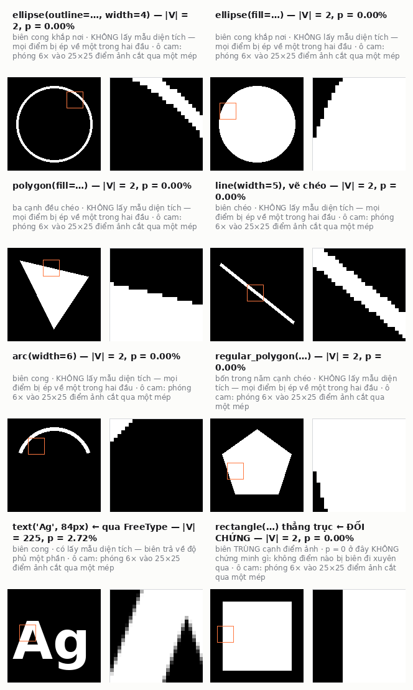
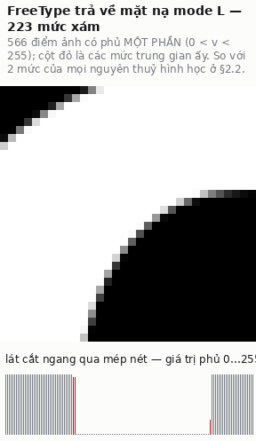
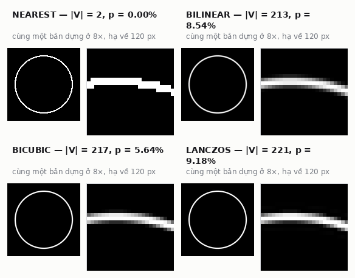
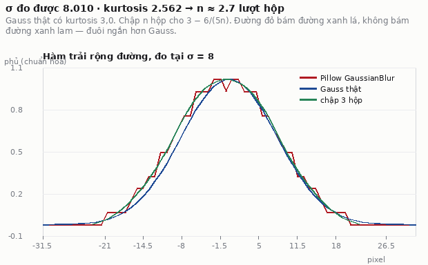
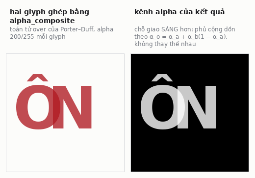
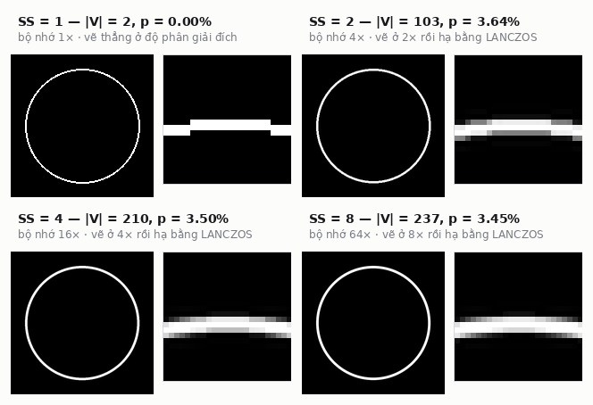
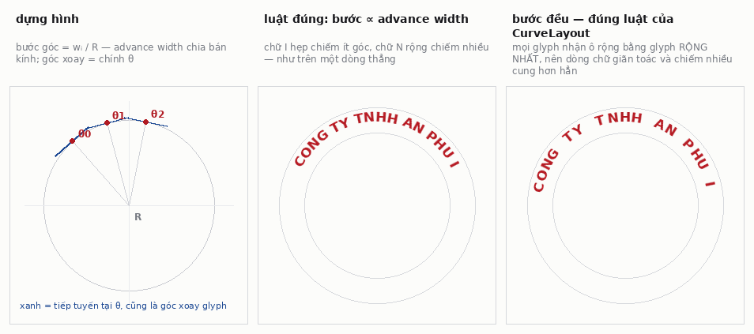
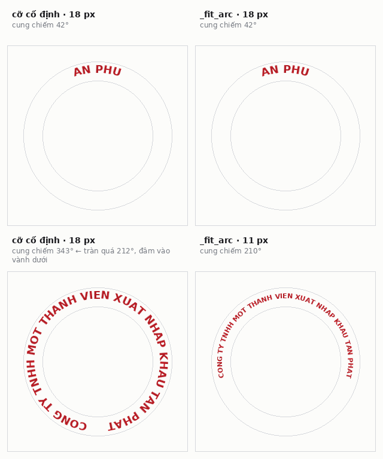
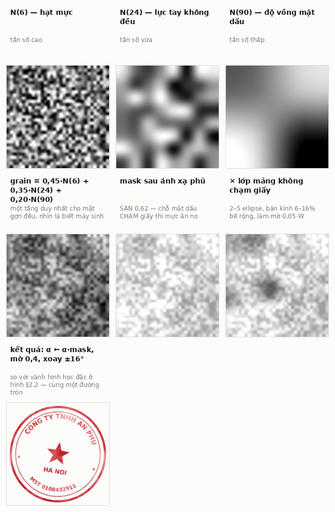
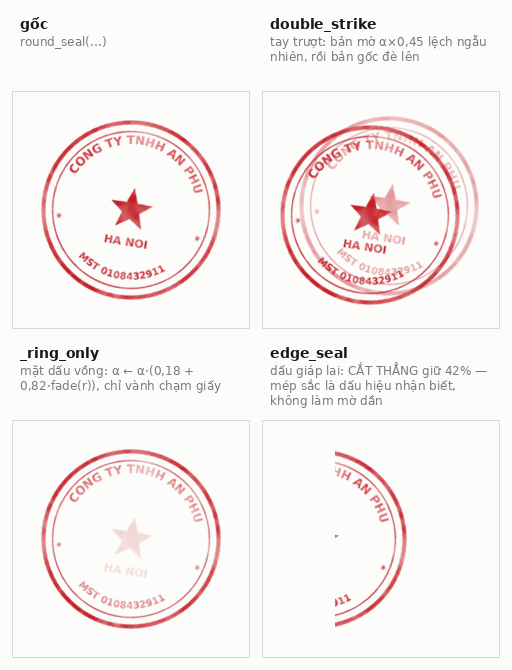

# Cơ chế sinh con dấu: từ mô hình raster của Pillow tới mực đóng tay

> Mọi con số trong tài liệu này đều **đo được**, không phải trích từ tài liệu
> của thư viện. Cách đo ghi ngay cạnh kết quả để chạy lại được. Đo trên Pillow
> 12.3.0, CPython 3.11, `tools/make_ornaments.py` tại `SS = 4`.

## Tóm tắt

`tools/make_ornaments.py` sinh 27 hoạ tiết trong `textures/ornament/`, trong đó
13 mục có chữ và 14 mục thuần hình học. Bài này mô tả cơ chế theo hai tầng.

**Tầng nền** là mô hình raster của Pillow, và nó có một tính chất quyết định
toàn bộ thiết kế phía trên: **các nguyên thuỷ hình học của `ImageDraw` không
khử răng cưa** — chúng cho ra ảnh nhị phân — trong khi **chữ thì có**, vì chữ
đi qua FreeType và nhận về trường phủ 8 bit. Một con dấu tròn gồm cả hai loại
nét, nên nếu vẽ thẳng ở độ phân giải đích thì vành tròn sẽ răng cưa còn chữ thì
mượt, và sự chênh lệch ấy nhìn thấy được.

**Tầng trên** giải quyết đúng chỗ đó bằng **siêu lấy mẫu (supersampling) hệ số
4**, rồi dựng ba cơ chế mà thư viện không có sẵn: đặt chữ trên cung tròn với
bước góc tỉ lệ advance width, khớp cỡ chữ theo metric để tên dài không tràn
vành, và một mô hình mực ba tầng biến đường viền hình học thành vết mực đóng
tay.

Phần 4 đưa ngân sách sai số đo được: sai số phủ suy giảm theo `1/SS`, khớp lý
thuyết lấy mẫu diện tích trong vòng 0,3 dB ở mọi bước, và `SS = 4` đặt hệ thống
ở 34,4 dB với chi phí bộ nhớ 16×.

---

## 1. Đặt vấn đề

Con dấu tròn Việt Nam có cấu trúc cố định: hai vành đồng tâm, một dòng chữ chạy
theo vành trên đọc xuôi từ ngoài nhìn vào, một dòng chạy theo vành dưới cũng
đọc xuôi (tức là **lộn ngược** so với dòng trên), một hoặc hai dấu sao ngăn hai
dòng, và một khối ở giữa. Ba yêu cầu kỹ thuật rút ra từ đó:

**R1 — chữ trên đường tròn.** Mỗi ký tự phải xoay theo **tiếp tuyến** của đường
tròn tại vị trí của nó, và bước góc giữa hai ký tự phải tỉ lệ với **advance
width** của ký tự trước, không phải một hằng số. Chữ tỉ lệ đặt cách đều theo
góc sẽ giãn ở chữ hẹp (`I`, `1`) và chồng ở chữ rộng (`M`, `Ơ`).

**R2 — cỡ chữ phụ thuộc nội dung.** Tên doanh nghiệp Việt Nam dài ngắn rất
khác nhau; "CÔNG TY TNHH MỘT THÀNH VIÊN XUẤT NHẬP KHẨU…" dài gấp đôi một tên
ngắn. Cỡ chữ cố định thì tên dài chạy quá nửa vòng và đâm vào vành dưới.

**R3 — mực, không phải hình học.** Một đường viền đặc màu đỏ là hình vẽ, không
phải con dấu. Mặt dấu cao su vồng, lực tay lệch, mực trên tấm lót không đều:
kết quả là độ phủ biến thiên theo không gian, cộng vài mảng mất hẳn.

---

## 2. Nền: mô hình raster của Pillow

### 2.1 Biểu diễn ảnh

Một `PIL.Image.Image` bọc một đối tượng lõi `ImagingCore` cài đặt trong C
(`_imaging` là extension nhị phân). Ảnh lưu **theo băng, xen kẽ theo điểm** với
mỗi băng một byte không dấu; ảnh `RGBA` do đó là 4 byte/điểm. Mọi thao tác nặng
— vẽ, lọc, lấy mẫu lại, ghép — chạy trong C; Python chỉ điều phối.

Hệ quả cho tài liệu này: **không có tầng float trung gian**. Mỗi lần một toán
tử chạy, kết quả bị lượng tử hoá về 8 bit. Chuỗi `vẽ → xoay → thu nhỏ → nhân
alpha → làm mờ` do đó tích luỹ sai số lượng tử ở từng bước, và đó là một lý do
nữa để làm việc ở độ phân giải cao rồi mới hạ xuống một lần.

### 2.2 Nguyên thuỷ hình học: không khử răng cưa

Đây là tính chất quyết định. Đo trực tiếp:

```python
im = Image.new('L', (200,200), 0)
ImageDraw.Draw(im).ellipse([20,20,180,180], outline=255, width=3)
np.unique(np.array(im))          # -> array([  0, 255], dtype=uint8)
```

| nguyên thuỷ | số mức xám khác nhau trong ảnh kết quả |
| --- | ---: |
| `ImageDraw.ellipse(outline=…)` | **2** |
| `ImageDraw.polygon(fill=…)` | **2** |
| `ImageDraw.text(…)` | **158** |



*Bảy nguyên thuỷ, cùng một phép đo. Sáu nguyên thuỷ hình học cho **2 mức xám** — phóng vào mép thấy bậc thang. `text()` cho **225 mức** vì nó đi qua FreeType.*

`ImageDraw` quyết định mỗi điểm ảnh thuộc hay không thuộc hình, theo quy tắc
điểm-trong-đa-giác quét dòng. Không có phủ một phần, không có mức trung gian.
Pillow không có API bật khử răng cưa cho nhóm này.

### 2.3 Chữ: FreeType và trường phủ 8 bit

Đường đi của chữ hoàn toàn khác. `ImageFont.truetype` mở font qua **FreeType2**;
`font.getmask(text)` trả về một mặt nạ **mode `L`** — tức là trường phủ 8 bit
đã khử răng cưa bởi bộ rasteriser của FreeType, không phải bởi Pillow.
`ImageDraw.text` chỉ lấy mặt nạ ấy làm alpha rồi tô màu qua nó.

Đó là lý do bảng trên chênh nhau 2 mức so với 158 mức: **hai đường raster khác
nhau trong cùng một thư viện**, và một con dấu tròn dùng cả hai.



*Mép một nét chữ, phóng 9×, và lát cắt ngang qua nó. Cột đỏ là các điểm ảnh có phủ **một phần** — thứ mà `ImageDraw.ellipse` không bao giờ sinh ra.*


### 2.4 Lấy mẫu lại

`Image.resize` cài đặt sáu bộ lọc; ba bộ dùng trong file này:

| bộ lọc | bán kính hỗ trợ | dùng ở đâu |
| --- | ---: | --- |
| `LANCZOS` | 3,0 | hạ 4× về độ phân giải đích |
| `BICUBIC` | 2,0 | xoay từng glyph, xoay cả con dấu |
| `NEAREST` | 0,5 | không dùng |



*Cùng một bản dựng ở 8×, hạ về 120 px bằng bốn bộ lọc. `NEAREST` lấy một mẫu nên giữ nguyên 2 mức của bản gốc; ba bộ còn lại lấy trung bình có trọng số.*

Pillow cài đặt phép thu nhỏ theo lối **tích chập tách được có tỉ lệ hỗ trợ**:
khi thu nhỏ hệ số `k`, bán kính hỗ trợ của bộ lọc được nhân `k`, nên mọi điểm
ảnh nguồn đều đóng góp. Đây chính là cái làm cho siêu lấy mẫu ở §3.1 hoạt động:
phép hạ mẫu *là* phép lấy trung bình diện tích có trọng số.

### 2.5 Làm mờ Gauss là ba lượt hộp, không phải tích chập Gauss

Docstring của `ImageFilter.GaussianBlur` nói thẳng: *"Blurs the image with a
sequence of extended box filters, which approximates a Gaussian kernel"*, dẫn
Gwosdek và cs. (SSVM 2011). Kiểm lại bằng đáp ứng bậc thang — làm mờ một nửa
mặt phẳng rồi vi phân theo trục ngang để lấy hàm trải rộng đường (LSF):

| σ khai | σ đo được | kurtosis | số lượt hộp ước lượng |
| ---: | ---: | ---: | ---: |
| 2,0 | 1,996 | 2,617 | 3,13 |
| 4,0 | 3,984 | 2,536 | 2,59 |
| 8,0 | 8,010 | 2,562 | 2,74 |
| 16,0 | 16,039 | 2,599 | 3,00 |
| 32,0 | 31,992 | 2,579 | 2,85 |

Hai kết luận, cả hai đều dùng được:

1. **Tham số `radius` chính là độ lệch chuẩn σ**, không phải bán kính hộp: σ đo
   khớp σ khai dưới 0,5 % trên hai bậc độ lớn.
2. **Nhân là chập của ba hộp, không phải Gauss.** Chập `n` hộp cùng độ rộng cho
   phân phối Irwin–Hall với kurtosis `3 − 6/(5n)`; nghịch đảo quan hệ ấy trên
   kurtosis đo được cho `n ≈ 2,6…3,1`, tức **n = 3**. Gauss thật có kurtosis 3.



*Hàm trải rộng đường đo tại σ = 8. Đường đỏ (Pillow) nằm chồng lên đường xanh lá (chập 3 hộp), không lên đường xanh lam (Gauss thật).*

Đuôi ngắn hơn Gauss thật là điều đáng biết khi mô hình hoá quang học: `_ink`
dùng `GaussianBlur(width * 0.05)` để làm mềm mảng mất mực, và ở bán kính lớn
như thế thì đuôi ngắn làm mép mảng dứt khoát hơn một chút so với Gauss.

### 2.6 Ghép alpha

`Image.alpha_composite` cài đặt toán tử **"over" của Porter–Duff** trên dữ liệu
không nhân sẵn alpha:

```
α_o = α_a + α_b(1 − α_a)
C_o = (C_a·α_a + C_b·α_b(1 − α_a)) / α_o
```



*Hai glyph chồng nhau, mỗi glyph alpha 200/255. Kênh alpha bên phải cho thấy chỗ giao **sáng hơn**: phủ cộng dồn theo `α_o = α_a + α_b(1 − α_a)`.*

với `a` là lớp trên. `_arc_text` ghép từng glyph vào canvas bằng toán tử này,
nên hai glyph chồng nhau ở chỗ giao sẽ **cộng phủ**, không thay thế nhau — đúng
với mực thật, nơi hai nét chồng lên nhau thì đậm hơn.

---

## 3. Bộ sinh con dấu

### 3.1 Siêu lấy mẫu thay cho khử răng cưa giải tích

Vì §2.2, cách duy nhất để vành tròn có mép mượt là **lấy mẫu diện tích bằng số**:
vẽ ở độ phân giải `SS` lần rồi hạ xuống. Mọi hàm vẽ trong file mở đầu bằng

```python
side = size * SS                     # SS = 4
canvas = Image.new("RGBA", (side, side), (0, 0, 0, 0))
...
canvas = canvas.resize((size, size), Image.LANCZOS)
```

Phép hạ mẫu LANCZOS (§2.4) biến `SS² = 16` mẫu nhị phân trong mỗi ô đích thành
một ước lượng phủ có trọng số. Nói cách khác, **siêu lấy mẫu mua lại đúng cái
mà `ImageDraw` không cho**, với giá bộ nhớ `SS²`.

Chọn `SS` là một đánh đổi đo được, và §4.1 đo nó.



*Cùng một vành tròn ở bốn hệ số. `SS = 1` cho 2 mức xám và mép bậc thang; từ `SS = 2` trở đi phép hạ mẫu biến `SS²` mẫu nhị phân thành ước lượng phủ.*


### 3.2 Chữ trên cung tròn

`_arc_text` là nguyên thuỷ mà cả Pillow lẫn synthtiger đều không có. Tham số
hoá: gọi `R` là bán kính vành, `wᵢ` là advance width của ký tự thứ `i` (nhân hệ
số `spacing`), `θ₀` là góc giữa dòng chữ, gốc 0° ở **đỉnh** và tăng theo chiều
kim đồng hồ.

**Bước góc tỉ lệ độ dài cung.** Một ký tự rộng `wᵢ` pixel chiếm cung `wᵢ/R`
radian:

```
span = (Σ wᵢ) / R                        cung cả dòng chiếm
θ_bắt_đầu = θ₀ − span/2                  (vành trên)
θᵢ = θ_bắt_đầu + Σ_{j<i} (wⱼ/R) + (wᵢ/R)/2      tâm ký tự i
```

Đây là điểm khác biệt cốt lõi với mọi cách bố trí "cách đều": bước là **độ dài
cung chia bán kính**, nên chữ hẹp chiếm ít góc và chữ rộng chiếm nhiều góc,
đúng như khi đặt trên một dòng thẳng.

**Xoay theo tiếp tuyến.** Tiếp tuyến của đường tròn tại góc `θ` hợp với phương
ngang đúng một góc `θ`. Nên phép xoay glyph là chính `θᵢ` (đổi dấu vì Pillow
xoay ngược chiều kim đồng hồ):

```python
rotation = -at * 180.0 / math.pi
glyph = glyph.rotate(rotation if outward else rotation + 180, ...)
```

**Vành dưới.** `outward=False` cộng thêm 180° và cho `θ` **giảm** dần. Kết quả
là chữ lộn ngược so với vành trên, nhưng khi người đọc nhìn con dấu thì dòng
dưới vẫn đọc xuôi từ trái sang phải — đúng quy ước của con dấu thật.

**Vị trí.** Tâm glyph đặt trên đường tròn bán kính `R`:

```
cx = centre_x + R·sin(θᵢ)
cy = centre_y − R·cos(θᵢ)
```

Dấu trừ ở `cy` là vì trục `y` của ảnh hướng xuống, còn 0° quy ước ở đỉnh.



*Trái: dựng hình — tiếp tuyến tại θ chính là góc xoay glyph. Giữa: bước ∝ advance width. Phải: bước đều, đúng luật `CurveLayout` — mọi glyph nhận ô rộng bằng glyph rộng nhất, nên dòng chữ giãn toác.*

**Từng glyph là một ảnh riêng.** Mỗi ký tự vẽ vào một tile RGBA riêng, xoay
bằng `BICUBIC, expand=True`, rồi `alpha_composite` vào canvas. Điều đó có hai
hệ quả ở §4.1: mỗi glyph đi qua **một lượt lấy mẫu lại**, và vị trí dán bị
**lượng tử hoá về số nguyên**.

### 3.3 Khớp cỡ chữ theo metric

`_fit_arc` giải R2 bằng tìm kiếm giảm dần trên cỡ chữ:

```python
size = start_px
while size > start_px * 0.55:
    font = ImageFont.truetype(path, int(size))
    span = sum(font.getlength(ch) * spacing for ch in text) / radius
    if span * 180.0 / math.pi <= max_deg:
        return font
    size *= 0.96
```

Điều kiện dừng đặt trên **cung chiếm được**, không trên bề rộng pixel, nên nó
là ràng buộc đúng cho vành tròn. Hệ số 0,96 mỗi vòng và sàn 0,55 lần cỡ đầu cho
tối đa `⌈log(0.55)/log(0.96)⌉ = 15` lần thử. `_fit_width` là bản thẳng hàng của
cùng ý tưởng, hệ số 0,95, sàn 0,45.

Đây cũng là cách thợ khắc dấu thật xử lý tên dài: co chữ cho vừa vành.



*Tên ngắn và tên dài, mỗi tên dựng hai lần. Với cỡ cố định, tên dài chiếm quá 212° và đâm vào vành dưới; `_fit_arc` co chữ lại cho vừa.*


### 3.4 Mô hình mực

`_ink` giải R3. Đầu vào là ảnh RGBA hình học đã hạ mẫu; nó **chỉ sửa kênh
alpha**, giữ nguyên màu. Ba tầng:

**(a) Trường phủ đa tần.** Ba tầng nhiễu giá trị, sinh ở độ phân giải thấp rồi
phóng BICUBIC, trộn theo biên độ giảm dần:

```
grain = 0.45·N(6) + 0.35·N(24) + 0.20·N(90)
```

`N(c)` là nhiễu trắng đều lấy mẫu trên lưới bước `c` pixel rồi nội suy. Ba tần
số tả ba nguyên nhân vật lý khác nhau: hạt mực (6), lực tay không đều (24), độ
vồng của mặt dấu (90). Một tầng duy nhất cho ra mặt gợn đều, nhìn là biết máy
sinh.

**(b) Ánh xạ phủ có sàn.** Chuẩn hoá `grain` về [0,1] rồi

```
mask = clip((grain − (1 − coverage)) / coverage, 0, 1)
mask = clip(0.62 + 0.55·mask, 0, 1)
```

Hằng số **0,62 là sàn, và nó là quyết định mô hình chứ không phải tinh chỉnh**:
chỗ mặt dấu *có* chạm giấy thì mực ăn no, nên biến thiên ở đó chỉ nên nằm trong
khoảng [0,62 – 1,0]. Phần loang lổ mạnh là do chỗ **không** chạm, và chỗ đó xử
lý riêng ở (c). Trộn hai cơ chế vào một hằng số duy nhất — hạ sàn xuống 0,35 —
cho ra con dấu bạc phếch đều khắp, một hiện tượng không tồn tại.

`coverage` bốc trong [0,78; 0,93] mỗi lần dựng, nên hai con dấu cùng seed khác
nhau về độ ăn mực.

**(c) Mảng không chạm giấy.** Từ 2 tới 5 ellipse bán kính 6–16 % bề rộng, giá
trị 95–185 trên nền 255, làm mờ bằng `GaussianBlur(0.05·W)` rồi **nhân** vào
mask. Bán kính mờ tỉ lệ bề rộng nên hình dạng bất biến theo cỡ ảnh.

**(d) Áp và làm mềm.** `alpha ← alpha · mask`, rồi `GaussianBlur(0.4)` toàn ảnh
— mực nhoè vào thớ giấy, mép nét không bao giờ sắc như mép hình học.

Cuối cùng `round_seal` xoay ảnh `±16°` bằng BICUBIC với `expand=True`: **con dấu
đóng tay không bao giờ thẳng**.



*Ba tầng nhiễu, mặt trộn, mặt nạ sau ánh xạ phủ có sàn 0,62, lớp mảng không chạm giấy, và kết quả. Vành tròn ở ô cuối là **cùng một `ImageDraw.ellipse`** với ô đầu của hình §2.2.*


### 3.5 Toán tử biến thể

Ba hàm nhận **ảnh con dấu đã dựng** làm đầu vào chứ không vẽ lại — chúng là
toán tử trên ảnh, và đó là điều đúng: cùng một con dấu, đóng hỏng theo ba kiểu.

| toán tử | mô hình vật lý | cơ chế |
| --- | --- | --- |
| `double_strike` | tay trượt, đóng hai lần | ghép bản mờ (α×0,45) lệch ngẫu nhiên, rồi ghép bản gốc lên |
| `_ring_only` | mặt dấu vồng, chỉ vành chạm giấy | `α ← α·(0,18 + 0,82·fade(r))`, `fade` tăng theo bán kính chuẩn hoá |
| `edge_seal` | dấu giáp lai vắt qua mép hai tờ | **cắt thẳng** giữ 42 % bề rộng — mép giấy cắt mực dứt khoát, và chính cạnh sắc ấy là dấu hiệu nhận biết |



*Cùng một con dấu, ba kiểu đóng hỏng. Cả ba nhận **ảnh** làm đầu vào chứ không vẽ lại từ đầu.*


---

## 4. Phân tích

### 4.1 Ngân sách sai số

**Thí nghiệm.** Rasterise một vành tròn (R = 190 px, dày 6 px, ảnh 430²) ở
`SS ∈ {1,2,3,4,6,8,12}` rồi hạ mẫu LANCZOS về 430². So với **chuẩn giải tích**:
phủ chính xác xấp xỉ bằng `clip(0.5 − d, 0, 1)` với `d` là khoảng cách có dấu
từ tâm điểm ảnh tới biên vành (chính xác tới `O(h/R) ≈ 0,5 %` với `R/h ≈ 190`).
Dùng chuẩn giải tích thay vì một bản dựng ở `SS` cao tránh được việc lưới của
bản dựng trùng lưới của chuẩn.

| SS | RMSE phủ | PSNR (dB) | tăng so với SS trước | lý thuyet `20·log₁₀(SS₂/SS₁)` |
| ---: | ---: | ---: | ---: | ---: |
| 1 | 0,0779 | 22,17 | — | — |
| 2 | 0,0376 | 28,50 | +6,33 | +6,02 |
| 3 | 0,0254 | 31,91 | +3,41 | +3,52 |
| **4** | **0,0191** | **34,37** | **+2,47** | **+2,50** |
| 6 | 0,0132 | 37,58 | +3,20 | +3,52 |
| 8 | 0,0102 | 39,81 | +2,23 | +2,50 |
| 12 | 0,0073 | 42,74 | +2,93 | +3,52 |


*Đo được so với đường lý thuyết `1/SS`, trục SS thang log. Hai đường gần như trùng nhau trên cả dải 1…12.*

**Sai số suy giảm theo `1/SS`, khớp lý thuyết trong vòng 0,3 dB ở mọi bước.**
Đó là hành vi đúng cho lấy mẫu diện tích một biên trơn: số điểm ảnh có phủ một
phần tỉ lệ `1/SS`, và sai số lượng tử trên mỗi điểm cũng vậy.

Ngoài sai số lấy mẫu, còn hai nguồn nữa, cả hai đều do §3.2:

**Lượng tử hoá vị trí glyph.** `alpha_composite` nhận toạ độ nguyên, và mã dùng
`int()` — cắt về 0, không làm tròn:

```python
draw_on.alpha_composite(glyph, (int(cx - glyph.width / 2), int(cy - glyph.height / 2)))
```

Sai số tối đa 1 px ở thang siêu lấy mẫu, tức **`1/SS = 0,25` px ở thang đích**.
Dưới một điểm ảnh, nên không thấy được — nhưng nó là lý do `SS = 1` không chỉ
răng cưa mà còn **đặt chữ lệch tới 1 px**.

**Lấy mẫu lại từng glyph.** Mỗi ký tự qua một lượt `rotate(BICUBIC)`. Bicubic
có bán kính hỗ trợ 2,0 và làm mềm nhẹ trường phủ; ở `SS = 4` thì trường ấy đã
được lấy mẫu dư 4 lần nên hiệu ứng nằm dưới ngưỡng nhìn thấy sau khi hạ mẫu.

**Vì sao dừng ở 4.** Chi phí bộ nhớ và thời gian đều bậc hai theo `SS`. Đo trên
`round_seal` 430²: `SS = 4` là 65 ms và 16× bộ nhớ; `SS = 8` là 254 ms và 64×,
đổi lấy 5,4 dB. Với 27 file sinh một lần rồi commit, đó không phải chi phí đáng
kể — nhưng cũng không có lợi ích tương ứng, vì §2.6 và §3.4 phía sau còn lượng
tử hoá về 8 bit vài lần nữa, mà 34 dB đã dưới ngưỡng ấy.

### 4.2 Độ phức tạp

Với dòng chữ `n` ký tự, bán kính vành `R`, ảnh đích cạnh `S`:

| bước | chi phí |
| --- | --- |
| `_fit_arc` | `O(15n)` lần đo metric, không rasterise |
| `_arc_text` | `n` lần rasterise glyph + `n` lần xoay + `n` lần ghép, mỗi lần trên tile `O((S·SS/R)²)` |
| vẽ vành | `O((S·SS)²)` |
| hạ mẫu | `O((S·SS)²)` |
| `_ink` | `O((S)²)` — chạy **sau** khi hạ mẫu, nên rẻ hơn 16 lần |

Thứ tự `hạ mẫu → _ink` chứ không ngược lại là một quyết định có chủ ý: mực là
hiện tượng ở thang điểm ảnh đích, và chạy nó ở thang siêu lấy mẫu vừa tốn 16
lần vừa cho ra hạt mực nhỏ hơn 4 lần so với ý định.

### 4.3 So sánh với `synthtiger.components.CurveLayout`

Đây là nguyên thuỷ gần nhất mà một thư viện khác cung cấp, và nó không giải
được R1. Mã của nó:

```python
x = (size[0] + space) * (idx - mid)      # size = max be rong CUA MOI glyph
y = a * x**2
angle = -degrees(arctan(y / x))
```

| yêu cầu | `_arc_text` | `CurveLayout` |
| --- | --- | --- |
| đường cong | đường tròn, khép được vành | parabol `y = ax²`, không khép được |
| bước giữa ký tự | `wᵢ/R` — tỉ lệ advance width | hằng số, lấy bề rộng glyph **rộng nhất** |
| góc xoay | `θᵢ` = tiếp tuyến của đường tròn | `arctan(y/x)` = góc tới gốc toạ độ; tiếp tuyến của parabol là `arctan(2ax)` |
| vành dưới đọc xuôi | có (`outward=False`) | không có khái niệm |

Chỗ sai thứ hai đáng chú ý nhất vì nó hỏng cả với parabol: đặt mọi glyph vào ô
rộng bằng glyph rộng nhất biến chữ tỉ lệ thành chữ đơn cách, nên dòng chữ giãn
toác ở mọi vị trí có ký tự hẹp.

---

## 5. Hạn chế

**Vành là đường tròn, không phải ellipse.** `_arc_text` nhận một `radius` vô
hướng. Dấu bầu dục của chi nhánh cần bước theo **độ dài cung của ellipse** —
không có dạng đóng, phải tích phân số hoặc lập bảng — và góc xoay là tiếp tuyến
của ellipse chứ không còn bằng góc tham số. Đây là mục `seal_oval_branch` đang
treo trong [`hoa-tiet-de-xuat.md`](hoa-tiet-de-xuat.md), và nó treo đúng ở đây.

**Không có tạo hình phức (complex shaping).** `font.getlength(ch)` đo từng ký tự
rời, nên kerning giữa hai ký tự và các phép thay thế của OpenType không được
tính. Với chữ Việt in hoa trên vành dấu thì ảnh hưởng nhỏ; với chữ có ligature
hoặc dấu kết hợp rời thì không.

**Sàn 0,62 trong `_ink` chưa đo.** Nó chỉnh bằng mắt. Khác với các hằng số ở
`degradation/`, chưa có phép đo nào ràng buộc nó — và cũng chưa có test nào bắt
được nếu nó trôi.

**13/27 file có chữ.** 14 file còn lại — guilloche, wave band, corner bracket,
rect grid, hoa văn Đông Sơn, EAN-13, QR — không dùng gì trong §3.2–§3.3. Chúng
là hình học thuần và hưởng lợi duy nhất từ §3.1.

---

## Tài liệu

- Gwosdek, P., Grewenig, S., Bruhn, A., Weickert, J. (2011). *Theoretical
  Foundations of Gaussian Convolution by Extended Box Filtering.* SSVM 2011.
  — bài mà `ImageFilter.GaussianBlur` dẫn trong docstring, và là nguồn của kết
  quả "ba lượt hộp" ở §2.5.
- Porter, T., Duff, T. (1984). *Compositing Digital Images.* SIGGRAPH '84.
  — toán tử "over" ở §2.6.
- Duchon, C. E. (1979). *Lanczos Filtering in One and Two Dimensions.* Journal
  of Applied Meteorology 18(8). — bộ lọc hạ mẫu ở §2.4.
- FreeType 2 documentation, *Glyph conventions* — advance width và trường phủ ở
  §2.3.

## Hình, và cách dựng lại

Mười một hình trong bài nằm ở [`figures/con-dau/`](figures/con-dau), dựng bằng

```bash
python docs/figures/make_stamp_figures.py     # hoặc: make figures-stamp
```

Bộ dựng **chạy lại đúng phép đo mà bài trích** rồi vẽ kết quả, nên một con số
trong bài và hình minh hoạ nó không thể lệch nhau — cả hai đến từ cùng một lần
chạy. Xuất PNG chứ không JPG: phần lớn hình phóng tới mức thấy từng điểm ảnh,
mà nén JPEG sẽ bịa thêm mức trung gian ở đúng chỗ bài khẳng định là chỉ có hai.

| hình | mục | trả lời câu hỏi |
| --- | --- | --- |
| `fig-2.2-nguyen-thuy-hinh-hoc` | §2.2 | nguyên thuỷ nào của `ImageDraw` khử răng cưa? |
| `fig-2.3-phu-freetype` | §2.3 | trường phủ 8 bit của FreeType trông thế nào? |
| `fig-2.4-lay-mau-lai` | §2.4 | bốn bộ lọc hạ mẫu khác nhau ra sao? |
| `fig-2.5-gauss-ba-luot-hop` | §2.5 | `GaussianBlur` là Gauss hay là hộp? |
| `fig-2.6-ghep-alpha` | §2.6 | hai glyph chồng nhau thì alpha cộng hay thay? |
| `fig-3.1-sieu-lay-mau` | §3.1 | `SS` mua được gì? |
| `fig-3.2-chu-tren-cung-tron` | §3.2 | bước góc theo advance width khác bước đều thế nào? |
| `fig-3.3-khop-co-chu` | §3.3 | tên dài không co chữ thì hỏng ra sao? |
| `fig-3.4-mo-hinh-muc` | §3.4 | từ vành hình học tới vết mực, qua những lớp nào? |
| `fig-3.5-toan-tu-bien-the` | §3.5 | ba kiểu đóng hỏng |
| `fig-4.1-ngan-sach-sai-so` | §4.1 | sai số suy giảm theo `1/SS` thật không? |

## Chạy lại các phép đo

Mọi bảng số trong bài dựng từ ba đoạn mã ngắn dùng Pillow và numpy: bảng §2.2
đếm `np.unique` trên ảnh nguyên thuỷ; bảng §2.5 làm mờ một nửa mặt phẳng, vi
phân theo trục ngang để lấy LSF, rồi tính moment bậc hai và bậc bốn; bảng §4.1
rasterise vành tròn ở nhiều `SS` và so với `clip(0.5 − d, 0, 1)`. Không đoạn nào
cần tài nguyên ngoài repo.
