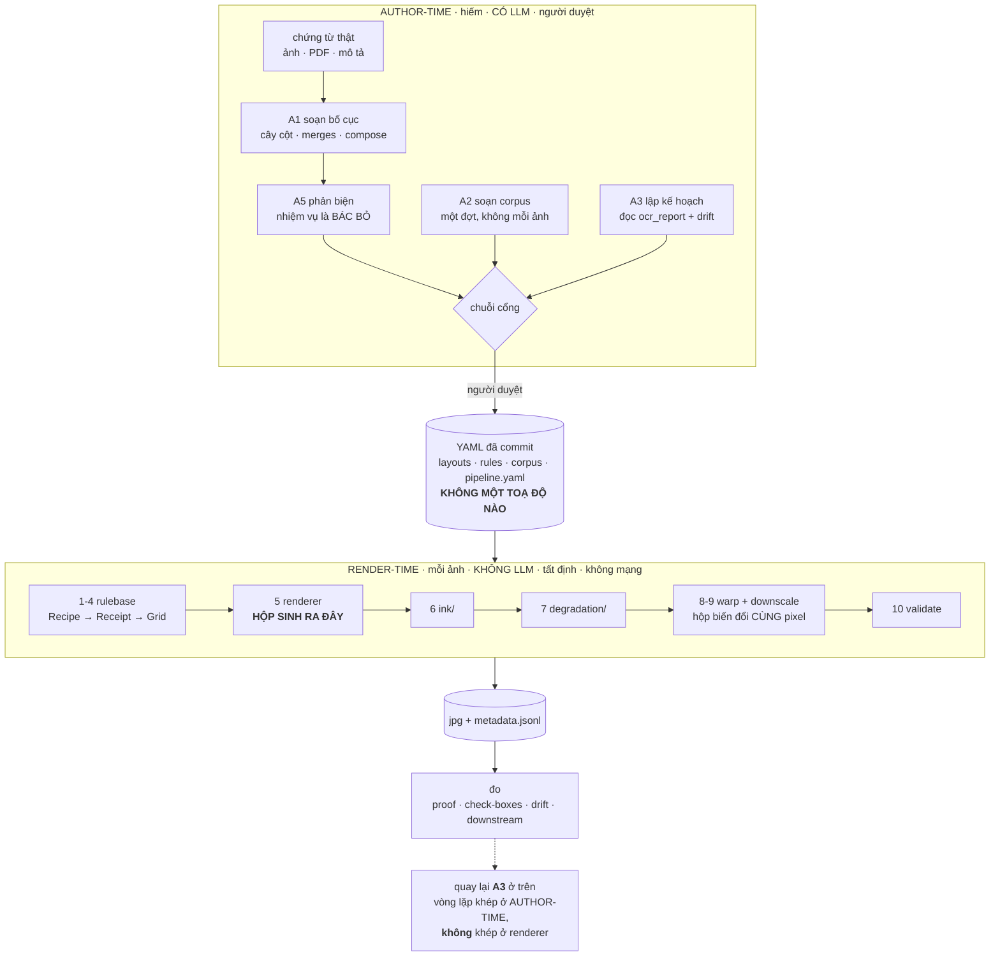
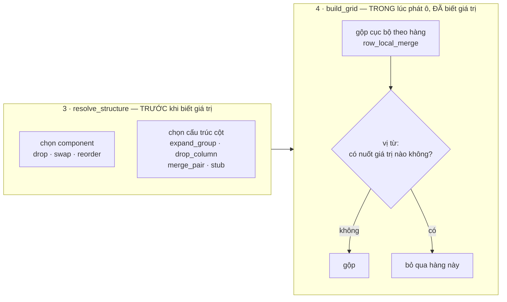
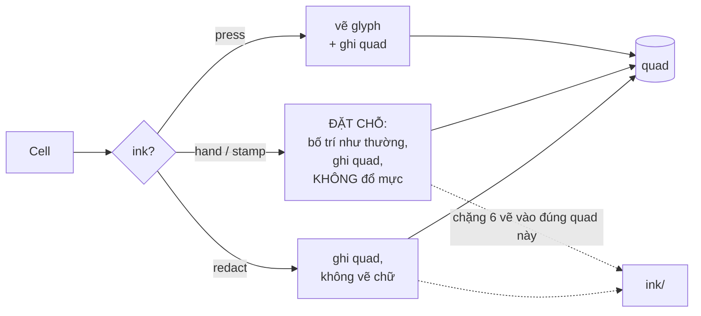
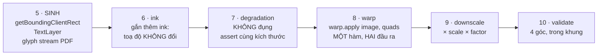
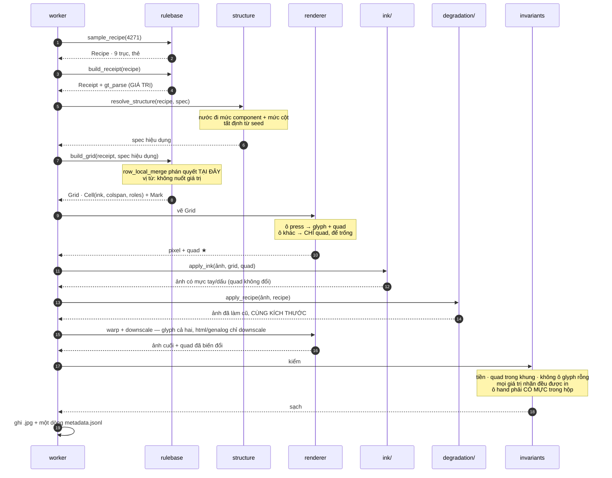
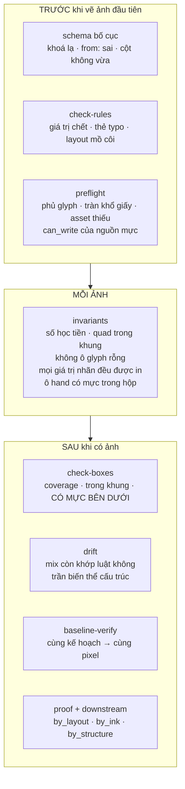

# Đường ống: một tờ giấy, từ `seed` tới nhãn

> Tài liệu thứ ba của bộ ba. [`tu-dong-hoa-bang-llm.md`](tu-dong-hoa-bang-llm.md)
> nói *ai ra quyết định*; [`tang-cuong-bo-cuc.md`](tang-cuong-bo-cuc.md) nói
> *một bố cục nhân lên thế nào*; bản này nói **một tờ giấy đi qua hệ thống ra
> sao, và ai sở hữu toạ độ.**

---

## 0. Câu trả lời, một câu

**Hộp (bbox) do *engine đã dàn chữ* sinh ra. Không bao giờ do LLM.**
LLM viết *quan hệ và lựa chọn*; mọi con số không gian đều **dẫn xuất** từ engine
thật sự đặt chữ xuống — trình duyệt, WeasyPrint, hay bộ dựng glyph.

Repo đã viết luật này ra từ trước, ở `README.md`:

> *"No renderer re-reads its own output. Boxes come from the engine that drew
> the text, so a box cannot inherit a recognition error."*

Phần còn lại của tài liệu là: **vì sao** (§1), **đường ống trông thế nào** (§2–§3),
**vòng đời một cái hộp** (§4 — chỗ then chốt), và **ba chỗ dễ đặt sai** (§6).

---

## 1. bbox: engine, luôn luôn

### 1.1 LLM không biết trang được dàn ra sao — vì chính nó không dàn

Một hộp là kết quả của những thứ chỉ engine biết, **sau khi** đã dàn:

* ngắt dòng ở đâu (tên hàng ba chữ có xuống dòng không, xuống ở chữ nào);
* độ rộng thật của chuỗi sau khi shaping — dấu tiếng Việt chồng dấu làm đổi
  chiều cao dòng, và `ế` không rộng bằng `e`;
* `1ch` bằng bao nhiêu pixel với **font này**, cỡ này, ở device scale này;
* trang có cao thêm không khi bảng thừa dòng;
* cỡ chữ bị kẹp lại bao nhiêu — `render.py` có
  `scale = min(cell.scale, width / max(len(cell.text), 1))`, nên một dòng tổng
  đặt 1,6em trong ô 20 ký tự **tự thu lại**.

Không dòng nào trong số đó có trong file bố cục. Chúng là đầu ra của engine.
Một LLM đoán hộp là đang đoán đầu ra của một chương trình nó không chạy.

### 1.2 Ba engine, ba cơ chế lấy hộp **hoàn toàn khác nhau**

Đây là bằng chứng mạnh nhất, và nó nằm sẵn trong repo:

| renderer | hộp lấy từ đâu |
| --- | --- |
| `synthdog` | chính `TextLayer` nó đã đặt, rồi **đẩy qua cùng phép warp với pixel** |
| `html` | `getBoundingClientRect()` trên DOM đã layout, × device scale × downscale |
| `genalog` | **chuỗi glyph của PDF** đọc bằng PyMuPDF, × `dpi/72` × downscale |

Và genalog là ca cho thấy việc này khó tới mức nào. Docstring trong
`generators/genalog/render.py` ghi lại:

> *"A CSS sheet does not [put one field per element]: two `<td>` on one line in
> one font come out of WeasyPrint as **one span** — no amount of concatenating
> spans forwards can take them apart again."*

Nên nó phải rơi xuống mức **glyph, không phải span**, gom lại theo dòng. Đó
không phải "nhìn trang rồi nói chữ nằm đâu" — đó là **dịch ngược mô hình đầu ra
của một engine cụ thể**. Ba engine, ba bài toán khác nhau. Không có mô hình
chung nào giải cả ba, và một LLM nhìn ảnh thì càng không.

### 1.3 Kể cả LLM đoán đúng, bạn vẫn phải kiểm — và bộ kiểm mới là nhãn

Giả sử có một VLM đoán hộp khá tốt. Bạn vẫn phải trả lời: *đúng bao nhiêu phần
trăm?* Muốn biết thì phải so với sự thật. Mà sự thật ở đây **là hộp của engine**.
Có nó rồi thì phần dự đoán là công thừa.

Repo đã trả giá một lần cho bài học này, và ghi lại trong
`tools/check_boxes.py`:

> *"The first version of the genalog extractor lost every field after the first
> separator row — the images were fine, the labels were fine, `metadata.jsonl`
> was well-formed, and coverage was **82 % instead of 100 %**. Nothing but
> counting the cells would have said so."*

Ảnh đúng, nhãn đúng, file đúng định dạng, và **gần một phần năm số trường
không có hộp** — im lặng. Đó là loại hỏng mà chỉ một phép đếm cơ học bắt được,
không phải một phán đoán.

`check_boxes.py` kiểm ba thứ, và thứ ba là thứ giết mọi hộp đoán:

| kiểm | bắt được gì |
| --- | --- |
| **coverage** | một hộp cho mỗi trường được vẽ — bắt lệch đồng bộ |
| **trong khung** | mọi góc nằm trong ảnh — bắt quên một hệ số scale |
| **có mực bên dưới** | điểm tối nhất trong hộp phải tối rõ so với trung vị của chính hộp đó — **bắt hộp đúng kích thước nhưng sai chỗ**, thứ mà hai phép trên vẫn cho qua |

Một hộp do LLM đoán trượt phép thứ ba trước tiên, và đó chính là phép mà "nhìn
có vẻ đúng" không giúp gì.

### 1.4 Ranh giới đơn vị: LLM được viết con số nào

Không phải mọi con số đều bị cấm. Ranh giới rất rõ và repo đã đặt sẵn:

> *"the rule-base states geometry in its own units, and each backend does the
> one multiplication it was already doing."*

| LLM **được** viết | LLM **không bao giờ** được viết |
| --- | --- |
| `width: [104, 118]` — bề rộng trang tính bằng **ký tự** | bất kỳ toạ độ pixel nào |
| `padding_top: [2.4, 3.6]` — tính bằng **chiều cao dòng** | `quad`, `bbox`, `x`, `y` |
| `margin: [0.06, 0.13]` — **phân số** của số cột | kích thước ảnh |
| `serial_width: 26`, `split: 0.55`, `indent: 0.42` | vị trí sau khi xuống dòng |
| `sheet: a4` — **tên** khổ giấy | milimét, DPI, hệ số scale |

Quy tắc: **đơn vị tương đối, khai báo — được. Toạ độ tuyệt đối — không.** Vì
đơn vị tương đối là *ý định*, còn toạ độ tuyệt đối là *kết quả*; LLM ở phía ý
định, engine ở phía kết quả.

### 1.5 Chỗ VLM **thật sự** có ích: đọc ảnh **vào**, không phải đoán toạ độ **ra**

Đừng đọc §1 thành "không dùng mô hình thị giác". Có đúng ba chỗ nó đáng dùng,
và cả ba đều ở **phía đầu vào hoặc phía phán quyết**, không ở phía nhãn:

| chỗ | việc | vì sao an toàn |
| --- | --- | --- |
| **A1, đầu vào** | nhìn ảnh chứng từ thật → mô tả có mấy khối, cột nào, chỗ nào để trống | đầu ra là *văn xuôi rồi YAML*, không phải toạ độ |
| **A1, xếp hạng** | so `preview` của k phương án với ảnh gốc, chấm | đầu ra là *một thứ hạng* |
| **A5, phản biện** | "bố cục này mô tả sai tờ giấy nào?" | đầu ra là *một phán quyết*, và người chốt |

Cả ba đều nằm ở **author-time**. Không cái nào đụng vào `metadata.jsonl`.

### 1.6 "bbox đã có sẵn theo `td`/`tr`?" — **có, và đã chạy** — nhưng là **hộp thứ hai**

Câu trả lời ngắn: đúng, và nó **đã được cài, đã sinh ra, đã nằm trong data
commit sẵn**. Nhưng nó không phải cùng một hộp với hộp chữ — nó là **loại hộp
thứ hai**, và cần cả hai.

| | lấy từ | nói gì |
| --- | --- | --- |
| `boxes` | `span[data-kind]` — `CELL_RECTS_JS` | **mực ở đâu** |
| `cells` | `[data-cell]` + `td.colSpan`/`rowSpan` — `CELL_REGIONS_JS` | **ô rộng tới đâu**, ở `row`/`col` nào, gộp mấy |

`generators/html/sheets/base.py::cell()` nói vì sao phải có cái thứ hai:

> *"the text box round 'Tổng tiền thanh toán' cannot say that its cell covers
> six columns, and a model asked to rebuild the table needs exactly that."*

Trình duyệt trả về **cả hình học lẫn cấu trúc** trong một lượt:

```js
[...document.querySelectorAll('#sheet [data-cell]')].map(td => ({
  kind: td.dataset.cell,
  row: Number(td.dataset.row), col: Number(td.dataset.col),
  colspan: td.colSpan || 1,    rowspan: td.rowSpan || 1,
  x: ..., y: ..., w: ..., h: ...,
}));
```

và `structure_from_cells` dựng token PP-Structure **từ ô đã đo, không từ
template** — *"so it describes the table the browser actually laid out."*

**Đo trên data đã commit** (dòng đầu mỗi `metadata.jsonl`):

| bộ | `boxes` | `cells` | `structure` |
| --- | ---: | ---: | ---: |
| `invoices54/html` (đường CSS) | 105 | **102** | 240 |
| `invoices54/genalog` (đường CSS) | 105 | **0** | 240 |
| `forms16/genalog` | 534 | **0** | 1016 |
| `dataset60/html` (đường lưới) | 16 | **0** | 0 |
| `dataset60/synthdog` | 16 | **0** | 0 |

Một ví dụ ô gộp thật, `invoices54/html` ảnh đầu — 3 ô gộp trên 102:

```json
{"kind": "total.line.label", "row": 12, "col": 0, "colspan": 7,
 "text": "Cộng tiền hàng chưa có thuế GTGT", "quad": [[...]]}
```

**Nên câu trả lời đầy đủ là: có, trên đúng một trong ba đường vẽ.**

| backend | `boxes` | `cells` (hình học ô) | `structure` |
| --- | :---: | --- | --- |
| **html** (Chromium) | ✓ | ✓ **đo từ DOM** | ✓ đo |
| **genalog** (WeasyPrint) | ✓ | ✗ | ✓ nhưng **parse từ markup**, không đo |
| **synthdog** (glyph) | ✓ | ✗ | ✗ |

`genalog` có cấu trúc đúng (240 token, **trùng khít** con số của html — nên hai
engine đồng ý về cấu trúc) nhưng không có hình học ô, vì `<td>` không sống sót
qua PDF. `synthdog` không có DOM nào để hỏi.

> **Nhầm hai loại hộp là một lỗi thật.** Một ô gộp có `<td>` box to và `<span>`
> box nhỏ nằm trong. Dạy một bộ dò bằng `<td>` box là dạy nó khoanh cả **giấy
> trắng**; dạy bằng `<span>` box thì mất thông tin "ô này phủ bảy cột". Nhãn
> phải mang cả hai, và `structure` là cái nối chúng lại.

### 1.6b Hộp = "ô trừ lề X%"? — **đúng làm lệnh bố trí, sai làm nhãn**, và đo được

Một đề xuất tự nhiên: đừng ghim toạ độ tuyệt đối cho hộp chữ, chỉ nói *"hộp nằm
trong ô này, thụt vào X%"*. Độc lập độ phân giải, chữ không đè lên component
bên cạnh, chỉ cần biết ô ở đâu.

Là **lệnh bố trí** thì đúng — nó chính là `padding` của CSS, và là cách đúng để
nói mực đi vào đâu. Là **nhãn** thì không, và đây là con số:

```
data/invoices54/html — 27 ảnh, 1.094 cặp (hộp chữ, ô chứa nó)

  diện tích hộp chữ / diện tích ô     trung vị 0,16   trung bình 0,17
  bề rộng  hộp chữ / bề rộng  ô       trung vị 0,37   p10 0,10   p90 0,69
  số cặp chữ chiếm < 50% bề rộng ô    779 / 1.094  =  71%
  riêng Ô GỘP (57 cặp)                bề rộng trung vị 0,25, nhỏ nhất 0,10
```

**Mực chiếm 16% diện tích ô ở trung vị.** Lấy "ô trừ lề" làm hộp chữ là ra một
hộp **lớn gấp khoảng sáu lần** thứ nó phải mô tả. Đó không phải sai số làm tròn,
đó là một cái nhãn khác.

Ba lý do, và không lý do nào chỉnh được bằng cách đổi con số `X%`:

| | vì sao |
| --- | --- |
| **Chữ hiếm khi lấp đầy ô** | `1.500.000` canh phải trong cột 14 ký tự chiếm ~60% bề rộng; `2` trong cột `Số lượng` chiếm 10%. Lề là hằng số, độ lấp đầy thì không |
| **Chữ xuống dòng** | tên hàng ba dòng: mực cao ba dòng nhưng dòng cuối có thể nửa bề rộng. `CELL_RECTS_JS` đã đi **từng ký tự** bằng `range.getBoundingClientRect()` và phát **một hộp cho mỗi dòng nhìn thấy** — một hình chữ nhật cho cả ô thì mất chuyện đó |
| **Ô gộp là ca tệ nhất** | "Cộng tiền hàng chưa có thuế GTGT" trong ô phủ 7 cột: đo được là **0,25** bề rộng, có ca xuống **0,10**. Suy hộp chữ từ ô là khai bảy cột giấy trắng |

Nghiêm trọng ở chỗ nó **qua được hai trong ba phép kiểm** của
`check_boxes.py`: hộp vẫn nằm trong khung, và vẫn *có mực bên dưới* (có mực
thật, chỉ là lệch tâm). Chỉ phép **coverage** thấy được — mà coverage đếm số
lượng, không đếm kích thước. Nên đây là loại sai **im lặng qua cổng**, và mô
hình học được thói khoanh rộng hơn chữ.

#### Nhưng ý này đúng ở ba chỗ, và một chỗ trong đó là chỗ **bắt buộc phải có**

| chỗ dùng | vì sao đúng |
| --- | --- |
| **Bố trí chữ in** | đúng là `padding` — declarative, tương đối, người duyệt đọc được. Không có gì phải bàn |
| **★ Đặt mực của tầng `ink/`** | chữ viết tay **không có `<span>` nào để đo**. Renderer đặt chỗ cho ô, còn `ink/` phải được bảo *vẽ vào đâu bên trong ô*: `{inside: cell(r,c), inset: 8%, baseline: 70%}` là đúng thứ cần khai. Rồi **hộp thật đo từ alpha của nét mực đã đáp xuống**, không lấy từ lời khai |
| **Một bất biến mới** | *"mọi hộp chữ phải nằm trong ô của nó, chừa ít nhất X% lề"* — bắt được chữ tràn ô, thứ hôm nay chỉ bắt gián tiếp (`test_text_fits_the_columns_it_claims` trên lưới, `overlap.py` trên đường CSS) |

Cái thứ hai là chỗ ý này **bắt buộc phải có**, không phải tuỳ chọn: không có
nó thì `ink/` không biết vẽ vào đâu. Và nó cho một quy tắc gọn cho cả hệ thống:

> **Khai báo thì tương đối với ô. Nhãn thì đo từ thứ đã đáp xuống.**

Cái thứ ba đáng chú ý vì nó **cần cả hai loại hộp cùng tồn tại** — thêm một lý
do nữa để `cells` phải có trên cả ba backend, chứ không chỉ backend có trình
duyệt (§1.7).

### 1.7 Và đây là chỗ engine bảng tường minh **trả công lần thứ hai**

Bảng trên cho thấy `cells` hôm nay **phụ thuộc vào việc có một DOM để hỏi**.
Nếu cấu trúc được **khai tường minh** — `merges: [{row: total[grand], from: stt,
to: amount}]` ([`tang-cuong-bo-cuc.md` §3.2c](tang-cuong-bo-cuc.md#32c--toạ-độ-tường-minh-không-phải-xác-suất))
— thì `row`/`col`/`colspan`/`rowspan` **đã biết trước khi vẽ**, và mỗi backend
chỉ còn phải cung cấp một thứ: **biên của ô theo pixel**, mà nó đã biết:

| backend | biên ô lấy từ đâu nếu cấu trúc được khai trước |
| --- | --- |
| html | vẫn `getBoundingClientRect()` — không đổi gì |
| genalog | biên cột × `line_px` của hàng — cùng phép nhân `marks_for` đang làm cho `Mark` |
| synthdog | `(row, col0, col1)` của `Grid` × advance của font — cùng phép nhân `RectLayer` đang làm |

Nghĩa là **cả ba backend đều phát được `cells`**, không chỉ backend có trình
duyệt. Và điều đó không đòi một cơ chế mới: `Mark` đã đi đúng con đường ấy —
rule/fill/frame được khai trên **cùng lưới (row, col)** mà ô dùng, rồi mỗi
backend nhân một lần. Một ô gộp là cùng loại đối tượng: một hình chữ nhật trên
lưới ấy, chỉ khác là nó có chữ bên trong.

Đây là lập luận mạnh nhất ủng hộ engine bảng tường minh, và nó không phải lập
luận về sự tiện: **khai cấu trúc trước khi vẽ là cách duy nhất để nhãn cấu trúc
không còn là đặc quyền của một renderer.**

---

## 2. Hai mặt phẳng



Một quy tắc, và nó là toàn bộ chính sách an toàn:

> **Mũi tên đi xuống là YAML. Không có mũi tên nào từ LLM vào bên trong hộp
> RENDER-TIME.** Vòng phản hồi khép ở A3, không khép ở renderer.

---

## 3. Một tờ giấy, mười chặng

`seed = 4271`, và mọi thứ dưới đây là hàm của nó.

| # | chặng | vào | ra | LLM | hộp |
| --- | --- | --- | --- | :---: | --- |
| 1 | `sample_recipe` | `seed` | `Recipe` — 9 trục + thẻ | – | – |
| 2 | `build_receipt` | `Recipe` | `Receipt` + `gt_parse` — **các giá trị** | – | – |
| 3 | `resolve_structure` **(mới)** | `Recipe` + spec bố cục | **spec hiệu dụng** sau nước đi | – | – |
| 4 | `build_grid` | `Receipt` + spec hiệu dụng | `Grid`: `Cell`(+`ink`,`colspan`,`roles`) + `Mark` | – | toạ độ **ô/ký tự**, chưa phải pixel |
| 5 | `render.py` | `Grid` | **pixel + quad** | – | **★ SINH RA Ở ĐÂY** |
| 6 | `ink/apply_ink` **(mới)** | ảnh + `Grid` + quad | ảnh có mực tay/dấu | – | thêm hộp cho ô `ink ≠ press` |
| 7 | `degradation/apply_recipe` | ảnh | ảnh **cùng kích thước** | – | không đụng (có assert) |
| 8 | `warp.apply` *(chỉ glyph)* | ảnh + quad | ảnh cong + quad đã xoay | – | **cùng phép biến đổi với pixel** |
| 9 | downscale | ảnh + quad | × `scale × factor` | – | nhân, **không đo lại** |
| 10 | `record.validate` + `invariants` | tất cả | `.jpg` + một dòng `metadata.jsonl` | – | kiểm |

### 3.1 Chặng 3 và 4 — chỗ "augment layout" thật sự xảy ra

Hai chặng, và chúng khác nhau ở chỗ **bao giờ thì biết đủ để quyết**:



Vì sao phải tách: nước đi ở mức component và mức cột chỉ cần **cây và chính
sách** — quyết được từ seed, trước khi biết tờ này bán gì. Nhưng
`row_local_merge` cần biết **hàng này có số ở cột nào** — mà điều đó chỉ có
trong lúc phát ô. Nên nó là *đề xuất ở chặng 3, phán quyết ở chặng 4*, và cùng
một dải có thể gộp ở hàng 3 mà không gộp ở hàng 4. Đó chính là *"merge tuỳ chỗ"*.

### 3.2 Chặng 5 — hợp đồng giữa renderer và `ink/`



Chi tiết đáng giá nhất của cách này: **hộp của chữ viết tay do engine dàn chữ
tính ra, không phải do bộ sinh chữ tay tính ra.** Nên chữ tay chiếm đúng chỗ mà
chữ in sẽ chiếm, tự vừa ô, tự xuống dòng theo cùng luật — và hộp của nó chính
xác ngang hộp chữ in. Không có hệ toạ độ thứ hai, đúng khuôn mẫu `Mark`.

---

## 4. Vòng đời của một cái hộp — chỗ then chốt

> Một hộp **sinh ra đúng một lần** (chặng 5, từ engine đã dàn chữ) và sau đó
> **chỉ bị biến đổi, không bao giờ được đo lại.**



| chặng | phép biến đổi lên **pixel** | phép tương ứng lên **hộp** |
| --- | --- | --- |
| 6 `ink/` | vẽ mực vào vùng đã đặt chỗ | đã có sẵn; chỉ gắn `ink:` |
| 7 `degradation/` | lọc, dán texture — **cấm đổi kích thước** | không đụng, và HTML backend **assert** kích thước không đổi |
| 8 `warp` | cong + phối cảnh + pad | `warp.apply(image, quads) → (image, quads)` — **một hàm trả về cả hai** |
| 9 downscale | × `factor` | × `scale × factor` — **hai phép nhân** |

Chặng 8 là chỗ nguyên tắc hiện ra rõ nhất trong code:

```python
def apply(self, image, quads, meta=None):
    """...Trả về (image_mới, quads_mới). Ảnh được pad trước để không bị cắt mất,
    và quad đã cộng sẵn offset của phần pad."""
```

Một hàm, hai đầu ra, cùng một phép biến đổi. Không có đường nào để pixel cong
mà hộp thì không.

Chặng 9 là chỗ dễ sai nhất, và docstring nói thẳng: *"Two multiplications, and
both are easy to forget."* `scale` là device scale factor (ảnh chụp ở độ phân
giải đó trong khi `getBoundingClientRect` báo CSS pixel), `factor` là tỉ lệ thu
nhỏ. Quên một cái thì hộp lớn lên có hệ thống và những cái sát lề phải rơi ra
ngoài ảnh — đúng thứ mà phép **"trong khung"** của `check_boxes.py` bắt.

**Vì sao đây là chỗ then chốt.** Nếu bất kỳ chặng nào *đo lại* hộp thay vì biến
đổi nó, hộp thôi không còn là hộp của engine đã vẽ chữ — nó thành hộp của một
bộ dò. Và một bộ dò thì sai. Sai bao nhiêu thì không ai biết, vì thứ duy nhất
để so đã bị vứt đi ở chính chặng đó.

---

## 5. Một tờ, theo trình tự



Đọc sơ đồ này theo một câu hỏi: **LLM ở đâu?** Không ở đâu cả. Nó đã xong việc
từ trước, và việc của nó là những file YAML mà `rulebase` đọc ở bước 1–7.

---

## 6. Ba chỗ dễ đặt sai, và hậu quả

| đặt sai | triệu chứng | vì sao chết người |
| --- | --- | --- |
| **Cho LLM sinh bbox** | nhãn "trông hợp lý", `check_boxes` đỏ ở phép *có mực bên dưới* | nhãn tụt xuống chỉ tốt bằng mô hình, và bạn **không đo được** tệ bao nhiêu vì đã vứt thứ duy nhất để so |
| **Đặt `ink/` vào chuỗi `augmentation`** | ảnh có chữ tay, `metadata.jsonl` không có hộp nào cho nó | chữ trên trang mà nhãn không biết — đúng khiếm khuyết `invariants.py` sinh ra để chặn |
| **Đo lại hộp sau khi làm cũ** | hộp "khít" hơn, trông đẹp hơn | hộp bám vào **nhiễu**: `phantom_character` dán mực ra rìa chữ, `ink_degradation` làm mực lem — đo lại là đo cả vết bẩn |

Và một cái thứ tư, nhẹ hơn nhưng hay gặp:

| **Quên một trong hai phép nhân ở chặng 9** | hộp lớn có hệ thống, cái sát lề phải rơi khỏi ảnh | `check_boxes` phép *trong khung* bắt được — nhưng chỉ khi có ai chạy nó |

---

## 7. Cổng nào bắt gì, ở chặng nào



Phân công rõ: **cổng trước** bắt lỗi khai báo (rẻ, chặn sớm); **cổng mỗi ảnh**
bắt lệch nhãn↔ảnh (rẻ, bắt buộc); **cổng sau** bắt lệch hộp↔pixel và lệch phân
phối (đắt hơn, chạy theo đợt).

Không cổng nào trong ba nhóm gọi một mô hình. Đó là cố ý: cổng phải rẻ hơn thứ
nó canh, và phải cho **cùng một câu trả lời** hôm nay và sáu tháng nữa.

---

## 8. Ranh giới tiến trình

Một chi tiết hay bị bỏ qua khi vẽ đường ống: **không phải mọi chặng chạy trong
cùng một tiến trình**, và không thể chạy chung.

```
worker (một tiến trình cho cả shard)
└── subprocess → generators/<backend>/.venv/bin/python render.py --jobs jobs.json
                 │
                 ├── import rulebase        (chặng 1-4)   ← thuần Python, không thư viện ảnh
                 ├── vẽ                      (chặng 5)     ← engine riêng của backend
                 ├── import ink/             (chặng 6)     ← dùng chung
                 ├── import degradation/     (chặng 7)     ← dùng chung
                 └── chặng 8-10
```

Ba venv vì synthtiger ghim `pillow<10` còn WeasyPrint cần Pillow mới — mâu
thuẫn thật, không phải sự cẩn thận thừa. Hệ quả cho đường ống:

* một **shard là một khoảng ảnh**, không phải một bố cục, nên worker giữ một
  trình duyệt cho cả shard — `worklist.py` đưa cả **danh sách công việc** vào
  một tiến trình: 1,43 ảnh/tiến trình lên 20, cùng kế hoạch từ 140 s xuống 98 s;
* `ink/` và `degradation/` phải **thuần numpy/opencv**, vì cả ba venv đều phải
  import được;
* mọi tham số của một lần chạy phải đi qua **file trên đĩa** (`plan.json`,
  `jobs.json`, `VLM_RULES_ROOT`) — đó cũng là lý do một lời gọi LLM giữa đường
  render không chỉ chậm mà còn phải qua ba biên tiến trình.

---

## 9. Tóm tắt để dán lên tường

```
LLM viết:      quan hệ, lựa chọn, ràng buộc, nội dung nguồn
               → YAML, commit, người duyệt

Engine viết:   MỌI toạ độ
               → hộp sinh một lần ở chặng 5, sau đó chỉ biến đổi

Cấm:           LLM ở trong đường render
               hộp đo lại sau khi làm cũ
               ink/ nằm trong chuỗi augmentation
               toạ độ tuyệt đối trong file bố cục
```

---

## Phụ lục · Số đo tái lập được

Con số ở §1.6b đo bằng đoạn dưới, trên data đã commit — không cần dựng venv nào:

```python
import json, statistics
def rect(q):
    xs=[p[0] for p in q]; ys=[p[1] for p in q]
    return min(xs), min(ys), max(xs), max(ys)

ratios, widths = [], []
for line in open('data/invoices54/html/metadata.jsonl', encoding='utf-8'):
    r = json.loads(line)
    cells = [(rect(c['quad']), c) for c in (r.get('cells') or [])]
    for b in r.get('boxes') or []:
        bx0, by0, bx1, by1 = rect(b['quad'])
        cx, cy = (bx0+bx1)/2, (by0+by1)/2          # tâm hộp chữ
        inside = [(c, (x1-x0)*(y1-y0), x1-x0)      # mọi ô bao trọn tâm ấy
                  for (x0,y0,x1,y1), c in cells
                  if x0 <= cx <= x1 and y0 <= cy <= y1 and x1 > x0 and y1 > y0]
        if not inside:
            continue
        _c, cell_area, cell_w = min(inside, key=lambda t: t[1])   # ô NHỎ NHẤT
        ratios.append((bx1-bx0)*(by1-by0) / cell_area)
        widths.append((bx1-bx0) / cell_w)

print(len(ratios), statistics.median(ratios), statistics.median(widths))
# 1094  0.16  0.37
```

Ghép hộp chữ với ô bằng **tâm của hộp nằm trong ô nhỏ nhất** — không phải bằng
`row`/`col`, vì `boxes` không mang hai khoá đó. 1.094 trên khoảng 2.800 hộp
khớp được, phần còn lại là chữ ngoài bảng (letterhead, chữ ký, chân trang).

---

## Liên quan

| | |
| --- | --- |
| [`tu-dong-hoa-bang-llm.md`](tu-dong-hoa-bang-llm.md) | ai ra quyết định · trục mực · lộ trình · [Phụ lục C: kinh tế](tu-dong-hoa-bang-llm.md#phụ-lục-c--kinh-tế-đặt-llm-ở-đâu-thì-rẻ) |
| [`tang-cuong-bo-cuc.md`](tang-cuong-bo-cuc.md) | cây cột · chín nước đi · [§4b component](tang-cuong-bo-cuc.md#4b-trục-thứ-hai-biến-thể-ở-mức-component) |
| [`README.md` §The eight stages](../README.md#the-eight-stages) | tám chặng hiện tại — bản này thêm chặng 3 và 6 |
| [`tools/check_boxes.py`](../tools/check_boxes.py) | ba phép kiểm hộp, và ca 82 % coverage |
| `generators/synthdog/elements/warp.py` (đã xoá) | `apply(image, quads) → (image, quads)` |
| `generators/genalog/render.py` (đã xoá) | vì sao phải rơi xuống mức glyph |
| [`pipeline/record.py`](../pipeline/record.py) | lược đồ một dòng `metadata.jsonl` |
