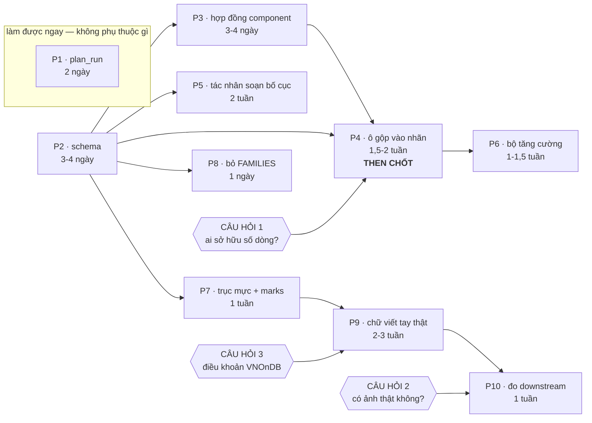

# Kế hoạch chi tiết — mười việc, mô tả từng việc

> Bản chi tiết của [`README.md` §5](README.md#5-kế-hoạch-hợp-nhất). Mỗi việc ghi
> đủ để một người nhận và làm mà không phải hỏi lại: **mục tiêu · file nào đụng
> vào · các bước · xong khi nào · cổng nào phải xanh · bẫy nào đã biết trước.**
>
> Ước lượng công là cho **một người** đã đọc ba tài liệu thiết kế.

## Bản đồ phụ thuộc



`P1` đứng riêng: không mũi tên nào vào, không mũi tên nào ra. Làm được hôm nay.

---

## P1 · `tools/plan_run.py` — LLM viết `pipeline.yaml`

**Công:** 2 ngày · **Phụ thuộc:** không · **Giá trị:** ★★★

> **Brief đầy đủ cho agent nhận việc này: [`brief-plan-run.md`](brief-plan-run.md)** —
> schema đầu vào đã đo, lời gọi SDK chính xác, danh sách cấm, mười test phải
> viết, và checklist nghiệm thu. Mục dưới đây là bản tóm tắt.

**Mục tiêu.** Biến *"một mục tiêu bằng lời + các số đo đã có"* thành một
`pipeline.yaml` hợp lệ **kèm lý do**, thay cho việc một người đọc
`ocr_report.json` rồi tự cân trọng số.

**Đụng vào:** `tools/plan_run.py` (mới) · `tasks.py` (một task) · `Makefile`.
**Không đụng vào:** bất cứ gì trong `pipeline/`, `rulebase/`, `generators/` —
đó là điều làm việc này rẻ và an toàn.

**Việc.**

1. Đọc ba nguồn số: `ocr_report.json` (`by_layout`, `by_layout_augmentation`,
   `worst_fields`), `drift.json`, và đầu ra của `rules_report.py --distribution`.
2. Dựng prompt: mục tiêu người dùng + ba bảng số + trọng số hiện hành + danh
   sách khoá hợp lệ của `pipeline.yaml` (lấy từ `_reject_unknown` trong
   `pipeline/config.py`, đừng chép tay).
3. **Hai lượt** (§6.3 tài liệu 1): lượt một lập luận tự do — *"bố cục nào yếu?
   yếu vì bố cục hay vì nó rơi trúng mix làm cũ nặng?"*; lượt hai mới xuất YAML
   dưới ràng buộc.
4. Ghi ra `proposals/run-<ngày>/` gồm `pipeline.yaml` và `reasoning.md`.
   **Không bao giờ ghi đè `pipeline.yaml` ở gốc** — người chép sang.
5. Tự xác thực: gọi `Config.load()` lên file vừa sinh, in lỗi nếu có.

**Xong khi.**

* `python tools/plan_run.py --goal "..." --report data/dataset60/proof/ocr_report.json`
  cho ra một file mà `Config.load()` nhận.
* **Mỗi mục trong `overrides:` có một dòng comment nói vì sao** — `pipeline.yaml`
  là file được chú thích dày nhất repo vì mỗi con số là một quyết định; một file
  do máy sinh mà không nói được vì sao thì làm hỏng nếp đó.
* Một override trỏ vào thứ không tồn tại bị **báo trước khi ghi ra**, không để
  `run.py` phát hiện lúc chạy.

**Cổng:** `Config.load()` xanh · `python tasks.py check` · `lint`.

**Bẫy.**

* LLM sẽ muốn sửa `run.pairing` và `run.seed`. Đổi hai khoá đó thì bộ dữ liệu
  mới **không so được** với bộ cũ. Chặn trong prompt **và** kiểm lại sau khi sinh
  — prompt một mình không phải là ràng buộc.
* `layouts: []` nghĩa là "mọi bố cục" và đúng cho một dataset, **sai** cho một
  so sánh cố định: quota đi theo thứ tự danh sách, nên bộ hôm nay khác bộ ngày
  mai nếu có ai thêm bố cục.

---

## P2 · `rulebase/schema.py` — ngữ pháp bố cục thành dữ liệu

**Công:** 3–4 ngày · **Phụ thuộc:** không · **Giá trị:** ★★★

**Mục tiêu.** Một file vừa là **cổng kiểm** vừa là **hợp đồng** đưa cho LLM.
Viết hai lần thì hai bản sẽ lệch nhau trong vòng một tháng.

**Quy mô, đã đếm** — đây là thứ quyết định ước lượng 3–4 ngày:

```
16 file bố cục  →  26 khoá cấp 1,  112 khoá ở mọi cấp
vốn từ phải đóng băng:  20 nguồn `from:`  ·  23 `role`  ·  15 section  ·  5 khổ giấy
```

**Đụng vào:** `rulebase/schema.py` (mới) · `rulebase/layout.py` (`build_grid`
gọi rồi raise) · `tools/rules_report.py` (`check()` gọi rồi liệt kê) ·
`tasks.py` + `Makefile` (`check-layouts`, `layout-schema`) ·
`.github/workflows/ci.yml`.

**Việc.**

1. `LAYOUT_SCHEMA` — khai theo **khối**, không phẳng: `header`, `meta`,
   `columns`, `item`, `totals`, `table`, `letterhead`, `parties`, `signatures`,
   `words`, `notes`, `vat_summary`, `strip`, `doctitle`, `footer`.
2. Đóng băng bốn vốn từ thành hằng số: `FROM_SOURCES` (20), `ROLES` (23 — hôm
   nay chỉ là chuỗi rải trong `layout.py`), `SECTIONS`, `SHEETS`.
3. `validate_layout(spec, layout_id) -> list[str]` — liệt kê **mọi** vấn đề,
   không dừng ở cái đầu tiên.
4. Khoá **mới** cho cây cột (§3.1 tài liệu 2): `columns[].optional` ·
   `table.merges[]` (`from`/`to`/`title`/`compose`) · `table.stub.columns` ·
   `table.header_groups[].optional` · `provenance` (`method` **bắt buộc**).
5. `schema_json()` — cùng schema, dạng JSON. Đây là thứ đưa cho LLM.
6. Gắn ba chỗ: `build_grid` raise · `rules_report.check()` liệt kê ·
   `make check-layouts` + `make layout-schema`.

**Kiểm phải bắt được** (hôm nay **không** cái nào bị bắt):

| | lỗi | hôm nay ra sao |
| --- | --- | --- |
| a | khoá lạ ở mọi cấp, kể cả trong `columns[]` và `item.rows[][]` | im lặng bỏ qua |
| b | `from:` trỏ nguồn không có trong 20 nguồn | in ra chuỗi rỗng |
| c | `col:` trỏ `key` chưa khai | ô rơi về `0..ncols` |
| d | tổng bề rộng cột + gutter > `width` nhỏ nhất | tràn, phát hiện bằng mắt |
| e | không có **đúng một** cột `width: 0` | cột cuối nuốt phần thừa |
| f | `shade:`/`border:` khai mà thiếu `rules: marks` | âm thầm bị bỏ qua |
| g | section khai mà thiếu khối cấu hình nó cần | vẽ ra khối rỗng |
| h | `merges` không có `compose` | *(khoá mới)* |
| i | `header_groups.from/to` không phải `key` có thật, hoặc hai nhóm chồng nhau | *(chỉ đường CSS đọc, im lặng bỏ qua)* |

**Xong khi.**

* 16 file hiện có qua **sạch**.
* Thí nghiệm `headr:` + `columns[0].algin:` báo **đúng hai lỗi**, kèm gợi ý
  chính tả (`ý bạn là 'header'?`).
* Một test khẳng định **mọi khoá xuất hiện trong 16 file đều có trong schema** —
  112 khoá. Đây là thứ giữ `schema.py` và `rulebase/README.md` §3 không lệch
  nhau, và nó phải chạy trong CI.
* CI job `rules` chạy thêm `check-layouts`.

**Cổng:** `pytest` · `check-rules` · `check-layouts` (mới) · `lint`.

**Bẫy.**

* `medical_statement.yaml` là file **duy nhất** khai `header_groups`. Rất dễ
  viết schema vừa khít nó rồi 15 file kia rơi. Chạy trên cả 16 **trước** khi
  khoá.
* Đừng để `validate_layout` dừng ở lỗi đầu: một người sửa YAML muốn thấy hết
  một lượt, và một LLM tự sửa thì càng cần (§10 tài liệu 1, vòng tự sửa).

---

## P3 · Hợp đồng component

**Công:** 3–4 ngày · **Phụ thuộc:** song song P2 (merge cùng lúc — chung schema)

**Mục tiêu.** 15 emitter thành 15 component **có khai báo**, để (a) kiểm được
một `sections:` có mạch lạc không, (b) xáo trộn/bỏ bớt được an toàn, (c) LLM có
một thực đơn máy đọc được.

**Vấn đề hôm nay:** `SECTIONS[name](builder, spec, receipt, columns, rng)` —
mọi component nhận **toàn bộ** `spec`, không khai mình cần gì, vẽ ra `role`
nào, phải đứng sau ai.

**Đụng vào:** `rulebase/layout.py` (`SECTIONS` dict → registry có kiểu) ·
`rulebase/schema.py` (`accepts` của từng component).

**Việc.**

1. ```python
   @dataclass(frozen=True)
   class Component:
       id: str
       emit: Callable
       requires: frozenset[str] = frozenset()   # trường trên Receipt nó cần
       provides: frozenset[str] = frozenset()   # role nó vẽ ra
       after: frozenset[str] = frozenset()      # ràng buộc thứ tự
       optional: bool = False
       repeatable: bool = False
       accepts: dict = field(default_factory=dict)   # schema RIÊNG của khối
   ```
2. Khai cho cả 15. Ví dụ: `doctitle.after = {letterhead}` ·
   `vat_summary.after = {table}` · `signatures.after = {totals}` ·
   `words.requires = {invoice}` · `notes.optional = repeatable = True`.
3. `validate_sections(sections) -> list[str]` — thứ tự vi phạm `after`,
   component `requires` thứ không ai `provides`, component lặp mà không
   `repeatable`.
4. Chia `LAYOUT_SCHEMA` theo `accepts` của từng component.

**Xong khi.**

* `sections: [vat_summary]` mà không có `table` bị **từ chối kèm lý do**.
* Thêm một component mới = **một entry trong registry**, không sửa `build_grid`.
* Câu lỗi đổi từ *"khoá lạ `algin`"* thành *"`table.algin` không có — `table`
  nhận: frame, row_rules, blank_rows, shade, border, header_groups, merges,
  stub"*. Với một LLM đang sửa YAML của chính nó, khác biệt này là khác biệt
  giữa hội tụ ở vòng 1 và vòng 4.

**Bẫy.** `after` phải là **quan hệ thứ tự bộ phận**, không phải một thứ tự cứng
— nếu khai chặt quá thì `reorder` (§4b.4 tài liệu 2) không còn nước đi nào.
Chỉ khai những ràng buộc **thật sự** vô nghĩa nếu vi phạm.

---

## P4 · Ô gộp vào lưới ký tự **và vào nhãn** — bước then chốt

**Công:** 1,5–2 tuần · **Phụ thuộc:** P2, P3, **và câu hỏi 1** · **Giá trị:** ★★★

**Mục tiêu.** Nhãn cấu trúc thôi là **đặc quyền của renderer có DOM**.

Đây là bước đáng làm **kể cả nếu không bao giờ sinh một biến thể nào** — nó vá
đúng khiếm khuyết [`brief-engine-html.md` §2](brief-engine-html.md) đã đo và ghi
lại: *"Ảnh có ô gộp, nhãn thì không biết."*

**Đo hiện trạng:**

```
invoices54/html     105 boxes · 102 cells · 240 token      ← duy nhất đủ
invoices54/genalog  105 boxes ·   0 cells · 240 token      ← có cấu trúc, không có hình học
dataset60/html       16 boxes ·   0 cells ·   0 token      ← đường lưới: không có gì
dataset60/synthdog   16 boxes ·   0 cells ·   0 token
```

**Đụng vào:** `rulebase/layout.py` (`Cell`, `_emit_column_header`,
`_emit_framed_totals`, `_group_row`, `_paint_bars`, `Grid.to_dict`) · cả ba
`generators/*/render.py` · `pipeline/record.py` · `pipeline/invariants.py` ·
`tests/test_layout.py`.

**Việc.**

1. `Cell` thêm `colspan: int = 1`, `rowspan: int = 1`, `roles: tuple = ()`.
   **Đơn vị là cột bảng, không phải ký tự** — `col0`/`col1` vẫn là ký tự để vẽ;
   hai hệ, cái thứ hai **dẫn xuất** từ cây cột (§5.1 tài liệu 3).
2. `_emit_column_header` đọc `table.header_groups`: dựng hai tầng, cột ngoài
   nhóm `rowspan=2`. Đường CSS đã làm đúng trong `_header_rows` — dùng chung
   logic nếu tách được, chép nếu không.
3. Mọi chỗ đang **mô phỏng** gộp phải **khai** nó:
   `_emit_framed_totals` (dòng tổng phủ tới cột đầu tiên có số) · `_group_row`
   (dải phân nhóm) · `_span` trong `item.rows` (đã là colspan cục bộ từ đầu).
4. `Grid.to_dict()` mang `colspan`/`rowspan`/`roles`.
5. **Ba backend phát `cells`**, mỗi cái bằng phép nhân nó đã làm sẵn:
   * html — đã có (`CELL_REGIONS_JS`), không đổi
   * genalog — biên cột × `line_px`, cùng phép nhân `marks_for` đang làm cho `Mark`
   * synthdog — `(row, col0, col1)` × advance của font, cùng phép nhân `RectLayer` đang làm
6. `record.py` nhận `cells` + `structure` cho **mọi** backend, `validate` kiểm.
7. Hai bất biến mới: **(e)** ô gộp không phủ cột có giá trị ở hàng đó · **(f)**
   token dựng lại được trang (dùng lại `rebuild_html` của `tables.py`).

**Xong khi — phép thử mạnh nhất trong cả kế hoạch:**

> `medical_statement` qua **đường lưới ký tự** và qua **đường CSS** phải cho ra
> **cùng một chuỗi `structure` token**.

Hai engine độc lập đồng ý về cùng một cấu trúc. Nếu chúng lệch, một trong hai
đang mô tả sai trang của mình.

Thêm: `dataset60/html` (đường lưới) phải có `cells > 0` — hôm nay là 0.

**Cổng:** `pytest` · `check-layouts` · `check-boxes` trên cả hai bộ đã commit ·
`baseline-verify` (sẽ đỏ — xem bẫy).

**Bẫy.**

* `_paint_bars()` hôm nay **bỏ qua** vị trí đã có ô chiếm chỗ, tức nó *suy ra*
  ô gộp từ chỗ trống. Phải đổi thành **đọc `colspan`**, không suy ra — nếu
  không thì nhãn và hình vẫn có thể lệch nhau.
* Trang hoá đơn GTGT có **hai bảng** (hàng và "Tổng hợp") và `_resolve()` được
  gọi **riêng cho từng bảng**. `data-row` phải đánh số **xuyên suốt cả trang**;
  restart ở bảng thứ hai sẽ hàn hai bảng thành một hàng vô nghĩa —
  `sheets/base.py` docstring đã cảnh báo đúng chỗ này.
* `make baseline-verify` **sẽ đỏ** (nhãn đổi, có thể cả pixel). Đó là đúng
  thiết kế: chụp lại bằng `make baseline-write REASON="..."`, và lý do phải nói
  rõ là nhãn thêm trường chứ không phải pixel hồi quy.

**⚠ Chặn bởi câu hỏi 1** — content-first hay layout-first quyết định `merges`
địa chỉ hàng bằng neo tượng trưng hay bằng chỉ số tuyệt đối. Chốt trước khi viết
dòng đầu tiên.

---

## P5 · Tác nhân soạn bố cục, và khai cây cho 15 bố cục

**Công:** 5a 2–3 ngày · 5b 1–1,5 tuần · **Phụ thuộc:** P2

Hai việc dùng chung hạ tầng. **Làm 5a trước** — dễ hơn, rẻ hơn, và cho giá trị
ngay cả khi 5b chưa xong.

### P5a · Khai cây cột cho 15 bố cục còn lại

Hôm nay **1/16** bố cục khai `header_groups`. Không phải vì 15 tờ kia không có
nhóm cột — `invoice_vat_form` có `Thuế suất GTGT` và `Thành tiền có thuế GTGT`
đứng cạnh nhau và tờ mẫu thật gộp chúng — mà vì khai ra thì **chỉ đường CSS
được lợi**. Sau P4 thì cả ba đường đều được lợi.

**Việc.** Với mỗi bố cục: mở file YAML **cùng bức ảnh mà `source:` trỏ tới**,
trả lời ba câu hẹp:

1. Cột nào là **các mặt của cùng một khái niệm**? → `header_groups`
2. Cột nào tờ này có mà tờ cùng họ bỏ? → `optional: true`
3. Cặp cột nào gộp được, và **viết chung thế nào**? → `merges` + `compose`

**Xong khi.** `make structures` in ra **> 1 cấu trúc** cho ít nhất 8 bố cục, và
mỗi khai báo mới có **một dòng lý do** — như comment `medical_statement` đã có:
*"Bốn cột cuối là bốn NGUỒN của cùng một số tiền, nên tờ mẫu gộp chúng dưới một
tiêu đề chung."*

**Vì sao đây là việc đầu tiên nên giao cho LLM:** câu hỏi hẹp, hỏi trên file
**đã đo từ giấy thật**, dễ phản biện, và rủi ro thấp hơn hẳn soạn bố cục mới.

### P5b · `tools/propose_layout.py` — soạn bố cục **mới**

**Ba lượt** (§10 tài liệu 1):

| lượt | làm gì | ràng buộc |
| --- | --- | --- |
| 1 | suy luận tự do: tờ này có mấy khối? cột nào? chỗ nào để trống cho người điền? giống bố cục nào đang có? | **không** ép định dạng — ép ở đây là trả chất lượng bố cục để mua sự tiện (§6.3 tài liệu 1) |
| 2 | chuyển bản suy luận thành YAML | ràng buộc schema (`schema_json()` của P2) · sinh **k phương án**, không một |
| 3 | xếp hạng k phương án | (a) số lỗi schema · (b) một VLM so `preview` với ảnh gốc · (c) khoảng cách tới bố cục đã có — **thưởng cái khác, phạt cái trùng** |

Chọn ví dụ mồi **động**: k bố cục gần nhất, đo bằng thứ đã có trong file — cùng
họ, có/không `sheet`, `rules: marks` hay `ascii`, số cột, có
`letterhead`/`table`/`signatures` không. Mười sáu file thì không cần embedding.

**Thư mục đề xuất — tác nhân không bao giờ ghi vào `rulebase/`:**

```
proposals/<id>/
├── reasoning.md         lượt 1 — để người đọc hiểu tác nhân NGHĨ gì
├── candidates/01..05.yaml
├── ranking.json         điểm từng phương án và vì sao
├── layout.yaml          phương án thắng
├── rules-layout.yaml    khối để chèn, dưới họ nào
├── provenance.json      nguồn · method · model · hash prompt · ngày
├── preview.txt          make preview-grid
├── rounds/NN.errors     mọi vòng tự sửa
└── verdict.md           A5 phản biện
```

**A5 phản biện — nhiệm vụ là BÁC BỎ, không phải chấm điểm:**

> *"Nêu một chứng từ Việt Nam có thật mà bố cục này mô tả sai. Nêu một trường mà
> nhãn sẽ khai nhưng trang không in. Nêu một cột mà bề rộng cộng lại không vừa
> khổ giấy hẹp nhất. **Mặc định là BÁC BỎ nếu không chắc.**"*

**Vòng tự sửa:** LLM đọc đầu ra validator và sửa YAML của chính nó, **tối đa 5
vòng**, ghi **mọi** vòng vào `rounds/`. **Dừng nếu một lỗi lặp hai vòng liền** —
model đang loanh quanh chứ không đang sửa.

**Chuỗi cổng của `make accept-layout ID=<id>`**, dừng ở lỗi đầu:

```bash
make check-layouts LAYOUT=<id>          # P2
make check-rules                        # khai báo trong họ có hợp lệ không
make preview-grid LAYOUT=<id>           # NGƯỜI nhìn một lần
make preflight                          # phủ glyph chuỗi mới, tràn khổ giấy
python -m pytest tests/test_layout.py tests/test_content.py -q
python tools/generate_dataset.py -n 3 --layouts <id> -o data/tmp-<id>
make check-boxes
```

`accept-layout` **không bao giờ** chạy `baseline-write` — thêm bố cục làm đổi kế
hoạch, nên chụp lại phải có chủ ý và có lý do riêng.

**Nền móng đã có sẵn — đây là chỗ việc này rẻ hơn tưởng:** `tests/test_layout.py`
đọc `available_layouts()` chứ không liệt kê tên, nên một file mới **tự động**
được 5 seed × ~15 kiểm tra hình học; `preflight.printable_text` đã đi bộ *toàn
bộ* file bố cục nên chuỗi mới được kiểm phủ glyph ngay ngày thêm vào.

**Bẫy.** LLM sẽ muốn phát minh section mới. Schema phải nói rõ 15 section là
**danh sách đóng** và **liệt kê ra trong câu lỗi**, không chỉ nói "không hợp lệ".

---

## P6 · Bộ tăng cường + `rules/structure.yaml`

**Công:** 1–1,5 tuần · **Phụ thuộc:** P4

**Mục tiêu.** Một bố cục → hàng trăm biến thể **chứng minh được là hợp lệ**.

**Đụng vào:** `rulebase/structure.py` (mới) · `rules/structure.yaml` (mới) ·
`rules/_order.yaml` (một dòng) · `rulebase/layout.py` (`build_grid` nhận spec
hiệu dụng; `row_local_merge` phán quyết tại đây) · `pipeline/drift.py` (trần
biến thể) · `tasks.py` + `Makefile`.

**Việc.**

1. `resolve_structure(recipe, spec) -> spec hiệu dụng` — áp nước đi **mức
   component** (4) và **mức cột** (8), giải xung đột. Xung đột điển hình: bỏ cột
   `unit` và gộp `qty`+`unit` **loại trừ nhau**.
2. `rules/structure.yaml` — trục thứ 9, bốc **ngay sau `layout`**, mỗi giá trị
   trỏ vào **một biến thể có tên**. **Không tham số ngẫu nhiên nào.**
3. `layouts/variants/<layout>/vNN-<tên>.yaml` — chỉ khai **delta**, có
   `derives_from` và `provenance.method: llm_variant`.
4. Nước đi thứ chín `row_local_merge` phán quyết **trong `build_grid`**, **từng
   hàng một**, bằng vị từ — vì chỉ ở đó mới biết hàng này có số ở cột nào.
5. `make structures` (đếm + liệt kê cấu trúc hợp lệ) ·
   `make preview-structures LAYOUT=<id>` (in **mọi** biến thể dạng text, cạnh
   nhau — 48 biến thể là hai màn hình, đủ để một người liếc qua).
6. `drift.py`: **trần biến thể ≤ 40% một lần chạy**, cảnh báo khi vượt — cùng cơ
   chế `FALLBACK_LIMIT = 0.05` đã dùng cho nguồn nội dung.

**Ranh giới phải giữ đúng** (§4.2 tài liệu 2):

| loại quyết định | ví dụ | xử lý |
| --- | --- | --- |
| **cấu trúc** — có thể làm mất một giá trị | ô nào gộp · cột nào bỏ · component nào chạy | **khai tường minh**, có tên, có duyệt |
| **vô hướng trong khoảng** — không thể làm mất gì | `width: [104,118]` · `blank_rows: [3,6]` · `name_scale` | **bốc từ seed** |

**Xong khi.**

* `make structures` in ra **48 cấu trúc cột × 8 biến thể component** cho
  `invoice_vat_form`.
* Mẫu ngẫu nhiên **100 trang** trong số đó dựng được, qua bất biến,
  `preview-grid` đọc được.
* Một mục `merges` không thoả vị từ → **báo lỗi có địa chỉ lúc soạn**, không im
  lặng bỏ qua lúc chạy. *(Đây chính là khiếm khuyết của bản thiết kế đầu —
  §3.2 tài liệu 2.)*
* `as_printed` là giá trị **nặng ký nhất** trong `structure.yaml`.

**Bẫy.** Đừng đọc bảng nhân (5.760 trang từ một file) thành "khỏi cần thêm bố
cục". 5.760 biến thể của **một** tờ giấy tương quan rất cao; chúng chống overfit
vào *một cách trình bày*, không thay được việc đo tờ giấy thứ mười bảy.

---

## P7 · Trục mực `ink` + nguồn `marks`

**Công:** 1 tuần · **Phụ thuộc:** P2

**Mục tiêu.** Thông **cả đường ống mực** bằng ca dễ nhất, trước khi thay ruột.

**Đụng vào:** `rulebase/layout.py` (`Cell.ink`) · `rules/ink.yaml` (mới) ·
`rules/_order.yaml` · `ink/` (package mới) · cả ba `generators/*/render.py` ·
`pipeline/invariants.py` · `tools/ocr_proof.py`.

**Việc.**

1. `Cell.ink: str = "press"` — bốn giá trị `press | hand | stamp | redact`.
2. `rules/ink.yaml` + một dòng trong `_order.yaml`: **bốc thứ 4**, sau `content`
   trước `visual` — nó cần biết chữ là gì, và phải đặt thẻ trước khi `visual`,
   `color`, `ornament`, `augmentation` bốc.
3. Ba renderer **chừa hộp** cho ô `ink != press`: bố trí như thường, ghi quad,
   **không đổ mực**.
   * synthdog — `TextLayer` trong suốt · html — `color: transparent` ·
     genalog — như trên (PyMuPDF vẫn đọc được chuỗi ký tự nên hộp vẫn ra)
4. `ink/` — package mới, **anh em với `degradation/`**, thuần numpy/opencv (cả
   ba venv phải import được). `apply_ink(image, grid, receipt, recipe, seed)
   -> (image, boxes)`.
5. `ink/sources/marks.py` — ✓, gạch chân, gạch xoá. Nét dựng tay, không mạng.
6. `HandSource` protocol với **`can_write()` đứng trước `write()`**.
7. Bất biến mới: **ô `hand` phải có mực trong hộp** (dùng `ink_coverage` của
   `drift.py`).
8. `ocr_proof`: nhóm `by_ink` — **thêm TRƯỚC khi bật chữ tay**, để có mốc so.

**Xong khi.** Một dấu tích lên đúng ô, **có hộp trong `metadata.jsonl`**, và một
ô `hand` rỗng làm **đỏ** bất biến.

**Bẫy.**

* `ink/` **không** được đặt vào `rules/augmentation.yaml`. `degradation/` không
  sinh hộp và cấm đổi kích thước; `ink/` **viết chữ**, nên nó sinh hộp và chịu
  kiểm. Đặt nhầm chỗ là cách chắc chắn nhất để có chữ trên trang mà nhãn không
  biết.
* `make baseline-verify` **sẽ đỏ** ngay khi `ink` vào `_order.yaml` — thêm một
  trục làm đổi **mọi** lần bốc. Đúng thiết kế; chụp lại có `REASON`.
* Bắt đầu bằng **`marks`, không phải `writevit`**: một nét thẳng run không đòi
  hình dạng chữ, và nó đủ để chứng minh cả đường ống — `Cell.ink` → renderer
  chừa hộp → `ink/` vẽ → hộp vào `metadata.jsonl` → `invariants` kiểm →
  `ocr_proof` tách nhóm.

---

## P8 · Bỏ hard-code `sheets.FAMILIES`

**Công:** 1 ngày · **Phụ thuộc:** P2

**Mục tiêu.** Xoá **điểm chạm Python cuối cùng** trên đường thêm một bố cục.

**Vấn đề.** `FAMILIES = {"invoice_vat_form": statutory, ...}` — một bố cục mới
đi đường CSS **bắt buộc** phải sửa Python, trong khi README tự nhận *"Nothing in
`generators/` changes"*. Với đường lưới thì câu đó đúng; với đường CSS thì chưa.

**Việc.** Bố cục tự khai `family: statutory`; schema kiểm giá trị nằm trong danh
sách module có thật; `FAMILIES` thành **sổ đăng ký module** chứ không còn là
bảng tra bố cục; `family_of()` đọc từ spec, giữ nguyên câu lỗi kèm danh sách.

**Xong khi.** Thêm một bố cục đi đường CSS **không sửa file Python nào**.

---

## P9 · Chữ viết tay thật

**Công:** 2–3 tuần · **Phụ thuộc:** P7, **và câu hỏi 3**

**Mục tiêu.** Lấp `handwriting_fill` — thứ
[`hoa-tiet-de-xuat.md`](hoa-tiet-de-xuat.md) gọi là **khoảng trống lớn nhất**
của bộ dữ liệu.

**Việc.**

1. `ink/sources/writevit.py` — bọc `tools/writevit/infer.py`. **Nạp mô hình một
   lần cho cả shard**: một trường mất ~6,7 s trên CPU và phần lớn là nạp
   `VN.pickle` (193 MB).
2. `can_write()` trả về ký tự **không** viết được. `preflight` gọi nó trên **mọi
   chuỗi mà `hand_roles` có thể tạo ra** — y hệt cách nó đang kiểm phủ glyph của
   font. Cùng một kiểm tra, cùng lý do, khác nguồn mực.
3. `ink/sources/digits.py` — nguồn **chữ số và `,. /-`**. Đây là chặn cứng:
   WriteViT có **0/10.131** token từng thấy chứa chữ số, và `ALPHABET` không có
   dấu phẩy/chấm/gạch chéo — nên `15/03/2025` và `1.500.000` không sinh được.
   **Dấu thanh là bài riêng của tiếng Việt; chữ số thì không** — một mô hình nét
   huấn luyện trên IAM-OnDB/VNOnDB dùng được, và rẻ hơn hẳn huấn luyện lại
   WriteViT.
4. `ink: stamp` — con dấu từ `textures/ornament/`, trộn **nhân** (mực dấu là mực
   trong, chữ dưới phải đọc được). **Đây là lần đầu `ornament` được vẽ lên
   trang**: hôm nay nó được bốc, được ghi vào `metadata.jsonl`, và không renderer
   nào vẽ nó.
5. `ink/sources/signature_bank.py` — nếu tìm được tập chữ ký có giấy phép. Không
   dựng bằng đường Bézier: `ff9a9f0` đã đi đường đó và đã sai.

**Xong khi.** Một tờ `invoice_vat_form` có **nhãn in sẵn + giá trị viết tay +
dấu tròn đóng lên chữ ký**, mọi bất biến xanh, `check-boxes` xanh.

**Bẫy.**

* WriteViT ra ảnh cao 32 px **nền trắng** → hợp thành phải lấy
  `alpha = 1 - giá trị điểm ảnh`, **không phủ đè**.
* Ảnh cao 32 px vào ô cao 6–8 mm ở 150 dpi (35–47 px) → phóng 1,1–1,5 lần. Tầng
  `degradation/` vốn đã làm nhoè, nên đây không phải vấn đề — nhưng đừng phóng
  quá 2×.
* **Nguồn mực im lặng vẽ sai còn tệ hơn nguồn từ chối.** WriteViT không báo lỗi
  khi gặp chữ số — nó vẽ một nét ngoằn ngoèo *trông như chữ*, và nhãn vẫn khai
  đúng số tiền. Đó là lý do `can_write()` phải chạy trước.

**⚠ Chặn bởi câu hỏi 3.** Tám kho sinh chữ tay đều MIT, nhưng trọng số học từ
**IAM-OnDB và VNOnDB** — điều khoản phát hành lại của **dữ liệu** mới là thứ
quyết định ảnh sinh ra có công bố được không. Đọc **trước** P9, không phải sau.

---

## P10 · Đo downstream — điều kiện nghiệm thu

**Công:** 1 tuần sau khi có tập đánh giá · **Phụ thuộc:** P9, **và câu hỏi 2**

**Mục tiêu.** Trả lời câu *"chữ viết tay tổng hợp có làm mô hình tốt lên
không"* bằng **số**, không bằng một bức ảnh đẹp.

**Vì sao đây là điều kiện nghiệm thu chứ không phải phần thưởng.**
[*Quo Vadis Handwritten Text Generation for HTR*](https://arxiv.org/pdf/2508.09936)
(2025) hỏi đúng câu này và trả lời: lợi ích **không đồng nhất**, phụ thuộc chất
lượng sinh, đặc điểm tập dữ liệu và cách trộn. Khuyến nghị của họ: *kiểm chứng
trên chính bài toán của mình trước khi cam kết nguồn lực.*

**Việc.**

1. Lấy một tập **nhỏ ảnh thật** form Việt Nam điền tay — đủ để **đánh giá**,
   không cần đủ để huấn luyện.
2. Huấn luyện một mô hình nhận dạng nhỏ ở **ba chế độ**:

   | | tập huấn luyện |
   | --- | --- |
   | a | chỉ dữ liệu in sẵn có |
   | b | in + **tổng hợp điền tay** |
   | c | in + một ít **thật** *(nếu có)* |

3. So cả ba trên **tập thật**.

**Xong khi.** Có bảng ba cột, và một câu kết luận.

> **Nếu (b) không hơn (a), đợt 4 chưa xong** — và thứ phải ghi lại là **vì
> sao**, không phải là thêm ảnh.

**Neo chống model collapse** (§6.1 tài liệu 1): tỉ lệ dữ liệu thật trong tập
huấn luyện **không được về 0** — ngưỡng ~5% là con số đã có trong tài liệu; và
mỗi vòng **cộng dồn**, không ghi đè.

---

## Đợt 5 · Mở rộng — sau khi bốn đợt trên đứng vững

| việc | vì sao | công |
| --- | --- | ---: |
| **Nhiều trang** — `doc_id` + `page` trong `record.py`; `plan.py` cấp seed theo *tài liệu* chứ không theo *ảnh* | mở KIE nhiều trang, DocVQA. Hôm nay một ảnh = một trang, không diễn tả được một tập hoá đơn | 1 tuần |
| **TEDS** cho `data/tables60` | thước đo đúng cho cấu trúc bảng; README đã tự nhận thiếu | 3–4 ngày |
| **Engine thứ tư: Typst** | 200–500 ms/tài liệu, ra PDF/SVG/PNG, tạo hình chữ khác cả ba engine hiện có — rẻ hơn WeasyPrint và thêm một cách vẽ | 1 tuần |
| **Corpus `source: llm`** | móc **đã chừa sẵn**: `drift.SOURCES = ("corpus", "llm", "fallback")`. Phá trần corpus (115 món quán, 88 mặt hàng) mà không đụng cấu trúc trang | 2–3 ngày |
| **Layout-FID** (LayoutLMv3) | thước phụ đo "có giống phân phối tài liệu thật không" — thứ `drift.py` không đo. **Không** được thành mục tiêu tối ưu | 3 ngày |
| **Mô hình học trò + vòng lặp đóng đầy đủ** | §11 tài liệu 1. Bắt đầu bằng tiêu chí chọn **tầm thường** (lấy mẫu tỉ lệ nghịch với điểm theo bố cục) | tuỳ |
| **Loại chứng từ mới** (chạm `content.py`) | chỗ **duy nhất** một sửa đổi có thể phá bất biến nhãn↔pixel. LLM đề xuất patch, **người duyệt** | tuỳ |

---

## Bảng tra nhanh

| | việc | công | phụ thuộc | chặn bởi |
| --- | --- | ---: | --- | --- |
| **P1** | `plan_run.py` — LLM viết `pipeline.yaml` | 2 ngày | — | — |
| **P2** | `rulebase/schema.py` | 3–4 ngày | — | — |
| **P3** | hợp đồng component | 3–4 ngày | ‖ P2 | — |
| **P4** | **ô gộp vào nhãn** *(then chốt)* | 1,5–2 tuần | P2, P3 | **Q1** |
| **P5a** | khai cây cho 15 bố cục | 2–3 ngày | P2 | — |
| **P5b** | `propose_layout.py` | 1–1,5 tuần | P2, P5a | — |
| **P6** | bộ tăng cường + `structure.yaml` | 1–1,5 tuần | P4 | — |
| **P7** | trục mực `ink` + `marks` | 1 tuần | P2 | — |
| **P8** | bỏ `sheets.FAMILIES` | 1 ngày | P2 | — |
| **P9** | chữ viết tay thật | 2–3 tuần | P7 | **Q3** |
| **P10** | **đo downstream** *(nghiệm thu)* | 1 tuần | P9 | **Q2** |

Năm câu hỏi cần người chốt: [`README.md` §7](README.md#7-năm-câu-hỏi-cần-người-chốt).
