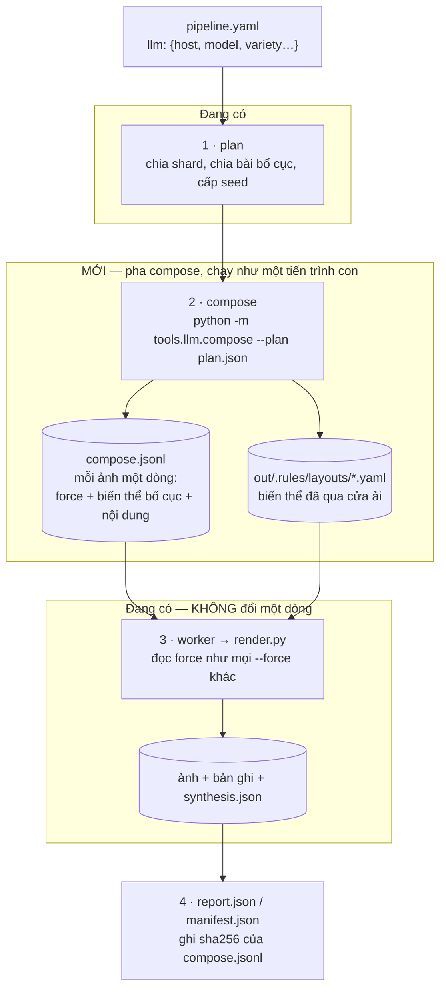

# Nối LLM vào pipeline: thiết kế

> Model chạy trên server, gọi qua API. Nó **đọc tham số của từng lượt chạy**,
> tự nghĩ ra biến thể bố cục, tự viết nội dung điền vào thay vì lấy từ corpus,
> và tự chọn các lớp augment cho **từng ảnh một** — trong khi cả lượt chạy vẫn
> cân bằng và vẫn **dựng lại được từng byte**.
>
> Tài liệu này là thiết kế. Phần đã làm xong được đánh dấu ✅; phần còn lại là
> việc tiếp theo, không phải lời hứa suông — mỗi bước nói rõ nó chạm vào file
> nào và cái gì chứng minh nó đúng.

---

## 1. Mâu thuẫn phải giải, chứ không phải né

Kho này dựng trên một lời hứa: **cùng seed thì ra cùng byte**.
`tools/baseline.py` vân tay từng ảnh, `tests/test_worklist.py` vẽ một trang
theo hai đường rồi so sha256, `pipeline/run.py` chứng minh một worker và tám
worker cho ra `manifest.json` giống hệt nhau.

Gọi model **trong lúc vẽ** phá cả ba, và phá lặng lẽ: ảnh vẫn ra, chỉ là không
còn dựng lại được nữa. `tools/llm/client.py` mở đầu bằng đúng câu đó, và
`tests/test_llm.py` khẳng định bằng một assertion — `pipeline/` và
`generators/` không được import bất cứ thứ gì dưới `tools/llm/`.

Nhưng yêu cầu ở đây là **mỗi ảnh một quyết định của model**. Hai điều ấy chỉ
mâu thuẫn nếu ta cho rằng "model quyết định" và "lúc vẽ" phải xảy ra cùng lúc.
Tách chúng ra thì hết mâu thuẫn:

> **Model quyết định TRƯỚC, và quyết định của nó được ghi thành file. Lúc vẽ
> chỉ đọc file.**

Đó là toàn bộ thiết kế. Phần còn lại là chi tiết.

---

## 2. Một pha mới: `compose`



**Vì sao `compose` là tiến trình con chứ không phải một import.** Renderer đã
là tiến trình con (`pipeline/worker.py::renderer_command`); `compose` đi đúng
đường ấy. Nhờ thế ranh giới trong `tests/test_llm.py` còn nguyên: `pipeline/`
gọi một lệnh, không import `tools/llm`. Lượt chạy không khai `llm:` thì pha này
không tồn tại — CI, baseline vàng và mọi tập đã commit đi đúng đường cũ.

**Model không phát minh ra cơ chế mới.** Nó chỉ điền vào hai chỗ pipeline đã có
sẵn:

| Model muốn | Nó viết ra | Ai thi hành |
| :--- | :--- | :--- |
| trang này dùng biến thể bố cục khác | một file YAML trong `out/.rules/layouts/` + `force: {layout: <id biến thể>}` | `rulebase` đọc như bố cục thường |
| trang này làm cũ kiểu khác | `force: {augmentation: …, ornament: …, handwriting: …}` | `worklist` + `--force`, đã có |
| trang này điền nội dung khác | `content: {store.name: …, menu[3].name: …}` | *(bước 4 dưới đây — chỗ duy nhất cần code mới trong đường vẽ)* |

Hai dòng đầu **không cần sửa renderer một dòng nào**. Đó là lý do thiết kế này
nhỏ hơn nó nghe.

---

## 3. Ràng buộc: chứng từ nào được biến đổi ✅

`rulebase/augmentable.yaml` + `tools/llm/policy.py` — **đã làm**.

| mức | nghĩa | ai |
| :--- | :--- | :--- |
| `fixed` | **không đổi bố cục**. Nội dung các trường vẫn đổi | 6 loại: hoá đơn GTGT theo mẫu, bản thể hiện HĐĐT, tiền điện, tiền nước, bảng kê viện phí, hoá đơn xuất khẩu |
| `styled` | cửa hàng tự thiết kế trong khuôn nội dung bắt buộc | 13 loại: giấy tính tiền quán/siêu thị, hoá đơn thương mại, folio khách sạn, giấy uỷ quyền |
| `free` | hình thức là của người làm báo, càng nhiều càng tốt | 4 loại: trang nhất, rao vặt, mục lục tạp chí, phỏng vấn |

Một tờ hoá đơn GTGT bị đổi bố cục **không phải "một cửa hàng khác"** — nó là
một tờ giấy không tồn tại, và mô hình học từ đó sẽ đi tìm trên ảnh thật những
thứ không có ở đấy. Bằng lái, giấy phép, chứng chỉ — khi nào kho có chúng —
vào thẳng `fixed` vì cùng lý do.

**Mặc định là mức chặt nhất.** Loại chứng từ chưa ai phân loại được coi là
`fixed`: quên khai thì mất một biến thể, chứ không phải sinh ra một giấy tờ
pháp lý bịa theo cách chưa ai duyệt. `policy.problems()` báo tên những loại
chưa khai, cả hai chiều.

```bash
python -m tools.llm.policy --check
```

---

## 4. Nội dung do model viết, thay vì lấy từ corpus

Đây là phần duy nhất cần một đường mới trong lúc vẽ, và nó vẫn không phải một
lệnh gọi mạng.

`rulebase.content.build` điền trường từ corpus. Thêm **một lớp phủ**: nếu
recipe mang `content_overrides` thì các trường ấy lấy giá trị đã ghi sẵn, phần
còn lại vẫn từ corpus như cũ. Lớp phủ đi vào qua `force` — nó đã là đường
truyền tham số vào một trang.

Giá trị model viết ra **phải qua `corpus_rules`** đúng như dòng corpus do model
sinh: đó là bộ luật đo từ chính corpus người viết, và nó đã từng loại 48 % số
dòng của lượt sinh đầu tiên. Không có ngoại lệ nào cho "model viết thẳng vào
trang" — trái lại, ở đó nó nguy hiểm hơn, vì không có ai đọc diff trước.

Ràng buộc số học **không** giao cho model: tiền, thuế, tổng cộng vẫn do
`rulebase.content` tính, vì `pipeline/invariants.py` kiểm chúng và một model
cộng sai sẽ làm hỏng cả shard. Model viết **chữ**: tên cửa hàng, tên mặt hàng,
địa chỉ, tiêu đề bài báo, đoạn mở của một mẩu rao vặt.

---

## 5. Cân bằng khi sinh nhiều — đo, không tin

Yêu cầu: "generate nhiều thì data vẫn balance và có nhiều layout khác nhau dựa
trên phôi gốc". Không giao việc ấy cho model, vì model không đếm được cái nó đã
sinh ở 3 000 ảnh trước.

Kho đã có sẵn thước đo: `pipeline/drift.py` tính **total variation** giữa mix
thực tế và mix luật mong đợi, đã trừ đi độ tán của mẫu cỡ đó. `compose` dùng
đúng thước ấy làm **ngân sách**:

```
cho mỗi trục (document, layout family, augmentation, ornament, handwriting):
    share_hiện_có  = đếm những gì compose đã phát ra
    share_kỳ_vọng  = mix luật, lấy từ plan
    nếu đề xuất của model đẩy một trục vượt dung sai:
        từ chối, hỏi lại (tối đa N lần), rồi rơi về giá trị luật tự bốc
```

Ba tính chất đi kèm:

* **Bố cục đã cân bằng sẵn** — `plan.deal` chia bài vòng tròn, mỗi bố cục một
  ảnh rồi quay lại, và hai ảnh liền kề không bao giờ cùng bố cục. `compose`
  không được đổi *bố cục gốc* của một ảnh, chỉ được đề xuất *biến thể* của
  chính bố cục ấy. Nhờ thế cân bằng theo bố cục là bất biến của kế hoạch, không
  phải thứ phải cầu xin model giữ.
* **Nhiều biến thể trên một phôi** — mỗi bố cục gốc sinh tối đa `variety` biến
  thể cho cả lượt chạy (mặc định đề xuất: 8). 32 phôi × 8 = 256 bố cục khác
  nhau, đủ cho một lượt 10 000 ảnh mà vẫn mỗi biến thể ~39 ảnh.
* **Số lượt gọi model là O(bố cục × variety), không phải O(ảnh)** — 256 lượt
  gọi cho 10 000 ảnh. Ở 5 token/giây của con 7B trên CPU, một lượt gọi ~2 phút;
  trên server có GPU thì đây là vài phút cho cả lượt chạy. Gọi mỗi ảnh một lần
  là 10 000 lượt gọi, và đó là lý do thứ hai (sau tính tái lập) để không làm
  thế.

---

## 6. Sổ cái: cái gì làm cho lượt chạy vẫn dựng lại được

`out/compose.jsonl`, mỗi ảnh một dòng:

```json
{"file": "html_017.jpg", "layout": "invoice_sidebar",
 "variant": "invoice_sidebar__v3",
 "force": {"layout": "invoice_sidebar__v3", "augmentation": "flatbed_scan",
           "handwriting": "hand_font", "ornament": "seller_seal"},
 "content": {"store.name": "CÔNG TY TNHH THIẾT BỊ Y TẾ AN KHANG"},
 "policy": "styled",
 "model": {"name": "qwen2.5:32b-instruct", "digest": "845dbda0ea48ed74",
           "prompt_sha": "1f4c…", "seed": 4117}}
```

Và cái này là điều kiện đủ:

* **`plan.json` + `compose.jsonl` + `out/.rules/` = lượt chạy.** Có ba thứ ấy
  thì vẽ lại ra **đúng từng byte**, không cần model, không cần mạng. Chúng được
  commit cùng tập dữ liệu.
* **`manifest.json` ghi sha256 của sổ cái**, nên "tập này sinh bằng model nào,
  quyết định gì" trả lời được mà không phải tin lời ai.
* **Chạy `compose` lần nữa ra sổ cái KHÁC** — model không tái lập được, và
  `client.py` đã nói rõ "thường" là xa nhất nó dám hứa. Đó là lý do sổ cái mới
  là artefact, chứ không phải prompt.
* **Baseline vàng không bao giờ bật `llm:`.** Ba kế hoạch cố định của
  `tools/baseline.py` là chỗ chứng minh "pixel không xê dịch"; một pha có model
  trong đó sẽ biến nó thành thứ đỏ mỗi lần chạy vì lý do vô nghĩa.

---

## 7. Hỏng thì làm gì

| chuyện gì | pipeline làm gì |
| :--- | :--- |
| server không với tới được | `on_error: stop` (mặc định) dừng trước khi vẽ ảnh nào; `skip` chạy tiếp bằng luật thuần và **ghi vào report** rằng lượt này không có compose |
| model trả về YAML hỏng | biến thể bị loại tại cửa ải `augment_layout`, ảnh ấy dùng bố cục gốc, `compose.jsonl` ghi `"variant": null, "rejected": "…"` |
| model viết nội dung phạm luật corpus | loại tại `corpus_rules`, trường ấy quay về corpus |
| model đẩy mix lệch | từ chối theo mục 5 |

Nguyên tắc chung: **một lượt chạy không bao giờ hỏng vì model có một ngày tồi**
— nó chỉ ít biến thể hơn, và nói ra là ít bao nhiêu.

---

## 8. Cấu hình

```yaml
llm:
  host: http://gpu-box.lan:11434   # hoặc để trống, đọc VLM_LLM_HOST
  model: qwen2.5:32b-instruct
  temperature: 0.9
  variety: 8              # biến thể tối đa mỗi bố cục gốc
  content: true           # để model viết chữ vào trang, không chỉ đổi bố cục
  on_error: stop          # stop | skip
  timeout: 900
```

Không khai `llm:` thì không có pha compose. Đó là mặc định, và mọi thứ đã
commit tới hôm nay đều là lượt chạy như thế.

Client đã đọc `VLM_LLM_HOST`, `VLM_LLM_MODEL`, `VLM_LLM_TOKEN` ✅ — trỏ sang
server là một biến môi trường, không phải một bản viết lại, vì Ollama từ xa nói
đúng `/api/chat` như Ollama cục bộ.

---

## 9. Thứ tự làm

| # | việc | file | xong khi |
| ---: | :--- | :--- | :--- |
| 1 ✅ | client nói chuyện được với server | `tools/llm/client.py` | `VLM_LLM_HOST` trỏ đi đâu thì gọi đúng đấy; loopback không qua proxy, host xa thì qua |
| 2 ✅ | chính sách chứng từ nào được biến đổi | `rulebase/augmentable.yaml`, `tools/llm/policy.py` | `--check` khớp hai chiều với `rules/document.yaml` |
| 3 | `compose` sinh biến thể theo lô | `tools/llm/compose.py` | 32 phôi × `variety`, mỗi biến thể qua đủ sáu cửa ải của `augment_layout` |
| 4 | ngân sách cân bằng | `tools/llm/compose.py` + `pipeline/drift.py` | 1 000 ảnh giả lập: total variation mọi trục ≤ dung sai |
| 5 | sổ cái + `pipeline/run.py` gọi pha compose | `pipeline/run.py`, `pipeline/compose.py` | chạy lại từ `compose.jsonl` ra đúng byte; `manifest.json` mang sha256 |
| 6 | lớp phủ nội dung | `rulebase/content.py`, `worklist.py` | trường do model viết qua được `corpus_rules`; số tiền vẫn do rule-base tính |
| 7 | tài liệu + một tập mẫu | `data/llm<N>/` | tập đầu tiên có biến thể do model sinh, kèm sổ cái |

Bước 3 và 5 là phần lớn công việc. Bước 1–2 xong rồi, và chúng là hai thứ phải
đúng trước: một client không trỏ được sang server thì không có gì để thiết kế,
và một pha compose không biết loại giấy nào bị pháp luật ràng buộc là một pha
sinh ra giấy tờ giả.
