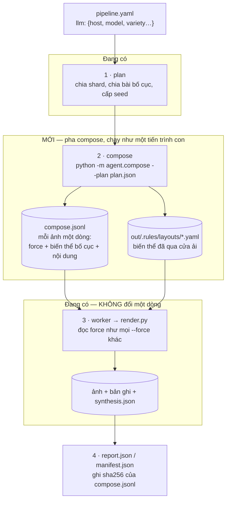

# Nối LLM vào pipeline: thiết kế

> Model chạy trên server, gọi qua API. Nó **đọc tham số của từng lượt chạy**,
> tự nghĩ ra biến thể bố cục, tự viết nội dung điền vào thay vì lấy từ corpus,
> và tự chọn các lớp augment cho **từng ảnh một** — trong khi cả lượt chạy vẫn
> cân bằng và vẫn **dựng lại được từng byte**.
>
> Tài liệu này là thiết kế. Phần đã làm xong được đánh dấu ✅; phần còn lại là
> việc tiếp theo, không phải lời hứa suông — mỗi bước nói rõ nó chạm vào file
> nào và cái gì chứng minh nó đúng.

---

## 1. Mâu thuẫn phải giải, chứ không phải né

Kho này dựng trên một lời hứa: **cùng seed thì ra cùng byte**.
`tools/baseline.py` vân tay từng ảnh, `tests/test_worklist.py` vẽ một trang
theo hai đường rồi so sha256, `pipeline/run.py` chứng minh một worker và tám
worker cho ra `manifest.json` giống hệt nhau.

Gọi model **trong lúc vẽ** phá cả ba, và phá lặng lẽ: ảnh vẫn ra, chỉ là không
còn dựng lại được nữa. `agent/ollama.py` mở đầu bằng đúng câu đó, và
`tests/test_llm.py` khẳng định bằng một assertion — `pipeline/` và
`generators/` không được import bất cứ thứ gì dưới `agent/`.

Nhưng yêu cầu ở đây là **mỗi ảnh một quyết định của model**. Hai điều ấy chỉ
mâu thuẫn nếu ta cho rằng "model quyết định" và "lúc vẽ" phải xảy ra cùng lúc.
Tách chúng ra thì hết mâu thuẫn:

> **Model quyết định TRƯỚC, và quyết định của nó được ghi thành file. Lúc vẽ
> chỉ đọc file.**

Đó là toàn bộ thiết kế. Phần còn lại là chi tiết.

---

## 2. Một pha mới: `compose`



**Sửa lại so với bản vẽ ban đầu ở đây: `agent/compose.py` (phần nội dung, §4)
chạy bằng IMPORT TRỰC TIẾP từ `tools/agent_dataset.py`, không phải tiến
trình con.** Lý do: `tests/test_llm.py::test_the_render_path_cannot_reach_
the_generator` chỉ cấm `generators/`, `pipeline/`, `rulebase/`,
`degradation/`, `components/` import `agent/` — `tools/` chưa bao giờ nằm
trong danh sách đó, và nó đã import `agent.planner`/`agent.client` trực
tiếp từ trước khi tài liệu này được viết. Ranh giới thật sự nằm ở
**renderer** (`generators/html/render.py`, chạy như tiến trình con của
`pipeline/worker.py`) — nó không import `agent` bao giờ, và nhận nội dung
model viết qua một file JSON + biến môi trường (`VLM_CONTENT_OVERRIDES`,
đọc trong `rulebase/content.py`) — cùng kiểu với `VLM_RULES_ROOT` đã có sẵn,
không phải CLI flag mới. Xem §4, đã làm.

**Model không phát minh ra cơ chế mới.** Nó chỉ điền vào hai chỗ pipeline đã có
sẵn:

| Model muốn | Nó viết ra | Ai thi hành |
| :--- | :--- | :--- |
| trang này dùng biến thể bố cục khác | một file YAML trong `out/.rules/layouts/` + `force: {layout: <id biến thể>}` | `rulebase` đọc như bố cục thường |
| trang này làm cũ kiểu khác | `force: {augmentation: …, ornament: …, handwriting: …}` | `worklist` + `--force`, đã có |
| trang này điền nội dung khác | một dòng trong `content_overrides.json` (`{"<seed>": {"store.name": …, "menu[3].name": …}}`) | `rulebase/content.py` đọc qua `VLM_CONTENT_OVERRIDES` — xem §4, đã làm |

Hai dòng đầu **không cần sửa renderer một dòng nào**. Đó là lý do thiết kế này
nhỏ hơn nó nghe.

---

## 3. Ràng buộc: chứng từ nào được biến đổi ✅

`agent/policy.yaml` + `agent/policy.py` — **đã làm** (hợp nhất từ
`rulebase/augmentable.yaml`/`agent/augmentable.py`, nay đã xoá, vào một
nguồn duy nhất; tên mức cũng đổi: `fixed→locked`, `styled→livery`,
`free→free` giữ nguyên).

| mức | nghĩa | ai |
| :--- | :--- | :--- |
| `fixed` | **không đổi bố cục**. Nội dung các trường vẫn đổi | 6 loại: hoá đơn GTGT theo mẫu, bản thể hiện HĐĐT, tiền điện, tiền nước, bảng kê viện phí, hoá đơn xuất khẩu |
| `styled` | cửa hàng tự thiết kế trong khuôn nội dung bắt buộc | 13 loại: giấy tính tiền quán/siêu thị, hoá đơn thương mại, folio khách sạn, giấy uỷ quyền |
| `free` | hình thức là của người làm báo, càng nhiều càng tốt | 4 loại: trang nhất, rao vặt, mục lục tạp chí, phỏng vấn |

Một tờ hoá đơn GTGT bị đổi bố cục **không phải "một cửa hàng khác"** — nó là
một tờ giấy không tồn tại, và mô hình học từ đó sẽ đi tìm trên ảnh thật những
thứ không có ở đấy. Bằng lái, giấy phép, chứng chỉ — khi nào kho có chúng —
vào thẳng `fixed` vì cùng lý do.

**Mặc định là mức chặt nhất.** Loại chứng từ chưa ai phân loại được coi là
`fixed`: quên khai thì mất một biến thể, chứ không phải sinh ra một giấy tờ
pháp lý bịa theo cách chưa ai duyệt. `policy.problems()` báo tên những loại
chưa khai, cả hai chiều.

Không còn CLI `--check` riêng: `agent/policy.py` không có `main()`, và bài
kiểm hai chiều (mọi chứng từ đã phân loại, không chứng từ nào ở hai lớp) là
`tests/test_agent.py::test_every_shipped_document_is_classified` +
`test_a_document_cannot_be_in_two_classes`.

---

## 4. Nội dung do model viết, thay vì lấy từ corpus ✅

**Đã làm** — `agent/compose.py`, `tools/agent_dataset.py --content-llm`.
Không đi qua `force` như bản vẽ ban đầu ở đây từng đề xuất: `force` là
`dict[str, str]` của đúng 6 thuộc tính luật (`rulebase.parse_force` từ chối
mọi tên khác), còn nội dung là theo TỪNG SEED, không theo job/attribute, nên
nó có đường riêng — một biến môi trường, cùng kiểu `VLM_RULES_ROOT` đã có:

* `agent/compose.py::decide(decisions, rules, llm=..., concurrency=...)` —
  cùng khối/`concurrency` như `agent/planner.py`, nhưng gộp khối theo
  **profile** (9 `profile:` trong `rulebase/documents/*.yaml`) chứ không phải
  theo chỉ số trang, vì schema khác nhau giữa các profile.
* Ghi hai file: `compose.jsonl` (sổ cái đầy đủ, có cả giá trị bị từ chối và
  vì sao) và `content_overrides.json` (`{"<seed>": {"store.name": …}}`, file
  gọn `rulebase/content.py` thực sự đọc).
* `rulebase/content.py` đọc `content_overrides.json` qua biến môi trường
  `VLM_CONTENT_OVERRIDES` (đọc lười, cache 1 lần/tiến trình) — **chữ ký
  `content.build()`/`rulebase.make()`/`rulebase.make_content()` không đổi
  gì cả**, và `generators/html/render.py` cũng vậy.

Giá trị model viết ra **qua `agent.corpus_rules.check_name()`** — đúng hàm
đang gác `agent/augment_content.py` — **cộng thêm** một điều kiện
`check_name` không có: `pipeline.drift.has_diacritics()`, bắt buộc mọi giá
trị phải còn dấu tiếng Việt. Điều kiện này **không** thêm vào `check_name`
dùng chung (dòng corpus người viết vẫn được phép không dấu — `"Natri Clorid
0,9%"`, `"iPad"`) — nó chỉ áp cho giá trị model viết cho `content_overrides`.
Một giá trị bị loại thì bỏ TRƯỜNG đó, không bỏ cả trang — trang vẫn dựng,
trường ấy lấy từ corpus như chưa từng có override.

Ràng buộc số học **không** giao cho model: tiền, thuế, tổng cộng vẫn do
`rulebase.content` tính, vì `pipeline/invariants.py` kiểm chúng và một model
cộng sai sẽ làm hỏng cả shard. Model viết **chữ**: tên cửa hàng, tên mặt hàng
(`store.name`, `menu[i].name`) — và với bảng kê viện phí, **một lựa chọn
ràng buộc enum**: `admission.diagnosis`/`admission.comorbid`, chọn đúng một
cặp mã-tên đã có sẵn trong `diagnoses:`/`comorbidities:` của chính file
`rulebase/documents/hospital_bill.yaml`, không tự bịa mã ICD mới — đây là
chỗ sửa đúng lỗi thật đã đo được: khoa phòng, chẩn đoán và danh mục dịch vụ
trước đây bốc độc lập bằng ba lần `rng.choice()` không liên quan gì nhau.

Phạm vi CHƯA làm ở bước này: `store.address`/`store.branch`/`store.website`
(chỉ `store.name` + `menu[i].name` + hai trường enum y tế), và 4 loại
`kind: periodical` (route riêng qua `rulebase/periodical.py`, không đụng).

---

## 5. Cân bằng khi sinh nhiều — đo, không tin

Yêu cầu: "generate nhiều thì data vẫn balance và có nhiều layout khác nhau dựa
trên phôi gốc". Không giao việc ấy cho model, vì model không đếm được cái nó đã
sinh ở 3 000 ảnh trước.

Kho đã có sẵn thước đo: `pipeline/drift.py` tính **total variation** giữa mix
thực tế và mix luật mong đợi, đã trừ đi độ tán của mẫu cỡ đó. `compose` dùng
đúng thước ấy làm **ngân sách**:

```
cho mỗi trục (document, layout family, augmentation, ornament, handwriting):
    share_hiện_có  = đếm những gì compose đã phát ra
    share_kỳ_vọng  = mix luật, lấy từ plan
    nếu đề xuất của model đẩy một trục vượt dung sai:
        từ chối, hỏi lại (tối đa N lần), rồi rơi về giá trị luật tự bốc
```

Ba tính chất đi kèm:

* **Bố cục đã cân bằng sẵn** — `plan.deal` chia bài vòng tròn, mỗi bố cục một
  ảnh rồi quay lại, và hai ảnh liền kề không bao giờ cùng bố cục. `compose`
  không được đổi *bố cục gốc* của một ảnh, chỉ được đề xuất *biến thể* của
  chính bố cục ấy. Nhờ thế cân bằng theo bố cục là bất biến của kế hoạch, không
  phải thứ phải cầu xin model giữ.
* **Nhiều biến thể trên một phôi** — mỗi bố cục gốc sinh tối đa `variety` biến
  thể cho cả lượt chạy (mặc định đề xuất: 8). 32 phôi × 8 = 256 bố cục khác
  nhau, đủ cho một lượt 10 000 ảnh mà vẫn mỗi biến thể ~39 ảnh.
* **Số lượt gọi model là O(bố cục × variety), không phải O(ảnh)** — 256 lượt
  gọi cho 10 000 ảnh. Ở 5 token/giây của con 7B trên CPU, một lượt gọi ~2 phút;
  trên server có GPU thì đây là vài phút cho cả lượt chạy. Gọi mỗi ảnh một lần
  là 10 000 lượt gọi, và đó là lý do thứ hai (sau tính tái lập) để không làm
  thế.

---

## 6. Sổ cái: cái gì làm cho lượt chạy vẫn dựng lại được

`out/compose.jsonl`, mỗi ảnh một dòng:

```json
{"file": "html_017.jpg", "layout": "invoice_sidebar",
 "variant": "invoice_sidebar__v3",
 "force": {"layout": "invoice_sidebar__v3", "augmentation": "flatbed_scan",
           "handwriting": "hand_font", "ornament": "seller_seal"},
 "content": {"store.name": "CÔNG TY TNHH THIẾT BỊ Y TẾ AN KHANG"},
 "policy": "styled",
 "model": {"name": "qwen2.5:32b-instruct", "digest": "845dbda0ea48ed74",
           "prompt_sha": "1f4c…", "seed": 4117}}
```

Và cái này là điều kiện đủ:

* **`plan.json` + `compose.jsonl` + `out/.rules/` = lượt chạy.** Có ba thứ ấy
  thì vẽ lại ra **đúng từng byte**, không cần model, không cần mạng. Chúng được
  commit cùng tập dữ liệu.
* **`manifest.json` ghi sha256 của sổ cái**, nên "tập này sinh bằng model nào,
  quyết định gì" trả lời được mà không phải tin lời ai.
* **Chạy `compose` lần nữa ra sổ cái KHÁC** — model không tái lập được, và
  `client.py` đã nói rõ "thường" là xa nhất nó dám hứa. Đó là lý do sổ cái mới
  là artefact, chứ không phải prompt.
* **Baseline vàng không bao giờ bật `llm:`.** Ba kế hoạch cố định của
  `tools/baseline.py` là chỗ chứng minh "pixel không xê dịch"; một pha có model
  trong đó sẽ biến nó thành thứ đỏ mỗi lần chạy vì lý do vô nghĩa.

---

## 7. Hỏng thì làm gì

| chuyện gì | pipeline làm gì |
| :--- | :--- |
| server không với tới được | `on_error: stop` (mặc định) dừng trước khi vẽ ảnh nào; `skip` chạy tiếp bằng luật thuần và **ghi vào report** rằng lượt này không có compose |
| model trả về YAML hỏng | biến thể bị loại tại cửa ải `augment_layout`, ảnh ấy dùng bố cục gốc, `compose.jsonl` ghi `"variant": null, "rejected": "…"` |
| model viết nội dung phạm luật corpus | loại tại `corpus_rules`, trường ấy quay về corpus |
| model đẩy mix lệch | từ chối theo mục 5 |

Nguyên tắc chung: **một lượt chạy không bao giờ hỏng vì model có một ngày tồi**
— nó chỉ ít biến thể hơn, và nói ra là ít bao nhiêu.

---

## 8. Cấu hình

**Thực tế đã làm khác bản vẽ này ở chỗ: không có khối `llm:` trong
`pipeline.yaml`.** `tools/agent_dataset.py` không đọc `pipeline.yaml` cho
phần agent; cấu hình là biến môi trường + cờ dòng lệnh:

```bash
export VLM_LLM_URL=http://gpu-box.lan:8000/v1   # hoặc VLM_LLM_URL rỗng = coverage thuần
export VLM_LLM_MODEL=Qwen/Qwen3.8-27B-FP8
export VLM_LLM_KEY=EMPTY                        # tuỳ server

python tools/agent_dataset.py -o out -n 5000 \
  --llm-concurrency 4    # bắn N khối cùng lúc, cho cả lập kế hoạch lẫn compose
  --content-llm           # BẮT BUỘC gõ riêng — không tự bật dù có VLM_LLM_URL,
                          # vì đổi nội dung là thay đổi lớn hơn chọn thuộc tính
```

`VLM_LLM_URL` rỗng thì không gọi model ở bước nào cả (kể cả lập kế hoạch) —
mọi thứ đã commit tới hôm nay đều là lượt chạy như thế. Có `VLM_LLM_URL`
nhưng KHÔNG có `--content-llm` thì chỉ bước lập kế hoạch (thuộc tính) dùng
model; nội dung vẫn 100% từ corpus như trước — đây là điểm khác biệt có chủ
đích so với "khai `llm:` là bật hết" của bản vẽ ban đầu.

Client đọc `VLM_LLM_URL`, `VLM_LLM_MODEL`, `VLM_LLM_KEY` ✅ (`agent/client.py`,
API kiểu OpenAI — không phải `VLM_LLM_HOST`/Ollama như bản vẽ ban đầu ghi).

---

## 9. Thứ tự làm

| # | việc | file | xong khi |
| ---: | :--- | :--- | :--- |
| 1 ✅ | client nói chuyện được với server | `agent/client.py` (thay `agent/ollama.py` cũ — API kiểu OpenAI, dùng cho vLLM) | `VLM_LLM_URL` trỏ đi đâu thì gọi đúng đấy; đã đo thật trên server vLLM thật của team |
| 2 ✅ | chính sách chứng từ nào được biến đổi | `agent/policy.yaml`, `agent/policy.py` | `tests/test_agent.py` khớp hai chiều với `rules/document.yaml` |
| 3 | `compose` sinh **biến thể bố cục** theo lô | *(chưa làm — khác với mục 6)* | 32 phôi × `variety`, mỗi biến thể qua đủ sáu cửa ải của `augment_layout`; `agent/augment_layout.py` hiện chỉ chạy tay, từng bố cục một, không theo lô/ngân sách tự động |
| 4 | ngân sách cân bằng (cho biến thể bố cục) | *(chưa làm — phụ thuộc mục 3)* | 1 000 ảnh giả lập: total variation mọi trục ≤ dung sai |
| 5 | `pipeline/run.py` tự gọi pha sinh biến thể bố cục | *(chưa làm — phụ thuộc mục 3)* | chạy lại từ sổ cái ra đúng byte; `manifest.json` mang sha256 |
| 6 ✅ | lớp phủ nội dung | `agent/compose.py`, `rulebase/content.py` (biến môi trường `VLM_CONTENT_OVERRIDES`, không phải `worklist.py`) | trường do model viết qua được `corpus_rules` + kiểm dấu tiếng Việt; số tiền vẫn do rule-base tính; test: `tests/test_compose.py` |
| 7 | tài liệu + một tập mẫu | `data/llm<N>/` | tập đầu tiên có biến thể do model sinh, kèm sổ cái — còn thiếu bản demo với server thật (đã demo bằng server giả lập trong phiên làm việc thêm mục 6) |

Bước 3 và 5 là phần lớn công việc. Bước 1–2 xong rồi, và chúng là hai thứ phải
đúng trước: một client không trỏ được sang server thì không có gì để thiết kế,
và một pha compose không biết loại giấy nào bị pháp luật ràng buộc là một pha
sinh ra giấy tờ giả.
