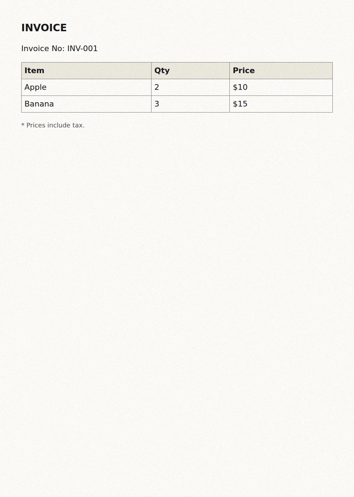
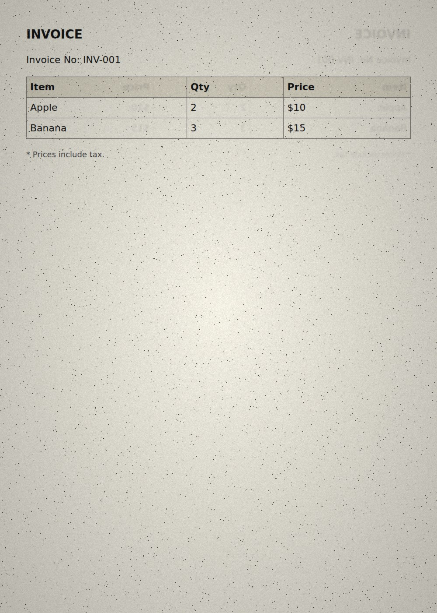
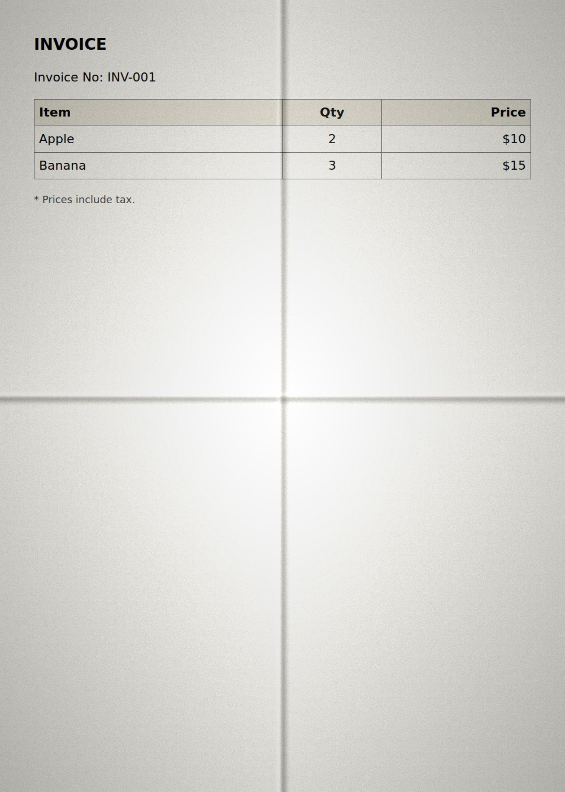

# Paper and degradation


Rendering runs in **two stages**. A backend first produces the *structure* —
glyphs, rules, table geometry — and the paper layer is applied to that finished
page afterwards, for **both backends and every config**. A browser screenshot is
pixel-perfect and a rasteriser is pixel-perfect; scanned paper is neither, and a
model trained only on clean pages learns the wrong prior.

Keeping the stages separate means you can check the structure on a clean sheet,
then try several paper presets against the same render without paying for the
layout again — no browser involved the second time:

```bash
python -m vlm_ocr_synthetic render -r html --no-paper     # stage one only
```

```python
structure = get_renderer("html", {"paper": {"enabled": False}}).render(document)

for preset in (PaperConfig(grain=4), PaperConfig(grain=9, blur=0.4, vignette=0.3)):
    structure.with_paper(preset).save("data/variants")
```

`with_paper()` carries the annotations over untouched — the paper stage moves no
geometry, which is exactly what `tests/renderers/test_paper.py` asserts. Applying paper
afterwards is byte-identical to letting the backend do it inline with the same
seed.

`renderers/paper.py` is shared, so the paper treatment is never what makes two
backends differ:

| knob | simulates | default |
| ---- | --------- | ------- |
| `color` | the sheet itself; the render is multiplied onto it, so ink stays dark | `[250, 249, 245]` |
| `grain` | paper texture, as gaussian grey-level noise | `4.0` |
| `fold_rows` / `fold_columns` | creases from a sheet that was folded before it was scanned | `0` |
| `fold_strength` | how hard those creases were pressed (0 disables folds) | `0` |
| `fold_softness` | crease blur radius in px; how rounded the fold is | `4.0` |
| `fold_jitter` | crease offset as a fraction of the page, so no two sheets fold alike | `0.02` |
| `texture` | a photographed sheet: an image, or a directory to pick one from | `null` |
| `texture_strength` | how far that photograph is blended in | `1.0` |
| `blur` | a scanner that cannot quite focus | `0` |
| `bleed_through` | ink seeping from the reverse side (mirrored, blurred) | `0` |
| `salt` | fraction of pixels lightened — faded ink | `0` |
| `pepper` | fraction of pixels darkened — dust and scanner specks | `0` |
| `vignette` | darkening towards the corners | `0` |

### Folds

synthdog gets its creases from photographs — `resources/paper/*.jpg`, real
sheets that had been folded before they were shot. This generates the same
effect procedurally, so nothing has to be shipped or downloaded:

```yaml
paper:
  fold_rows: 1        # one crease across
  fold_columns: 1     # one down: the sheet was quartered
  fold_strength: 0.6
  fold_softness: 5.0
```

`fold_rows: 2` is a letter tri-fold; `fold_rows: 1` alone is the single crease a
restaurant bill picks up on the way into a pocket. Each crease gets a dark
valley and a lighter ridge beside it, each panel between creases leans towards
or away from the light, and position and pressure are jittered per page from the
seed — so a batch does not fold identically. `configs/renderers/html_folded.yaml` is a
ready-made quarter fold.

| clean | tri-fold, photocopied | quarter fold |
| --- | --- | --- |
|  |  |  |

If you do have real paper photographs — synthdog's `resources/paper`, or your
own scans — point `texture` at the file or the directory and they are multiplied
into the sheet instead, with one picked per page from the seed:

```yaml
paper:
  texture: /path/to/synthdog/resources/paper
  texture_strength: 0.8
```

The effect list follows [genalog's degradation
model](https://github.com/microsoft/genalog); the sheet-and-ink compositing
follows synthdog's paper layer. Turn it all off with `paper: {enabled: false}`,
or turn it up with `configs/renderers/html_scanned.yaml`.

Two properties are enforced by `tests/renderers/test_paper.py`: degradation changes
**pixels only, never annotations**, and the same seed always produces the same
page. Implementation stays on Pillow's C paths (a 256-entry LUT for the gaussian
grain, thresholded noise planes for salt and pepper), so this sits in the
default pipeline without dominating render time.
