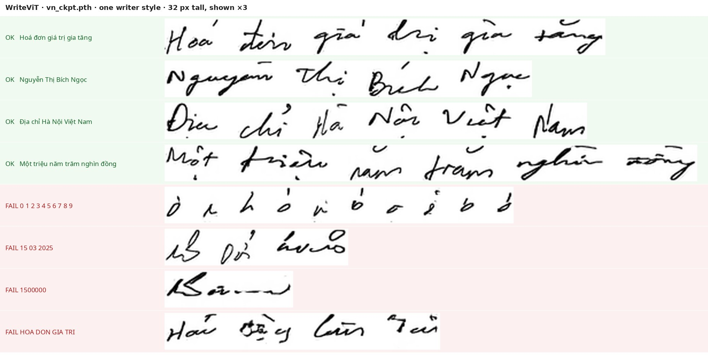

# WriteViT — sinh chữ viết tay tiếng Việt

[Khảo sát tám kho mã](khao-sat-sinh-chu-viet-tay.md) kết luận WriteViT là kho
duy nhất phát hành **trọng số tiếng Việt** dùng được ngay. Tài liệu này ghi lại
việc dựng nó, và — quan trọng hơn — **đo xem nó viết được gì và không viết được
gì**, trước khi ai đó dựa vào nó để lấp `handwriting_fill`.

WriteViT (Đặng Hoài Nam và cộng sự, *Expert Systems with Applications* 2026,
MIT) **không phải phụ thuộc của kho này** — không file nào ở đây import nó. Nó
được clone **cạnh** kho, không nhúng vào: trọng số và dữ liệu nặng 294 MB, và
`*.pth` nằm trong `.gitignore`.

## Dựng

```bash
python tools/writevit/setup.py            # clone ../WriteViT, vá, tải, dựng venv
../WriteViT/.venv/bin/python tools/writevit/infer.py \
    --text "Hoá đơn giá trị gia tăng" --writer 11 --out out/ --scale 3
```

`setup.py` chạy lại được nhiều lần: clone, từng miếng vá và từng file tải về
đều bỏ qua nếu đã có. Không cần GPU — một trường mất khoảng **6,7 giây trên
CPU**, phần lớn là nạp mô hình và nạp `VN.pickle` (193 MB), nên sinh hàng loạt
thì phải nạp một lần rồi gọi nhiều lượt.

`infer.py` ghi mỗi từ một PNG cộng thêm `line.png` đã ghép — WriteViT sinh
**theo từng từ**, khoảng cách giữa các từ là do người gọi đặt.

`tools/writevit/serve.py` là cùng mô hình ấy nhưng **sống lâu**: mỗi dòng stdin
một yêu cầu JSON, mô hình nạp một lần cho cả lượt chạy. Đó là thứ engine HTML
gọi, và cũng là lý do 11 giây kia không nhân lên theo số ô.

## Nó viết được gì



**Chữ cái và dấu thì tốt.** `Hoá đơn giá trị gia tăng`, `Nguyễn Thị Bích Ngọc`,
`Địa chỉ Hà Nội Việt Nam` — dấu đặt đúng chỗ, kể cả dấu chồng (`ệ`, `ộ`, `ễ`),
và có đúng những thứ mà `ff9a9f0` nói là thiếu: chỗ bút nhấc, nét nối, độ
nghiêng đổi trong câu.

**Chữ số thì hỏng hoàn toàn.** `0 1 2 3 4 5 6 7 8 9` ra một dãy hình giống chữ
cái. `1500000` ra một nét ngoằn ngoèo. `15 03 2025` ra `1S 0h ảvcls`.

**Chữ hoa toàn phần cũng hỏng.** `HOA DON GIA TRI` ra `Hai Đồng Giữ Tư`.
Chữ hoa **đầu từ** thì không sao — `Nguyễn`, `Địa`, `Một` đều đúng.

### Vì sao — không phải ngẫu nhiên, mà là lỗi trong mã huấn luyện

`models/model.py` chia từ điển làm hai rồi chỉ dùng một nửa:

```python
if word.isupper() or word.isdigit():
    lex_upper_number.append(word)     # dựng lên rồi không bao giờ dùng
else:
    lex.append(word)
...
self.fake_y_dist = Categorical(...len(self.lex)...)          # dòng 118
fake_y = [self.lex[i].encode("utf-8") for i in sample_lex_idx]  # dòng 402
```

Bộ sinh **chỉ** chạy trên `text_encode_fake`, lấy từ `self.lex`. Đếm trên
`File/vn_words.txt`:

| | |
| --- | --- |
| tổng số token | 14.185 |
| vào `lex` — thứ bộ sinh từng thấy | 10.131 |
| vào `lex_upper_number` — **không bao giờ được lấy mẫu** | 4.054 |
| token trong `lex` **có chứa một chữ số bất kỳ** | **0** |

Bộ sinh chưa từng thấy một chữ số nào trong lúc học. Mười ô `0123456789` trong
`ALPHABET` có tồn tại nhưng chưa bao giờ được dạy.

### Sửa được không

Được, và **không cần dữ liệu mới**. `File/VN.pickle` có sẵn:

| | |
| --- | --- |
| tổng số nhãn | 92.048 |
| nhãn có chứa chữ số | 2.579 (2,80 %) |
| nhãn viết hoa toàn phần | 1.388 (1,51 %) |

Nghĩa là VNOnDB **có** chữ số viết tay; chỉ bộ lọc từ điển gạt chúng ra. Cho
`lex_upper_number` vào phân phối lấy mẫu rồi huấn luyện tiếp là một việc nhỏ về
mã — nhưng vẫn là **một đợt huấn luyện**, cần GPU, không phải một miếng vá lúc
suy luận.

### Còn đường tắt thì không

Đọc bảng trên xong, ai cũng nghĩ tới đường tắt: khỏi huấn luyện, cắt luôn ảnh
chữ số thật trong `VN.pickle` ra rồi ghép thành số. Đã đếm, cả ba split:

| | train | test | val |
| --- | ---: | ---: | ---: |
| ảnh nhãn **một** chữ số | 614 | 188 | 125 |
| trong đó là chữ **`0`** | **1** | **0** | **0** |
| người viết có đủ mười chữ số | 1 / 106 | 0 / 60 | 0 / 34 |

Cả kho có **đúng một** ảnh chữ số `0` viết rời, mà `1.500.000` cần bốn cái. Ghép
lại thì bốn số không giống hệt nhau đến từng điểm ảnh; ghép từ nhiều người viết
thì một con số gồm nét chữ của bốn người. Nhãn nhiều chữ số thì chỉ có 143 chuỗi
khác nhau, phủ chưa tới 5 % số nhóm ba chữ số, và cắt chữ số ra khỏi ảnh nhiều
chữ số lại là một bài phân đoạn.

Nên câu "cần một đợt huấn luyện" ở trên là câu cuối, không phải câu đầu tiên
trong danh sách phương án.

## Bảng chữ: chỉ chữ cái, chữ số và `!`

`ALPHABET` của cấu hình VNDB **không có** dấu phẩy, dấu chấm, gạch chéo hay gạch
nối. `15/03/2025` và `1.500.000` không sinh được, kể cả sau khi sửa chuyện chữ
số. `infer.py` chặn sớm và nói rõ ký tự nào thiếu, chứ không ném `KeyError`.

## Năm miếng vá

`setup.py` vá bản gốc, mỗi miếng có lý do:

| File | Vá gì | Vì sao |
| --- | --- | --- |
| `params.py` | `DATASET` đọc từ `WRITEVIT_DATASET` | chọn ngôn ngữ không phải sửa file; mặc định giữ nguyên hành vi cũ |
| `params.py` | thêm `import os` | vì dòng trên cần |
| `models/Unifront.py` | `import DEVICE` | để dùng thiết bị đã phân giải |
| `models/Unifront.py` | `device='cuda'` → `device=DEVICE` | **bảng font bị đẩy lên GPU vô điều kiện**, nên bản gốc không chạy được trên máy chỉ có CPU |
| `models/Generator.py` | bỏ `.squeeze(1)` trong `Eval` | `QRS[:, i, :]` đã là `[B, L]`; `squeeze` vô hại khi `L > 1` nhưng **xoá mất trục độ dài khi `L == 1`**, làm hỏng mọi từ một ký tự |

Hai miếng cuối là lỗi thật của bản gốc, không phải chuyện thích nghi môi trường.

## Vài chỗ đã đọc mã và thấy khác tài liệu

- **Kho không có mã suy luận.** Chỉ có `train.py`; README trỏ sang một Colab.
  `tools/writevit/infer.py` là phần thiếu đó.
- **Mô hình one-shot thật, một ảnh mẫu.** README nói "a small set of reference
  images" và `params.py` khai `NUM_EXAMPLES = 15`, nhưng `models/model.py` nạp
  `input["img"]` — **một** ảnh — vào `netW`. Trường `simg` chứa 15 ảnh được dựng
  trong `data/dataset.py` và **không bao giờ được dùng**; nó thừa kế từ
  Handwriting Transformers.
- **`_generate_page` là mã chết**, không ai gọi.

## Ghép vào tờ giấy

Ảnh ra cao 32 px, rộng 16 px mỗi ký tự. Tờ A4 ở 150 dpi — độ phân giải
`generators/genalog/render.py` và `samples/invoice-templates/render.py` đang
dùng — là 1240 × 1754 px, một dòng điền tay cao 6–8 mm tức **35–47 px**. Phóng
**1,1–1,5 lần**, và tầng [`degradation/`](../degradation/README.md) vốn đã làm
nhoè ảnh. Nền là trắng nên hợp thành ảnh phải lấy `alpha = 1 - giá trị điểm ảnh`
chứ không phủ đè.

Việc ghép ấy **đã làm rồi**, ở
[`docs/handwriting-html.md`](handwriting-html.md): `tools/writevit/serve.py`
giữ mô hình sống suốt lượt chạy (11 giây một lượt gọi lạnh là toàn bộ giá của
tính năng nếu trả từng ô), `generators/html/handwriting.py` quyết định ô nào
điền được rồi viết lại markup, và `data/hand12/` là 12 trang đầu tiên trong kho
này có nét bút thật trên giấy.

## Còn thiếu gì trước khi dựng `handwriting_fill`

1. **Chữ số.** Ô "Số tiền", ngày tháng, số hoá đơn, mã số thuế — tất cả đều là
   số, và đây là chỗ chặn cứng. Hoặc huấn luyện tiếp như trên, hoặc lấy chữ số
   từ nguồn khác — cắt từ `VN.pickle` thì không, xem "Còn đường tắt thì không".
   Đo trên 16 bố cục: chữ số chặn **70 %** số ô đáng điền tay.
2. **Đường `from_receipt`.** Nội dung phải lấy từ chính `receipt` sinh ra tờ
   giấy, để ảnh và nhãn không nói hai chuyện khác nhau. **Xong**: mực thay cách
   vẽ một giá trị chứ không thay giá trị, và có test giữ điều đó trên sáu họ tờ
   giấy.
3. **Giấy phép.** Trọng số học từ VNOnDB; điều khoản phát hành lại của **dữ
   liệu** mới là thứ phải đọc trước khi công bố ảnh sinh ra, không phải giấy
   phép MIT của **mã**. Giờ đã có ảnh thật để công bố, nên câu này thôi là câu
   dự phòng.
