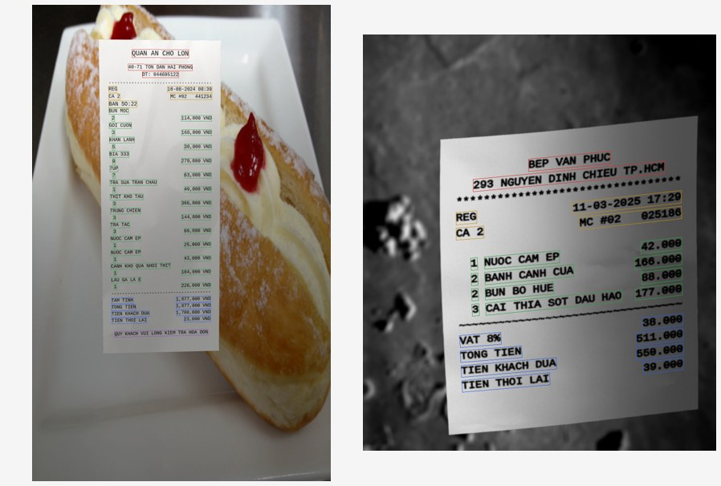

# SynthDoG-VN 🧾 — Sinh ảnh hoá đơn bán lẻ Việt Nam

Template [synthtiger](https://github.com/clovaai/synthtiger) sinh ảnh hoá đơn kiểu máy in
nhiệt (quán ăn, nhà hàng, siêu thị) **kèm nhãn có cấu trúc**, dùng để train/fine-tune
[Donut](https://github.com/clovaai/donut) cho bài toán trích xuất thông tin từ hoá đơn.

> **Nội dung KHÔNG sinh ở đây.** Chữ gì, bố cục nào, có dấu hay không, làm cũ ra sao —
> tất cả do [`rulebase/`](../../rulebase/README.md) quyết định, dùng chung với hai
> renderer HTML. File trong thư mục này chỉ lo phần *vẽ bằng glyph*: đặt chữ lên toạ độ,
> cong giấy, ghép nền, chụp lại. Muốn đổi nội dung thì sửa `rulebase/`, không sửa ở đây.


*8 mẫu sinh bằng config mặc định — có dấu/không dấu, chữ hoa/thường, 1 dòng/2 dòng mỗi
mặt hàng, có/không VAT, giảm giá, tiền thối; giấy nghiêng, cong và nhoè khác nhau.*

---

## 1. Yêu cầu môi trường

| Thành phần | Yêu cầu |
|---|---|
| Python | 3.8 – **3.11** (đã kiểm thử trên 3.11; 3.12+ KHÔNG chạy được, xem `docs/python-versions.md`) |
| Hệ điều hành | Linux / macOS / WSL |
| RAM | ~1 GB mỗi worker |
| GPU | **Không cần** — toàn bộ chạy trên CPU |
| Đĩa | ~50 KB mỗi ảnh sinh ra |

Thư viện đã ghim sẵn trong `requirements.txt`. **Ba mốc chặn trên là do lỗi thật, đừng gỡ:**

- `pillow<10` — synthtiger 1.2.1 gọi `ImageFont.getsize()`, API này bị xoá ở Pillow 10.
- `numpy<2` — `imgaug` dùng `np.sctypes`, bị xoá ở NumPy 2.
- `opencv-python<5` — bản 5 yêu cầu `numpy>=2`, xung đột với dòng trên.

---

## 2. Cài đặt

```bash
git clone https://github.com/LinhPhuong14/vlm-ocr-synthetic.git
cd vlm-ocr-synthetic/generators/synthdog

python -m venv .venv
source .venv/bin/activate          # Windows: .venv\Scripts\activate

pip install -U pip setuptools wheel   # BẮT BUỘC — xem mục Sự cố thường gặp
pip install -r requirements.txt
```

> **macOS** cần thêm: `export OBJC_DISABLE_INITIALIZE_FORK_SAFETY=YES`

Kiểm tra cài đặt:

```bash
python -c "import synthtiger, PIL, numpy, cv2; print(synthtiger.__version__, PIL.__version__, numpy.__version__, cv2.__version__)"
# 1.2.1 9.5.0 1.26.4 4.11.0
```

---

## 3. Sinh dữ liệu

```bash
# chạy từ thư mục generators/synthdog
synthtiger -o ./outputs/VNReceipt -c 1000 -w 4 -v \
    template_receipt.py SynthVNReceipt config_vi_receipt.yaml
```

| Tham số | Ý nghĩa |
|---|---|
| `-o` | Thư mục xuất dữ liệu |
| `-c` | Số ảnh cần sinh |
| `-w` | Số worker (đặt bằng số nhân CPU) |
| `-s` | Seed — **cùng seed cho ra cùng dataset**, bất kể `-w` bao nhiêu |
| `-v` | In traceback |

> ⚠️ **Luôn bật `-v` khi debug.** synthtiger nuốt exception rồi retry vô hạn; template
> hỏng sẽ treo im lặng không báo gì.

Kết quả:

```
outputs/VNReceipt/
├── train/        (80%)  image_0.jpg, image_3.jpg, ..., metadata.jsonl
├── validation/   (10%)
└── test/         (10%)
```

---

## 4. Xem trước và kiểm tra

```bash
# lưới 8 mẫu, có đủ hiệu ứng
python tools/preview_receipt.py --count 8 --grid 4 --seed 2026 --out /tmp/preview

# tắt hiệu ứng + vẽ box từng trường — để soi bố cục
python tools/preview_receipt.py --count 2 --grid 2 --seed 3 --clean --boxes --out /tmp/preview

# kiểm tra font có đủ dấu tiếng Việt không (chạy TRƯỚC khi thêm font mới)
python tools/check_fonts.py ../../fonts/mono
```

**Bố cục sạch, không hiệu ứng** — mỗi màu là một nhóm trường
(🔴 cửa hàng · 🟠 thông tin phiếu · 🟢 mặt hàng · 🔵 tổng tiền · 🟣 chân hoá đơn):


**Sau khi giấy đã nghiêng và cong** — box vẫn bám sát từng dòng chữ:



---

## 5. Nhãn xuất ra

`metadata.jsonl` — mỗi dòng một ảnh, đúng định dạng `DonutDataset` đọc được:

```json
{
  "file_name": "image_0.jpg",
  "ground_truth": "{\"gt_parse\": {\"store\": {\"name\": \"QUAN AN CHO LON\", \"address\": \"40-71 TON DAN HAI PHONG\", \"phone\": \"DT: 044695122\"}, \"menu\": [{\"nm\": \"BUN MOC\", \"cnt\": \"2\", \"price\": \"114,000 VND\"}], \"total\": {\"total_price\": \"1,677,000 VND\", \"cashprice\": \"1,700,000 VND\", \"changeprice\": \"23,000 VND\"}}}",
  "boxes": [
    {"kind": "menu.nm", "text": "BUN MOC", "quad": [[x,y],[x,y],[x,y],[x,y]]}
  ]
}
```

- **`gt_parse`** — cấu trúc lồng nhau kiểu CORD:
  - `store.{name, address, phone}`
  - `menu[].{nm, cnt, price, unitprice}`
  - `total.{subtotal_price, discount_price, tax_price, total_price, cashprice, changeprice}`
- **`boxes`** — polygon 4 điểm cho từng trường. Donut **bỏ qua** khoá lạ trong
  `ground_truth` nên `boxes` để riêng bên ngoài; dùng cho detection hoặc để kiểm tra nhãn.
- Đổi `label_format: text` trong YAML để xuất `{"text_sequence": "..."}` thay cho
  `gt_parse` — dùng cho bài pre-training đọc trơn.

**Số học trong nhãn luôn nhất quán**: đơn giá × số lượng = thành tiền, tổng các dòng =
tạm tính, tiền khách đưa − tổng = tiền thối. Đã kiểm tra tự động trên 60 mẫu, 0 lỗi.

---

## 6. Dùng để train Donut

Tạo `config/train_vi_receipt.yaml` ở thư mục gốc repo:

```yaml
resume_from_checkpoint_path: null
result_path: "./result"
pretrained_model_name_or_path: "naver-clova-ix/donut-base"
dataset_name_or_paths: ["./synthdog/outputs/VNReceipt"]
sort_json_key: False
train_batch_sizes: [4]
val_batch_sizes: [1]
input_size: [1280, 960]
max_length: 768
align_long_axis: False
num_nodes: 1
seed: 2022
lr: 3e-5
warmup_steps: 300
num_training_samples_per_epoch: 800
max_epochs: 30
max_steps: -1
num_workers: 8
val_check_interval: 1.0
check_val_every_n_epoch: 3
gradient_clip_val: 1.0
verbose: True
```

```bash
cd ..                 # về thư mục gốc repo
python train.py --config config/train_vi_receipt.yaml --exp_version "vi_receipt_v1"
```

Lưu ý `train.py` cần thêm `torch`, `pytorch-lightning`, `transformers` — cài theo
`setup.py` ở thư mục gốc (`pip install .`), **tách riêng khỏi venv sinh dữ liệu** vì
Donut cần Pillow/NumPy mới hơn mức synthtiger cho phép.

---

## 7. Thành phần

| File | Vai trò |
|---|---|
| `template_receipt.py` | Template `SynthVNReceipt` — điều phối và lưu dữ liệu |
| `render.py` | Chạy template trực tiếp, chọn được seed và ghim được bố cục |
| `elements/receipt.py` | Đổi lưới ô của rule-base thành `TextLayer` — **không sinh nội dung** |
| `elements/warp.py` | `CurlWarp` — cong giấy phi tuyến, **có map lại toạ độ** |
| `config_vi_receipt.yaml` | Tham số riêng của renderer glyph: khung ảnh, độ cong, hiệu ứng chụp |
| `requirements.txt` | Thư viện đã ghim phiên bản |
| `resources/background/` | Ảnh nền riêng của bạn (tuỳ chọn) — mặc định lấy từ `textures/background/` ở gốc repo |
| `resources/font/<mono\|sans>/` | Font riêng của bạn; có thì được ưu tiên hơn `fonts/` ở gốc repo |
| `tools/preview_receipt.py` | Xem trước, ghép lưới, vẽ box |
| `tools/check_fonts.py` | Kiểm tra font có đủ glyph tiếng Việt |

Nội dung, bố cục, corpus, chuỗi làm cũ: [`rulebase/`](../../rulebase/README.md).
Các model làm cũ: [`degradation/`](../../degradation/README.md).

---

## 8. Khác gì SynthDoG gốc

**1. Nội dung có cấu trúc, không phải chữ ngẫu nhiên.**
SynthDoG cắt ký tự liên tục từ Wikipedia. Ở đây hoá đơn sinh từ một mô hình dữ liệu thật
(cửa hàng → mặt hàng → tổng tiền), nên nhãn xuất được dạng `gt_parse` lồng nhau và các
con số khớp nhau.

**2. Vẽ theo trường, không theo ký tự.**
`elements/textbox.py` của SynthDoG tạo một `TextLayer` cho **mỗi ký tự** — đo được
~2.7 ms/ký tự. Hoá đơn dày chữ nên cách đó không dùng được. Ở đây mỗi trường là một
`TextLayer`.

| | Hoá đơn ~40 dòng | SynthDoG gốc (~370 ký tự) |
|---|---:|---:|
| 4 worker (máy 4 nhân) | **0.44 s/ảnh** | 0.60 s/ảnh |
| CPU tiêu tốn | **1.78 CPU-s/ảnh** | 2.34 CPU-s/ảnh |

Nhiều chữ hơn hẳn mà vẫn nhanh hơn.

**3. Giấy cong mà nhãn vẫn đúng.**
`components.ElasticDistortion` của synthtiger chỉ warp pixel, **không** cập nhật toạ độ —
méo mạnh là box lệch khỏi chữ. `CurlWarp` định nghĩa biến dạng bằng công thức giải tích,
tách thành 2 lượt, mỗi lượt khả nghịch trên một trục:

```
lượt 1 (theo hàng y):  x' = a(y)·(x − cx) + cx + b(y)
lượt 2 (theo cột x'):  y' = y + c(x')
```

Nhờ vậy vừa dựng được ánh xạ ngược cho `cv2.remap` (ảnh), vừa map xuôi được 4 góc của
từng trường (nhãn). Đó là lý do box trong ảnh mục 4 vẫn bám sát chữ dù giấy đã uốn.

---

## 9. Các trục ngẫu nhiên hoá

**Của rule-base** (dùng chung với hai renderer HTML — sửa ở `rulebase/rules/`):
loại document, bố cục, có dấu/không dấu, chữ hoa/thường, định dạng tiền, VAT, khuyến
mãi, font, cỡ chữ, độ đậm mực, tờ giấy, màu mực, chuỗi làm cũ. Xem
[`rulebase/README.md`](../../rulebase/README.md).

**Của riêng renderer này** (sửa ở `config_vi_receipt.yaml`):

- **Cong giấy** — biên độ nhân thêm hệ số `visual.curl` của recipe, nên giấy nhiệt mỏng
  cong nhiều còn hoá đơn laser trên giấy A5 gần như phẳng.
- **Khung ảnh**: tỉ lệ tờ giấy chiếm trong khung (`canvas_fill`), tỉ lệ cạnh
  (`canvas_aspect`), cạnh ngắn của ảnh xuất (`short_size`).
- **Hiệu ứng "chụp lại"**: bóng đổ, tương phản, độ sáng, nhoè chuyển động, nén JPEG.
- **Hiệu ứng mức tài liệu**: elastic distortion, nhiễu Gauss, perspective.

---

## 10. Muốn chỉnh gì thì sửa ở đâu

| Muốn | Sửa |
|---|---|
| Thêm món / đổi giá | `rulebase/corpus/vi/items_*.txt` — `tên<TAB>giá_min<TAB>giá_max` |
| Thêm tên quán / đường / dòng chân | `rulebase/corpus/vi/shops_*.txt`, `streets.txt`, `footers_*.txt` |
| Thêm bố cục | `rulebase/layouts/` + khai báo ở `rulebase/rules/layout.yaml` |
| Hoá đơn dài/ngắn | `num_items` trong `rulebase/rules/document.yaml` |
| Giấy rộng/hẹp | `width` trong file bố cục ở `rulebase/layouts/` |
| Tỉ lệ bỏ dấu | `prob_ascii_fold` trong `rulebase/rules/content.yaml` |
| Đổi tỉ lệ loại hoá đơn | `weight` trong `rulebase/rules/document.yaml` |
| Thêm font | Bỏ vào `fonts/<mono\|sans>/` (hoặc `resources/font/` nếu không phát hành lại được), **chạy `tools/check_fonts.py` trước** |
| Giấy cong nhiều/ít | `curl.*` ở đây, và `visual.curl` ở `rulebase/rules/visual.yaml` |
| Thêm hiệu ứng ảnh | Thêm component vào `Iterator` trong `template_receipt.py` **và** thêm khối `args` **đúng thứ tự** trong YAML — synthtiger ghép theo index, sai thứ tự **không báo lỗi** |

---

## 11. Sự cố thường gặp

| Triệu chứng | Nguyên nhân & cách xử lý |
|---|---|
| `ERROR: Failed building wheel for pytweening` | setuptools bản vá của Debian/Ubuntu. Cài trong **venv** và chạy `pip install -U setuptools` trước. Đừng cài vào python hệ thống. |
| Chạy mãi không ra ảnh, không báo lỗi | synthtiger nuốt exception rồi retry vô hạn. Chạy lại với `-v` để thấy traceback. |
| `AttributeError: 'FreeTypeFont' object has no attribute 'getsize'` | Pillow ≥ 10. Chạy `pip install "pillow<10"`. |
| `AttributeError: np.sctypes was removed` | NumPy ≥ 2. Chạy `pip install "numpy<2"`. |
| Chữ hiện ô vuông ▯▯▯ | Font thiếu glyph tiếng Việt. Chạy `python tools/check_fonts.py ../../fonts/mono`. **Nhãn vẫn ghi đúng chữ nên lỗi này không tự báo ra** — phải chủ động kiểm tra. |
| `FileNotFoundError: resources/...` | Phải chạy từ thư mục `generators/synthdog`, đường dẫn trong YAML là tương đối. |

---

## 12. Hạn chế đã biết

- **Ảnh nền là ảnh sinh, không phải ảnh chụp.** `textures/background/` có bốn mặt
  bàn sinh bằng `make textures` (gỗ sáng, gỗ tối, đá, vải). Bỏ vài chục ảnh **chụp
  thật** mặt bàn / tay cầm hoá đơn vào `resources/background` rồi trỏ
  `background.image.paths` vào đó sẽ cải thiện realism **nhiều hơn bất kỳ thay đổi
  code nào** — đây là việc đáng làm đầu tiên. Đây cũng là lý do renderer này khó đọc
  nhất trong ba renderer: xem điểm OCR ở
  [`data/dataset60/proof/`](../../data/dataset60/proof).
- Font: 5 mono + 5 sans, đều đã kiểm tra phủ đủ dấu tiếng Việt. Hoá đơn thật còn dùng
  nhiều font máy kim / máy nhiệt khác nữa.
- `CurlWarp` mô hình hoá giấy cong theo sóng trơn; nếp gấp gãy góc do
  `degradation.paper_texture(creases=...)` lo, và nó là hiệu ứng 2D chứ không phải hình học.
- Chưa sinh mã vạch / QR / logo cửa hàng dưới dạng hình — mã vạch mới chỉ là chữ số.
- Giá tiền lấy theo khoảng cố định trong `items.txt`, chưa mô phỏng lạm phát theo năm in
  trên hoá đơn.

---

## Giấy phép

Code theo MIT (kế thừa từ Donut). Font trong `fonts/` xem [`fonts/README.md`](../../fonts/README.md).
