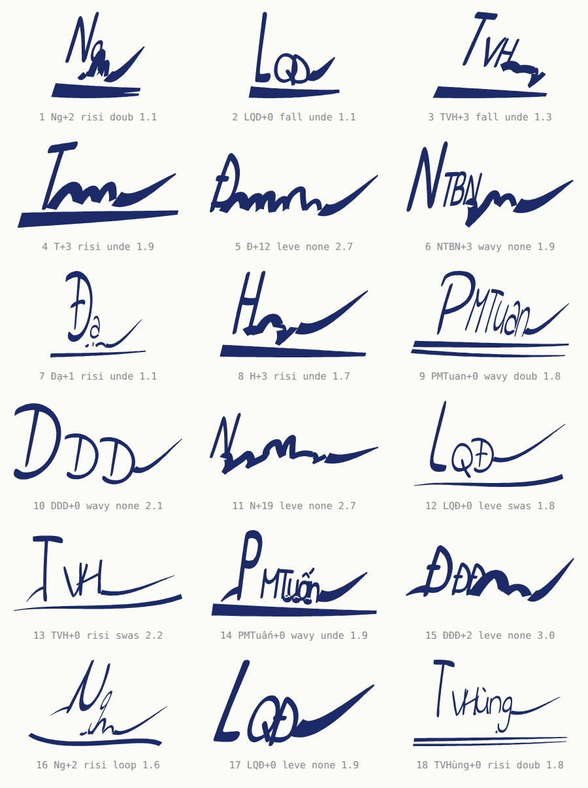
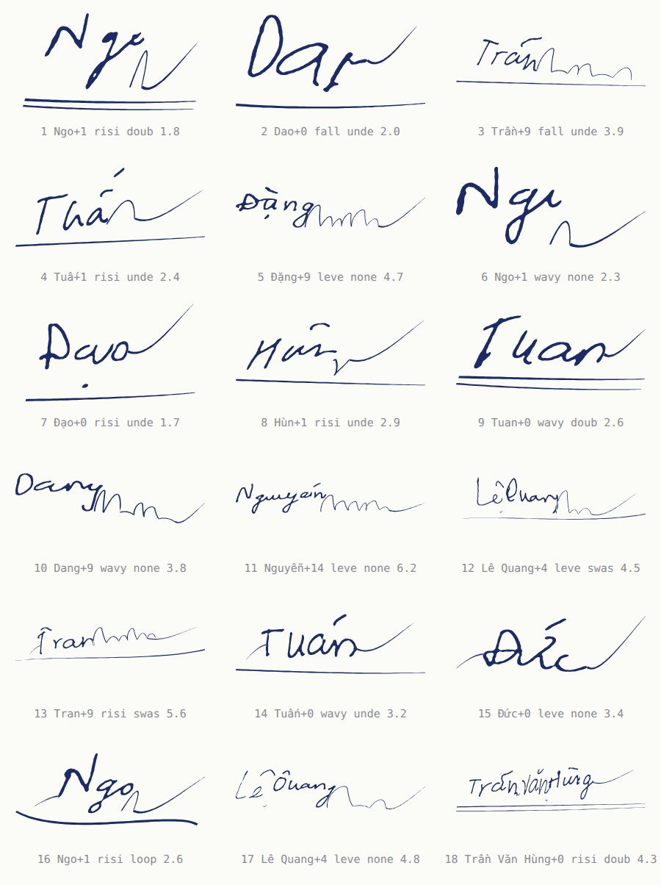

# signatures — chữ ký kéo giãn từ chữ viết tay

Sáu tệp để nhìn, chia theo **hai nguồn mực**. Toàn bộ lý do chúng có hình dạng
như thế nằm ở [`docs/chu-ky.md`](../../docs/chu-ky.md) — khảo sát mẫu chữ ký
trước, rồi mới dựng engine.

| tệp | nguồn | là gì |
| --- | --- | --- |
| `styles.jpg` | `font` | 18 hạt giống, 5 tên: lưới để nhìn **dải tham số** |
| `styles-model.jpg` | `model` | cùng 18 hạt giống ấy, mực WriteViT — **nét mỏng, nối liền** |
| `signed-folio.jpg` | `font` | tờ **có in tên** — chữ ký đè lên tên |
| `signed-form.jpg` | `font` | tờ **để trắng** — đa số bố cục là loại này |
| `signed-model.jpg` | `model` | cùng loại tờ ấy, ký bằng mực mô hình |
| `signatures.json` | | kiểu dáng từng dấu ký, đúng như nó vào nhãn |

```bash
make signatures        # dựng lại tất cả; bỏ qua phần model nếu chưa clone WriteViT
```

## Nhìn cái gì ở lưới



Nhãn dưới mỗi ô là `hạt-giống · chữ-còn-hình + số-chữ-đã-tan · đường-chân-chữ ·
paraph · tỷ-lệ`. Nên `Ng+2` đọc là: hai chữ `N` `g` còn giữ hình, hai chữ nữa
đã tan thành nét lượn.

Một chữ ký không chứng minh được gì; lưới thì có. Ba thứ đáng nhìn:

- **hầu hết đều không đọc ra chữ** — chỉ một hai chữ đầu còn hình, phần còn
  lại là nét lượn chạy. Đó là điều khảo sát nói và là điều lượt dựng đầu tiên
  làm sai: bóp hẹp một chữ thì nó vẫn là một chữ;
- **nét lượn giữ hướng của chữ nó thay**: chữ có đuôi (`g` `y` `p`) để lại vòng
  cắm xuống, chữ cao (`l` `h` `đ`) để lại vòng vắt lên. Vì thế `5` và `11` là
  hai nét lượn khác nhau chứ không phải một cái ngoằng dùng chung;
- **chữ cái đầu phóng to** và **nét cuối hất lên** — hai đặc điểm nhất quán
  nhất trong khảo sát, thấy rõ ở `4`, `8`, `15`.

Sáu ô vẫn đọc được, vì hai lý do khác nhau. `2`, `10`, `12`, `13`, `17` là
**chữ lồng toàn chữ hoa**, mà chữ hoa thì không bao giờ tan — ba chữ cái đầu là
để đọc, đó là toàn bộ công dụng của chữ lồng. `9`, `14`, `18` thì là một phần
mười số người ký **hình thành hết mọi chữ**, và đó cũng là chữ ký thật. Đo trên
300 hạt giống: 74 % tan thành nét lượn, 13 % là chữ lồng, 13 % giữ nguyên mọi
chữ.

Tỷ lệ khung rơi vào khoảng 0,98–3,05. Dải các bộ dữ liệu chữ ký offline thu mẫu
là 1,8–3,0; ở đây **không ép** vào dải ấy, chỉ báo cáo — xem `in_capture_box`
trong `signatures.json`.

## Mực mô hình



Đây là nét mà mặt chữ không cho được: **mỏng, nối liền, mỗi lần một khác**, vì
nó do checkpoint sinh ra chứ không phải glyph dựng sẵn. `trace` biến ảnh ấy
thành contour, rồi mọi phép biến đổi của engine áp lên y như áp lên một glyph —
xem `5` và `11`: phần đầu là chữ model viết, phần đuôi là nét lượn engine vẽ,
và hai thứ ăn khớp vì cùng bề dày nét.

Cả **18 trên 18** đều là mực model, không ô nào phải lùi về mặt chữ. Không phải
vì checkpoint viết được nhiều hơn — nó vẫn không viết nổi `LQĐ` — mà vì kiểu
chữ ký giờ được bốc **từ những kiểu nguồn mực vẽ được**, thay vì bốc trước rồi
bị từ chối sau.

Cái giá nằm ở chỗ khác và phải nói thẳng: **lưới này không có chữ lồng nào.**
So với `styles.jpg`, dải kiểu hẹp lại còn `given` và `full` — vì `monogram` và
`initials` là chuỗi chữ hoa theo định nghĩa.

Hai giới hạn nữa, nhìn thấy được ở đây: **đầu nét bị tù** — ngưỡng trace luôn
cắt mất phần thon chỗ bút nhấc, và hạ ngưỡng chỉ làm béo nét chứ không lấy lại
được (xem `docs/chu-ky.md`); và **tỷ lệ khung rộng hơn `font`** — trung vị 3,3
so với dải 1,8–3,0 các bộ chữ ký offline thu mẫu, vì model viết cả từ liền
mạch nên dấu ký trải dài.

## Nhìn cái gì ở hai tờ

`signed-folio.jpg` là `invoice_hotel_stay`, bố cục duy nhất trong bộ mẫu này có
`signature_names`: tên **được in sẵn**, và chữ ký nằm đè lên nó, vì đó là chỗ
cây bút đặt xuống.

`signed-form.jpg` là `invoice_vat_form`: dưới chú thích *(KÝ, GHI RÕ HỌ TÊN)*
chỉ có một dòng trắng. Tên người ký lấy từ `rulebase.corpus.people`, cùng kho
tên mà tài liệu rút người mua ra. Không có `names` thì khối ấy **để trắng và
được đếm**, không bịa.

`signed-model.jpg` là cùng bố cục ấy nhưng `--signature model`: hai khối đều là
mực mô hình thật.

Cả ba vẽ với `augmentation=pristine`: đây là ca-ta-lô mực, không phải bộ dữ
liệu. Bộ dữ liệu là `make dataset`.

## Điều phải nói thẳng

Với `font`, nét là nét của **một mặt chữ**, kéo giãn — đủ để làm hoa tiết trên
tờ giấy, không đủ để làm mẫu chữ ký của một người, và hai mặt chữ thì không
phải 106 người viết. Cùng sự đánh đổi mà [`samples/handwriting/`](../handwriting)
đã ghi cho `FontHand`.

Với `model`, giới hạn ấy được gỡ — nét do mô hình sinh, 106 kiểu người viết —
và đổi lấy một giới hạn khác: không chữ số, không IN HOA, một clone 1,7 GB, và
vài giây mỗi từ. Cả hai đều **không** phải corpus để huấn luyện xác thực chữ
ký: một hạt giống vẫn là một dấu ký cố định.
