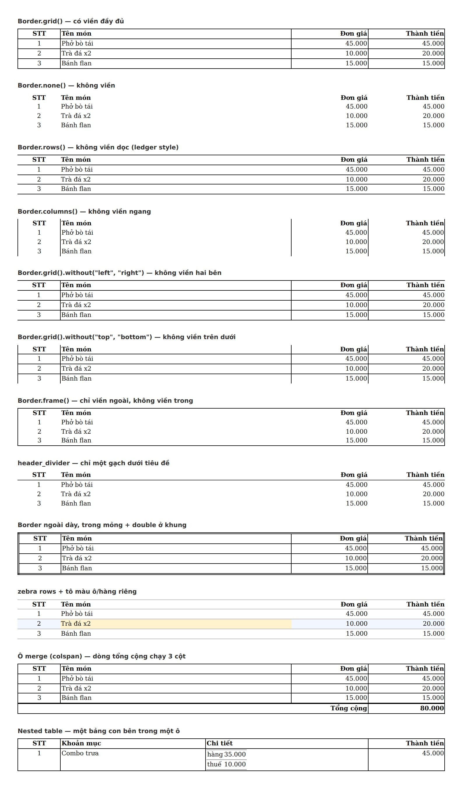

# table-component — một bảng, mười hai cách viền/tô/gộp

`generators/html/table.py` là một component bảng dùng chung: khai báo bằng
`TableSpec`/`Border`/`Row`/`Cell`, `render_table()` trả về một `<table>` tự
đủ (CSS nhúng inline, không cần khớp với stylesheet nào khác) — nên **thêm
một bố cục mới không phải viết CSS**, chỉ chỉnh attribute. Chi tiết mô hình
viền (6 đường: 4 cạnh ngoài + 2 loại gạch trong) nằm ở docstring đầu
[`generators/html/table.py`](../../generators/html/table.py).

`gallery.jpg` là **cùng một bảng 3 dòng hàng**, vẽ lại 12 lần — mỗi lần chỉ
đổi một attribute — để chứng minh cái đổi giữa các khung thật sự là
attribute được ghi dưới nó, không phải nội dung.

```bash
python3 tools/table_showcase.py -o samples/table-component
```



| # | Panel | Attribute |
| --: | --- | --- |
| 1 | có viền đầy đủ | `Border.grid()` |
| 2 | không viền | `Border.none()` |
| 3 | không viền dọc (ledger) | `Border.rows()` |
| 4 | không viền ngang | `Border.columns()` |
| 5 | không viền hai bên | `Border.grid().without("left", "right")` |
| 6 | không viền trên dưới | `Border.grid().without("top", "bottom")` |
| 7 | chỉ viền ngoài, không viền trong | `Border.frame()` |
| 8 | một gạch dưới tiêu đề, không gì khác | `TableSpec(header_divider=Line(...))` |
| 9 | viền ngoài dày + kiểu double, viền trong mỏng | `Border(top=Line(..., "double"), ...)` |
| 10 | zebra rows, cộng một ô/hàng tô màu riêng | `TableSpec.zebra=` + `Cell.bg=` / `Row.bg=` |
| 11 | ô merge (colspan) — dòng tổng cộng chạy 3 cột | `Cell(colspan=3, ...)` |
| 12 | bảng lồng bên trong một ô | `Cell(content=<TableSpec khác>)` |

`gallery.html` đi kèm là chính trang đã chụp — mở thẳng trong trình duyệt để
xem markup, không cần dựng gì.

Kiểm chứng ở mức thuộc tính/markup (không cần trình duyệt) nằm trong
[`tests/test_table.py`](../../tests/test_table.py) — 47 test, mỗi case trong
bảng trên có ít nhất một test khẳng định đúng cạnh nào được/không được vẽ.
